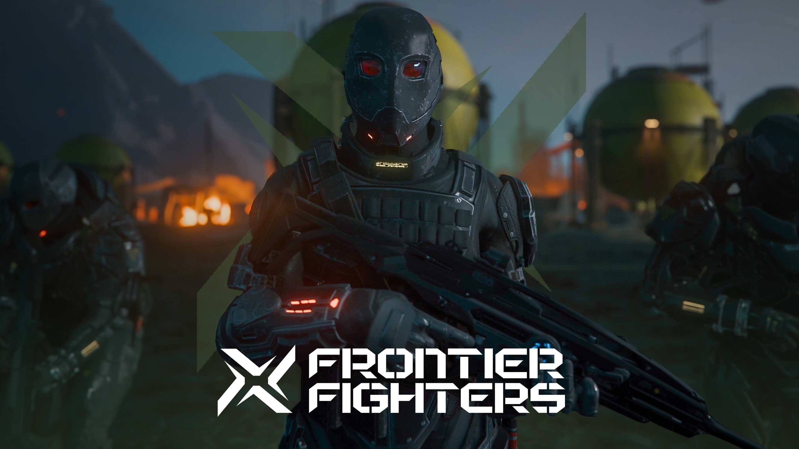
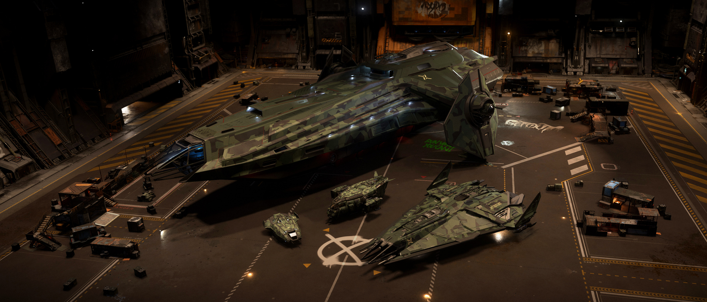

## People of Pyro - Frontier Fighter

ในโลกที่ Pyro เต็มไปด้วยความโกลาหลและอันตราย ยังมีกลุ่มหนึ่งที่ยืนหยัดต่อสู้เพื่อความยุติธรรมและเสรีภาพ นั่นคือ **Frontier Fighter** กลุ่มนักสู้ผู้กล้าหาญที่พร้อมปกป้องผู้บริสุทธิ์และรักษาความสงบในดินแดนไร้กฎหมายแห่งนี้

### จุดกำเนิดของนักสู้ชายแดน

Frontier Fighter เกิดขึ้นจากกลุ่มผู้ตั้งถิ่นฐานและนักผจญภัยที่เบื่อหน่ายกับการถูกข่มเหงโดยอาชญากรและแก๊งต่าง ๆ ใน Pyro พวกเขารวมตัวกันเพื่อปกป้องชุมชนและสร้างความหวังใหม่ให้กับผู้คนที่ต้องการใช้ชีวิตอย่างสงบสุข แม้จะต้องเผชิญกับอันตรายรอบด้าน แต่ Frontier Fighter ก็ไม่เคยยอมแพ้

### ปรัชญาและอุดมการณ์

หัวใจของ Frontier Fighter คือ "เสรีภาพและความยุติธรรม" พวกเขาเชื่อว่าทุกคนควรมีสิทธิ์ในการใช้ชีวิตอย่างปลอดภัยและมีศักดิ์ศรี ไม่ว่าจะอยู่ที่ไหนใน Pyro สมาชิกแต่ละคนได้รับการฝึกฝนให้เป็นนักสู้ที่มีวินัย กล้าหาญ และพร้อมเสียสละเพื่อส่วนรวม

### ฐานที่มั่นและกิจกรรม

Frontier Fighter มักตั้งฐานอยู่ตามจุดยุทธศาสตร์ใกล้เส้นทางการค้าและชุมชนผู้ตั้งถิ่นฐาน พวกเขาทำหน้าที่เป็นทั้งผู้พิทักษ์ ผู้ไกล่เกลี่ยข้อพิพาท และผู้นำภารกิจช่วยเหลือผู้เดือดร้อน ไม่ว่าจะเป็นการป้องกันการปล้นสะดม การคุ้มกันขบวนสินค้า หรือการช่วยเหลือผู้รอดชีวิตจากการโจมตี

### บทบาทใน Pyro และ Star Citizen

ในเกม Star Citizen ผู้เล่นจะได้พบกับ Frontier Fighter ผ่านภารกิจที่เกี่ยวข้องกับการปกป้องชุมชน การต่อสู้กับกลุ่มอาชญากรรม และการสร้างเครือข่ายพันธมิตรใน Pyro การสร้างชื่อเสียงกับ Frontier Fighter จะเปิดโอกาสให้ผู้เล่นได้รับความไว้วางใจและการสนับสนุนจากชุมชนชายแดน

### ผู้นำและโครงสร้างองค์กร

Frontier Fighter มีโครงสร้างองค์กรที่ยืดหยุ่นและเน้นความร่วมมือ สมาชิกทุกคนมีสิทธิ์แสดงความคิดเห็นและมีบทบาทในการตัดสินใจสำคัญ ผู้นำของกลุ่มมักเป็นผู้ที่ได้รับความเคารพจากการกระทำและความเสียสละ ไม่ใช่แค่ตำแหน่งหรืออำนาจ

### ความท้าทายและอนาคต

แม้จะมีอุดมการณ์ที่สูงส่ง แต่ Frontier Fighter ต้องเผชิญกับศัตรูที่แข็งแกร่งและสถานการณ์ที่เปลี่ยนแปลงตลอดเวลา พวกเขาต้องต่อสู้กับทั้งอาชญากร แก๊งโจร และความไม่แน่นอนของ Pyro อย่างไรก็ตาม Frontier Fighter ยังคงยืนหยัดด้วยความหวังและความกล้าหาญ เพราะพวกเขาเชื่อว่าทุกคนมีสิทธิ์ในเสรีภาพและความปลอดภัย

> **ข้อควรรู้:** Frontier Fighter คือสัญลักษณ์ของความกล้าหาญและความหวังใน Pyro หากคุณต้องการพันธมิตรที่ไว้ใจได้ในดินแดนไร้กฎหมาย กลุ่มนี้คือคำตอบ!



Frontier Fighter ไม่ใช่แค่กลุ่มนักสู้ แต่คือแรงบันดาลใจให้ทุกคนลุกขึ้นปกป้องสิ่งที่ถูกต้องในโลกที่โหดร้าย คุณจะเลือกยืนหยัดเพื่อความยุติธรรมหรือจะปล่อยให้ Pyro ถูกปกครองด้วยความกลัว? ทางเลือกอยู่ในมือคุณแล้ว!
