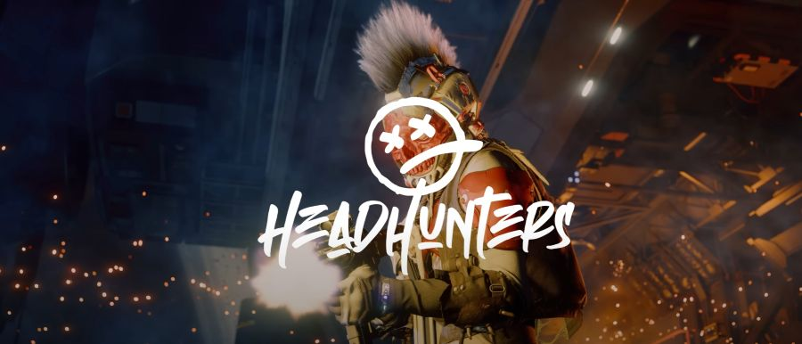
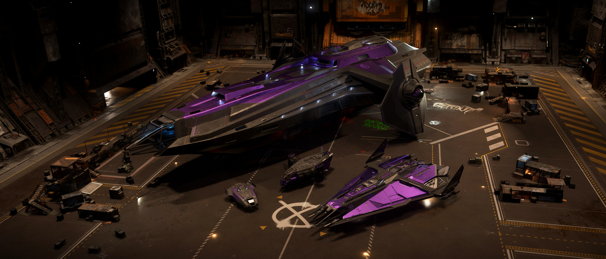

## People of Pyro - Head Hunter

ในโลกที่ไร้กฎหมายของระบบ Pyro มีชื่อหนึ่งที่ทุกคนต้องระวัง: **Head Hunter** กลุ่มนักล่าหัวอิสระที่ไม่ขึ้นกับใคร และเชื่อมั่นในพลังของตัวเองเหนือทุกสิ่ง

### จุดกำเนิดของนักล่า

Head Hunter ไม่ใช่แก๊งในความหมายดั้งเดิม พวกเขาไม่มีหัวหน้า ไม่มีโครงสร้างองค์กรที่ตายตัว สิ่งเดียวที่ผูกมัดพวกเขาคือปรัชญา "แข็งแกร่งเท่านั้นที่อยู่รอด" สมาชิกแต่ละคนคือมืออาชีพด้านการล่าค่าหัว นักสู้รับจ้าง และนักล่าฝีมือฉกาจที่เลือกเดินบนเส้นทางอิสระ ไม่ยึดติดกับกฎเกณฑ์หรือความภักดีต่อใคร

### ปรัชญาและวัฒนธรรม

สำหรับ Head Hunter ความสำเร็จและชื่อเสียงต้องได้มาด้วยฝีมือของตัวเอง พวกเขาดูถูกการพึ่งพาคนอื่น และมองว่าการรวมกลุ่มใหญ่คือจุดอ่อน สมาชิกแต่ละคนจึงแข่งขันกันเองอยู่ตลอดเวลา เพื่อพิสูจน์ว่าใครคือผู้ล่าที่แท้จริงใน Pyro

เอกลักษณ์ของ Head Hunter คือทรงผมโมฮอว์กสุดโดดเด่นและชุดเกราะสีสันจัดจ้าน สะท้อนความกล้าท้าทายและความเป็นตัวของตัวเองแบบสุดขั้ว ใครเห็นก็รู้ทันทีว่ากำลังเผชิญหน้ากับนักล่าหัวตัวจริง

### บทบาทใน Pyro และ Star Citizen

Head Hunter คือกลุ่มที่รับงานล่าค่าหัวและภารกิจเสี่ยงตายที่ไม่มีใครกล้ารับ พวกเขาเชี่ยวชาญการต่อสู้ทั้งระยะประชิดและระยะไกล ไม่ลังเลที่จะกำจัดเป้าหมายเพื่อเงินรางวัลและชื่อเสียงในโลกใต้ดินของ Pyro

ในเกม Star Citizen ผู้เล่นอาจพบ Head Hunter ได้ทั้งในฐานะคู่แข่งในการล่าค่าหัว หรือแม้แต่กลายเป็นเป้าหมายของพวกเขาเอง หากชื่อเสียงหรือค่าหัวของคุณสูงพอ

### การปะทะและสิ่งที่ต้องระวัง

การเผชิญหน้ากับ Head Hunter ไม่ใช่เรื่องเล่นๆ พวกเขาไม่ลังเลที่จะใช้ทุกวิธีเพื่อชัยชนะ ไม่ว่าจะเป็นการซุ่มโจมตี การลอบสังหาร หรือการต่อสู้ซึ่งหน้า หากคุณเห็นใครใน Pyro ที่ใส่เกราะสีสดและผมโมฮอว์ก—จงเตรียมตัวให้พร้อม เพราะคุณอาจกำลังตกเป็นเป้าหมายรายต่อไป

> **ข้อควรรู้:** ใน Pyro ไม่มีใครปลอดภัยจาก Head Hunter ถ้าคุณมีค่าหัวสูงหรือสร้างศัตรูไว้มาก เตรียมรับมือกับการถูกล่าได้ทุกเมื่อ!



Head Hunter คือสัญลักษณ์ของความอิสระ ความท้าทาย และการเอาตัวรอดในโลกที่โหดร้าย พวกเขาอาจเป็นแรงบันดาลใจให้กับผู้ที่เชื่อมั่นในตัวเอง หรือเป็นฝันร้ายของผู้ที่ประมาทใน Pyro คุณจะเลือกเป็นนักล่าหรือเหยื่อ? ทางเลือกอยู่ในมือคุณแล้ว!