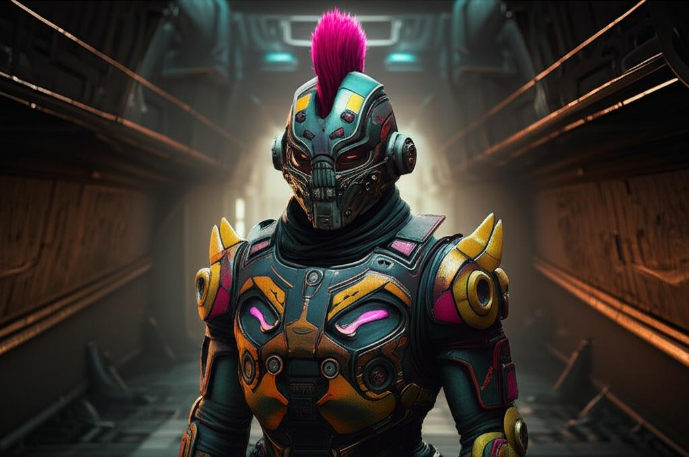

ในดินแดนเถื่อนอย่างระบบสุริยะ Pyro ที่ซึ่งแก๊งต่างๆ ปกครองด้วยกฎของตัวเอง มีกลุ่มหนึ่งที่โดดเด่นออกมาด้วยปรัชญาที่แตกต่างและอันตรายอย่างยิ่ง พวกเขาคือ **Head Hunter** เหล่านักล่าหัวอิสระที่เชื่อมั่นในฝีมือของตัวเองมากกว่าการรวมกลุ่ม 🎯

## ใครคือ Head Hunter?

Head Hunter ไม่ใช่แก๊งในความหมายดั้งเดิม พวกเขาไม่มีโครงสร้างการปกครองที่ชัดเจน ไม่มีหัวหน้าใหญ่ และไม่ได้ยึดติดกับอุดมการณ์ร่วมกันเหมือนแก๊งอื่นๆ สิ่งที่ผูกมัดพวกเขาไว้ด้วยกันคือความเชื่อมั่นอย่างแรงกล้าว่า "ความแข็งแกร่งที่แท้จริงมาจากตัวบุคคล ไม่ใช่จำนวนคน" พวกเขามองว่าการพึ่งพาคนอื่นคือความอ่อนแอ

สมาชิก Head Hunter คือยอดฝีมือด้านการต่อสู้และการล่าค่าหัว พวกเขามักจะรับงานที่อันตรายและท้าทายที่สุด งานที่แก๊งอื่นปฏิเสธเพราะเสี่ยงเกินไป แต่สำหรับ Head Hunter มันคือโอกาสในการพิสูจน์ตัวเองและสร้างชื่อเสียง พวกเขามีชื่อเสียงในด้านความโหดเหี้ยมและไม่เคยลังเลที่จะกำจัดเป้าหมายเพื่อเงินรางวัล 💰

เอกลักษณ์ที่โดดเด่นของพวกเขาคือทรงผมโมฮอว์ก (Mohawk) และชุดเกราะสีสันสดใสที่ดูเหมือนหลุดมาจากหนังยุค 80s ซึ่งเป็นสัญลักษณ์ของการประกาศตัวตนและความไม่เกรงกลัวใคร

## ฐานที่มั่น: Ruin Station

บ้านของเหล่า Head Hunter คือ **Ruin Station** สถานีอวกาศที่ผุพังและเต็มไปด้วยอันตราย ที่นี่เปรียบเสมือนสนามประลองที่เปิดตลอด 24 ชั่วโมง ที่ซึ่งนักล่าหัวสามารถทดสอบฝีมือ สู้กันเอง หรือรับงานใหม่ๆ ได้ตลอดเวลา บรรยากาศใน Ruin Station นั้นตึงเครียดและคาดเดายาก เพราะทุกคนที่นั่นคือคู่แข่งที่พร้อมจะหักหลังกันได้ทุกเมื่อเพื่อผลประโยชน์

สำหรับผู้เล่นอย่างเรา การเผชิญหน้ากับ Head Hunter ใน Pyro ถือเป็นเรื่องที่ต้องระวังตัวเป็นพิเศษ พวกเขาอาจจะเป็นคู่แข่งในการล่าค่าหัวคนเดียวกัน หรือเราอาจจะกลายเป็นเป้าหมายของพวกเขาเสียเอง หากค่าหัวของเราสูงพอที่จะล่อใจนักล่าฝีมือดีเหล่านี้ 🔥

> **💡 คำแนะนำสำหรับชาว Verse:** เมื่ออยู่ใน Pyro ถ้าคุณเห็นใครใส่เกราะสีเจ็บๆ พร้อมกับผมทรงโมฮอว์ก จงเตรียมตัวให้พร้อม! พวกเขาไม่ใช่แค่นักเลงธรรมดา แต่อาจเป็น Head Hunter ที่กำลังมองหาเหยื่อรายต่อไป... และเหยื่อรายนั้นอาจเป็นคุณก็ได้ 💥