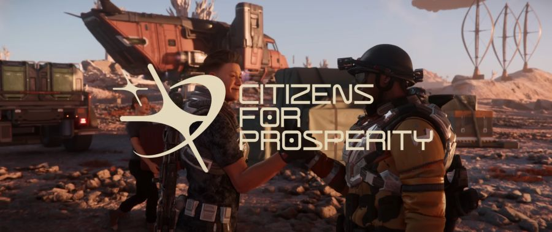
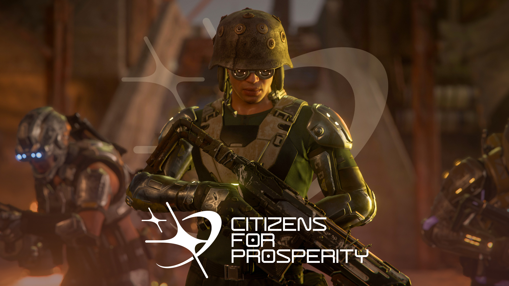

## People of Pyro - Citizen for Prosperity

ในดินแดน Pyro ที่ขึ้นชื่อเรื่องความโกลาหลและอันตราย ยังมีแสงแห่งความหวังที่ชื่อว่า **Citizen for Prosperity (CfP)** กลุ่มพลเรือนผู้กล้าหาญที่ลุกขึ้นมาต่อสู้กับอิทธิพลของอาชญากรรม เพื่อสร้างอนาคตใหม่ให้กับระบบนี้

### จุดเริ่มต้นของความหวัง

Citizen for Prosperity ไม่ได้ถือกำเนิดจากอำนาจหรือความมั่งคั่ง แต่เกิดจากความสูญเสียและความหวัง Madge "Dash" Hartford ผู้ก่อตั้ง CfP สูญเสียเพื่อนรักจากเหตุการณ์ความรุนแรงระหว่างแก๊งใน Pyro เธอจึงรวมกลุ่มพลเรือนที่มีอุดมการณ์เดียวกัน ลุกขึ้นมาต่อสู้กับความไร้ระเบียบและอาชญากรรม เป้าหมายของ CfP คือการสร้าง Pyro ให้เป็นบ้านที่ปลอดภัยสำหรับทุกคน ไม่ใช่แค่สนามรบของเหล่าอาชญากร

### ปรัชญาและแนวคิด

CfP เชื่อว่าการเปลี่ยนแปลงที่แท้จริงต้องเริ่มจากรากฐานของสังคม พวกเขาสนับสนุนการสร้างชุมชนที่เข้มแข็ง การศึกษา และการลงทุนในโครงสร้างพื้นฐาน เพื่อให้พลเรือนสามารถใช้ชีวิตได้อย่างปกติใน Pyro แม้จะต้องเผชิญกับอันตรายรอบด้าน CfP ยังเชื่อว่าความร่วมมือระหว่างพลเรือนและภาคธุรกิจจะช่วยผลักดัน Pyro ให้พ้นจากวงจรความรุนแรงและความยากจน 🤝

### การขยายอิทธิพลและนิคมสำคัญ

ฐานปฏิบัติการหลักของ CfP อยู่ที่ดาว Bloom (Pyro III) ซึ่งเป็นศูนย์กลางของการสร้างนิคมใหม่และการฟื้นฟู Pyro ให้กลับมามีชีวิตชีวาอีกครั้ง นอกจาก Bloom แล้ว CfP ยังขยายอิทธิพลไปยังจุดยุทธศาสตร์ต่าง ๆ เช่น Monox, Ignis และ Terminus โดยแต่ละแห่งมีบทบาทสำคัญในการสนับสนุนภารกิจของ CfP ไม่ว่าจะเป็นศูนย์กลางการค้า การขนส่ง 🚚 หรือการป้องกันภัย

### บทบาทในเกม Star Citizen

ในโลกของ Star Citizen ผู้เล่นจะได้พบกับ CfP ผ่านภารกิจที่หลากหลาย ตั้งแต่การคุ้มกันขบวนสินค้า 🚚 การช่วยเหลือชุมชนที่ถูกคุกคาม ไปจนถึงการต่อสู้กับกลุ่มโจรและอาชญากร CfP พร้อมต้อนรับทุกคนที่ต้องการร่วมสร้างอนาคตใหม่ให้กับ Pyro ไม่ว่าคุณจะเป็นนักผจญภัย นักขนส่ง หรือผู้พิทักษ์กฎหมาย การสร้างชื่อเสียงกับ CfP จะเปิดโอกาสให้ผู้เล่นเข้าถึงทรัพยากรพิเศษและได้รับความไว้วางใจจากชุมชน

### ผู้นำและโครงสร้างองค์กร

Madge "Dash" Hartford คือหัวใจของ CfP เธอเป็นผู้นำที่ได้รับความเคารพและศรัทธาจากสมาชิกทุกคน โครงสร้างองค์กรของ CfP เน้นความโปร่งใสและการมีส่วนร่วมของสมาชิก ทุกคนมีสิทธิ์แสดงความคิดเห็นและมีบทบาทในการตัดสินใจที่สำคัญ CfP ยังเปิดรับสมาชิกใหม่ที่มีอุดมการณ์เดียวกัน ไม่ว่าจะมาจากระบบไหนหรือมีภูมิหลังอย่างไร 🌈

### ความท้าทายและอนาคต

แม้ CfP จะมีเป้าหมายที่สูงส่ง แต่เส้นทางก็เต็มไปด้วยอุปสรรค พวกเขาต้องเผชิญกับกลุ่มอาชญากรรมที่ทรงอิทธิพลใน Pyro รวมถึงความไม่ไว้วางใจจากบางฝ่ายที่มองว่าการเปลี่ยนแปลงเป็นไปไม่ได้ อย่างไรก็ตาม CfP ยังคงเดินหน้าด้วยความหวังและความมุ่งมั่น 💪 เพราะพวกเขาเชื่อว่าทุกคนมีสิทธิ์ในความปลอดภัยและความเจริญ ไม่ใช่แค่การเอาตัวรอดในโลกที่โหดร้าย

> **ข้อควรรู้:** Citizen for Prosperity คือสัญลักษณ์ของความหวัง ✨ ความร่วมมือ และการไม่ยอมแพ้ใน Pyro พวกเขาเชื่อว่าการเปลี่ยนแปลงที่แท้จริงต้องเริ่มจากคนธรรมดา



Citizen for Prosperity ไม่ใช่แค่กลุ่มหนึ่งใน Pyro แต่คือแรงบันดาลใจให้ทุกคนลุกขึ้นมาสร้างความเปลี่ยนแปลงในดินแดนที่ใคร ๆ ก็เคยคิดว่าไร้ความหวัง คุณจะเลือกยืนข้าง CfP เพื่ออนาคตที่ดีกว่า หรือจะเดินเส้นทางของตัวเองในจักรวาล Star Citizen? ทางเลือกอยู่ในมือคุณแล้วครับ