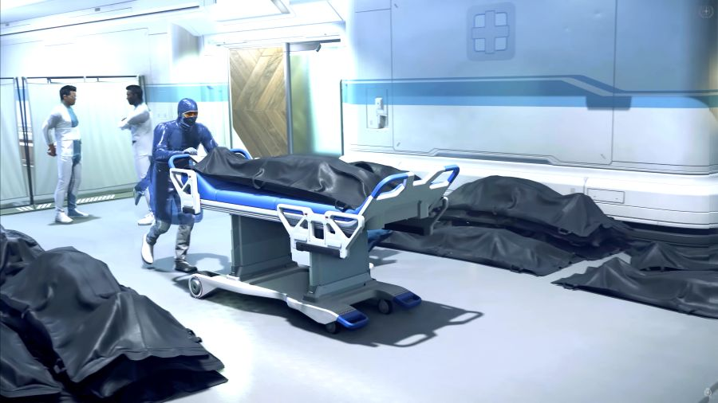
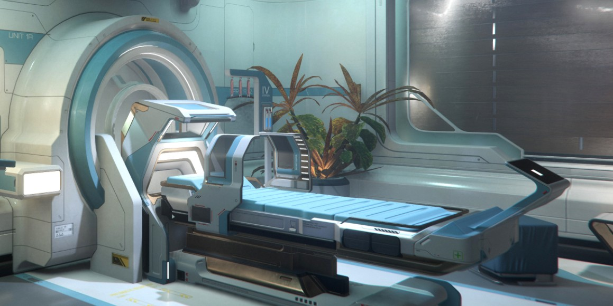
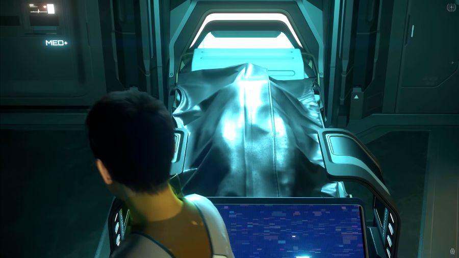
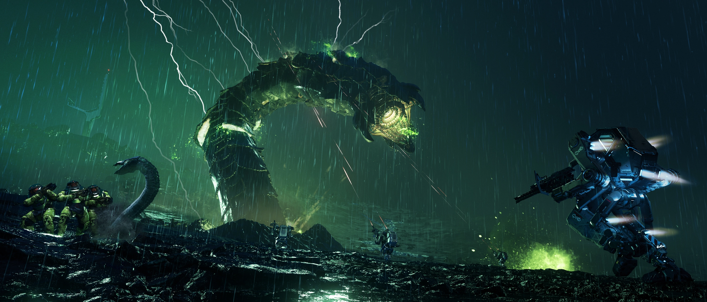
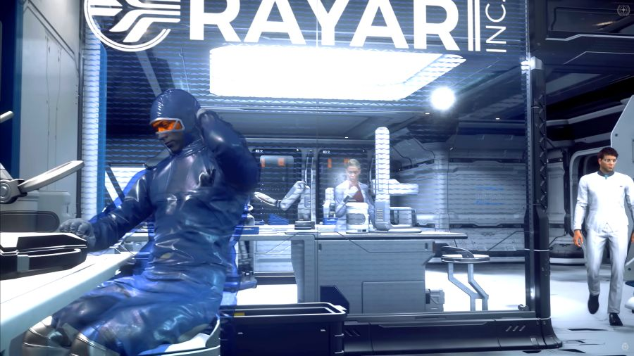
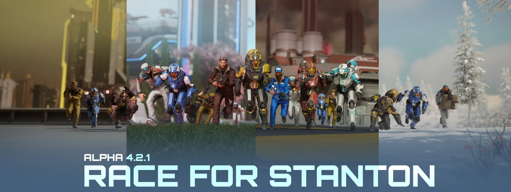

สวัสดีครับเพื่อน ๆ ชาว Star Citizen ทุกคน!

ใครที่อยู่ในจักรวาลแห่งนี้คงจะทราบกันดีว่าคำสัญญาแห่งศตวรรษที่ 30 คือ "ชีวิตอันเป็นนิรันดร์" สำหรับพลเมืองแห่ง United Empire of Earth (UEE) ความตายไม่ใช่จุดสิ้นสุดอีกต่อไป แต่เป็นเพียงอาการป่วยราคาแพงที่รักษาได้ เทคโนโลยีที่เรียกว่า "Regeneration" หรือ "regen" คือรากฐานสำคัญของโลกยุคใหม่ ที่สามารถชุบชีวิตคนให้ฟื้นจากความตายได้พร้อมกับความทรงจำและตัวตนที่ครบถ้วน แม้ว่าการทำ "Imprint" (พิมพ์เขียวชีวภาพ) แบบถาวรจะต้องใช้เงินเก็บทั้งชีวิต แต่มันก็คือการซื้อโอกาสครั้งที่สอง...ได้ไม่รู้จบ

แต่ยุคทองแห่งความกึ่งอมตะนั้นได้พังทลายลงแล้ว ในปี 2955 นี้ UEE กำลังเผชิญกับวิกฤตการณ์ครั้งใหญ่ที่เรียกว่า "Regen Crisis" ซึ่งเป็นความล้มเหลวเป็นวงกว้างขวาง ของเทคโนโลยีที่เคยให้คำมั่นสัญญาถึงชีวิตนิรันดร์ สิ่งที่เริ่มต้นจากเหตุการณ์เล็กๆ ได้บานปลายเป็นการโกลาหลครั้งใหญ่ที่สั่นสะเทือนรากฐานของจักรวรรดิ และนี่ไม่ใช่แค่เนื้อเรื่องเสริม แต่มันคือเส้นเรื่องหลักที่กำลังขับเคลื่อนจักรวาล Star Citizen ที่เราอยู่ และเชื้อเชิญให้ผู้เล่นทุกคนเข้ามามีส่วนร่วมโดยตรง

## ต้นตอของวิกฤต: เมื่อเทคโนโลยีทรยศ

หากจะเข้าใจวิกฤตครั้งนี้ เราต้องย้อนกลับไปดูที่มาของเทคโนโลยี Regeneration กันก่อนครับ เทคโนโลยีนี้ไม่ได้มาจากองค์ความรู้ของมนุษย์ทั้งหมด แต่เป็นการผสมผสานระหว่างเทคโนโลยีการสแกนชีวภาพของเอเลี่ยนที่เก็บกู้มาในปี 2932 และข้อมูลสำคัญเกี่ยวกับกระบวนการหลักของเทคโนโลยีจากเผ่า Vanduul ที่กองทัพ UEE ยึดมาได้ในปี 2946

หัวใจของระบบนี้คือ **Imprint** ซึ่งไม่ใช่แค่การสแกน DNA แต่เป็นการเก็บข้อมูลชีวภาพทั้งหมด ทั้งความทรงจำ ความคิด และบุคลิกภาพ ณ ช่วงเวลาหนึ่ง ข้อมูลนี้จะถูกเก็บไว้ในอุปกรณ์ที่เรียกว่า **Ibrahim Sphere** ซึ่งได้แรงบันดาลใจจากเทคโนโลยีของ Vanduul เมื่อเจ้าของ Imprint เสียชีวิต ข้อมูลจาก Sphere จะถูกส่งไปยังเครื่องพิมพ์ชีวภาพของบริษัท **BiotiCorp** เพื่อสร้างร่างกายใหม่ที่แทบจะเหมือนเดิมทุกประการ

แต่เทคโนโลยีนี้ก็มีจุดบกพร่องที่สำคัญที่เรียกว่า **Traumatic Response Echos (TREs)** การบาดเจ็บรุนแรงหรือการตายอย่างทุกข์ทรมานจะทิ้ง "ร่องรอย" ไว้บน Imprint ซึ่งจะปรากฏเป็นแผลเป็น แขนขาไซเบอร์เนติก หรือแม้กระทั่งความเสียหายทางระบบประสาทบนร่างกายใหม่ เมื่อตายซ้ำๆ ร่องรอยเหล่านี้จะสะสมมากขึ้น ทำให้ค่าความเสถียรของ Imprint หรือ **Imprint Viability Score (IVS)** ลดลงเรื่อยๆ และหากค่า IVS ต่ำเกินไป การฟื้นคืนชีพก็จะล้มเหลวและนำไปสู่ "ความตายที่แท้จริง" (true death)

น่าสนใจนะครับว่าทีมพัฒนาเกม (CIG) ได้วางรากฐานของความล้มเหลวนี้ไว้ในเนื้อเรื่องตั้งแต่แรกแล้ว วิกฤตการณ์ที่เกิดขึ้นจึงไม่ใช่การเขียนบทแบบด้นสด แต่เป็นการเปิดใช้งานจุดอ่อนที่มีอยู่แล้วอย่างจงใจ เพื่อปูทางไปสู่ระบบเกมที่ทุกคนรอคอย นั่นคือ **"Death of a Spaceman"**

> อ่านต่อ: [**ความตายของนักบินอวกาศ (Death of a Spaceman)**](../death-of-a-spaceman/)

## ลำดับเหตุการณ์แห่งหายนะ

ความล่มสลายนี้เกิดขึ้นอย่างรวดเร็วในช่วงไม่กี่เดือนของปี 2955:

*   **มีนาคม 2955:** เกิดเหตุระเบิดครั้งใหญ่ใจกลางเมือง New Austin บนดาว Terra สิ่งที่น่าตกใจคือ เหยื่อจำนวนมากที่มี Imprint กลับไม่สามารถฟื้นคืนชีพได้
*   **เมษายน 2955:** ความกลัวลุกลามเป็นความโกลาหล เมื่อ BiotiCorp หนึ่งในผู้บุกเบิกเทคโนโลยี ออกมายอมรับว่า Regeneration กำลังล้มเหลวสำหรับ "ประชากรส่วนใหญ่" เนื่องจาก "ปัจจัยที่ไม่ทราบสาเหตุ" ประชาชนต่างหลั่งไหลไปยังโรงพยาบาลเพื่อเรียกร้องคำตอบ Imperator Laylani Addison ได้ประกาศให้มีการวิจัยทางวิทยาศาสตร์ครั้งใหญ่เพื่อแก้ไขวิกฤตนี้
*   **มิถุนายน 2955:** มีผู้แจ้งเบาะแสซึ่งเป็นอดีตพนักงานของบริษัท Associated Sciences & Development (ASD) ออกมาแฉว่าบริษัทกำลังทำการทดลองที่ผิดกฎหมายและไร้จริยธรรม
*   **กรกฎาคม 2955:** เมื่อการวิจัยไม่คืบหน้า Imperator Addison จึงได้เปิดตัวโครงการ **"Second Life Resource Drive"** เพื่อระดมพลเรือนให้ช่วยกันหาวัตถุดิบหายากที่จำเป็นต่องานวิจัย และนี่คือจุดที่ผู้เล่นอย่างเราได้ก้าวเข้ามามีบทบาทสำคัญในเนื้อเรื่อง

## เบื้องลึกเบื้องหลัง: แผนลับและทางเลือกของผู้เล่น

เรื่องราวได้แยกออกเป็นสองเส้นทางคู่ขนานกันไป ทางหนึ่งคือภารกิจของรัฐบาล UEE ที่ดูเหมือนจะดีงาม และอีกทางหนึ่งคือแผนการลับสุดดำมืดที่อาจเชื่อมโยงกันอย่างน่าสงสัย

การสืบสวนชี้ไปที่บริษัท ASD ซึ่งแอบไปทำการวิจัยภายใต้ชื่อรหัส **"Second Life Initiative"** ในระบบสุริยะนอกกฎหมายอย่าง Pyro พวกเขาใช้วิธีที่โหดร้ายโดยการสังหารสิ่งมีชีวิตพื้นถิ่นที่เรียกว่า Valakkar เพื่อเก็บไข่มุกกัมมันตรังสีของมัน บันทึกเสียงที่กู้คืนมาได้เผยว่าฝุ่นจากไข่มุกนี้อาจช่วยแก้ปัญหาความเสื่อมของ Imprint ได้

ในขณะเดียวกัน รัฐบาล UEE ก็ได้เปิดตัวโครงการระดมทรัพยากร **"Second Life Resource Drive"** ซึ่งเป็นชื่อเดียวกับโครงการลับของ ASD อย่างน่าประหลาด นี่ทำให้เกิดคำถามที่น่าคิดว่า รัฐบาลอาจรู้เห็นเป็นใจ หรือกระทั่งสนับสนุนการวิจัยที่ไร้มนุษยธรรมนี้อยู่เบื้องหลังหรือไม่? และทรัพยากรที่เราหามาอย่างยากลำบากกำลังถูกนำไปใช้เพื่อการกุศลจริงๆ หรือเป็นเพียงส่วนหนึ่งของแผนการที่ซับซ้อนและดำมืดกว่านั้น?

### "Race for Stanton": ถึงเวลาที่คุณต้องเลือกข้าง

อีเวนต์ "Second Life Resource Drive" ได้กลายเป็นกิจกรรมหลักในเกม Alpha 4.2.1 ที่เรียกว่า **"Race for Stanton"** ผู้เล่นถูกขอให้เลือกสนับสนุนหนึ่งในสี่บริษัทยักษ์ใหญ่แห่งระบบ Stanton ได้แก่ Hurston Dynamics, ArcCorp, microTech, และ Crusader Industries

แต่ละบริษัทก็มีภาพลักษณ์และแนวทางที่แตกต่างกัน:

*   **Hurston Dynamics:** บริษัทผลิตอาวุธเผด็จการที่ขึ้นชื่อเรื่องสัญญาแรงงานทาส แม้จะดูเป็น "ตัวร้าย" ที่สุด แต่ของรางวัลสีดำ-เหลืองสุดเท่ของพวกเขาก็ได้รับความนิยมอย่างล้นหลาม
*   **ArcCorp:** บริษัทยักษ์ใหญ่สายทุนนิยมสุดขั้ว ที่มองว่าความโกลาหลคือโอกาส เหมาะสำหรับผู้เล่นสาย "ทำทุกอย่างเพื่อผลกำไร"
*   **microTech:** บริษัทนวัตกรรมไฮเทคที่นำเสนอภาพลักษณ์แห่งความหวังและการกอบกู้มนุษยชาติด้วยวิทยาศาสตร์
*   **Crusader Industries:** ผู้ผลิตยานรายใหญ่ที่เน้นภาพลักษณ์ความปลอดภัยและความน่าเชื่อถือ

การเลือกข้างครั้งนี้จึงเป็นการตัดสินใจที่ซับซ้อนระหว่างการเล่นตามบทบาท (lore) กับผลประโยชน์ในเกม (loot) ซึ่งเป็นบทพิสูจน์ที่น่าสนใจว่าผู้เล่นให้ความสำคัญกับอะไรมากกว่ากัน

### อนาคตที่รออยู่: การมาถึงของ "Death of a Spaceman"

ท้ายที่สุดแล้ว วิกฤตการณ์ Regen ทั้งหมดนี้คือการปูทางอย่างมีชั้นเชิงไปสู่การนำระบบ **"Death of a Spaceman" (DOASM)** เข้ามาในเกม แทนที่จะประกาศการเปลี่ยนแปลงกฎของเกมผ่าน Patch Note ธรรมดาๆ CIG กลับเลือกที่จะให้เรา "ใช้ชีวิต" ผ่านเหตุการณ์ประวัติศาสตร์ที่ทำให้การเปลี่ยนแปลงนี้มีความหมาย

เมื่อระบบ DOASM มาถึง ความตายจะส่งผลกระทบอย่างถาวร ตัวละครจะแก่ลง, มีแผลเป็นหรืออวัยวะจักรกลติดตัว, และท้ายที่สุดคือ "ความตายที่แท้จริง" ที่ทรัพย์สินและชื่อเสียงจะถูกส่งต่อไปยังทายาท

วิกฤตครั้งนี้ทำให้เราเห็นว่า CIG กล้าหาญและสร้างสรรค์แค่ไหนในการเล่าเรื่อง พวกเขากำลังสร้างประวัติศาสตร์ไปพร้อมกับเรา และให้ผู้เล่นเป็นผู้กำหนดผลลัพธ์ ยุคสมัยแห่งการใช้ชีวิตโดยไม่ต้องกลัวผลที่ตามมาได้สิ้นสุดลงแล้ว ชีวิตในจักรวาลแห่งนี้กำลังจะอันตรายขึ้น เปราะบางขึ้น และในขณะเดียวกัน **ชีวิต** มันก็จะมีความหมายมากขึ้น

## อ้างอิง (References)
* [Far From Home: Regen Contemplation](https://robertsspaceindustries.com/en/comm-link/spectrum-dispatch/18386-Far-From-Home-Regen-Contemplation)
* [Loremaker's Guide to Regeneration](https://robertsspaceindustries.com/en/comm-link/spectrum-dispatch/18327-Loremakers-Guide-To-Regeneration)
* [Alpha 4.2.1: Race For Stanton](https://robertsspaceindustries.com/en/comm-link/transmission/20651-Alpha-421-Race-For-Stanton)
* [Star Citizen Alpha 4.2 Patch Notes](https://robertsspaceindustries.com/en/comm-link/Patch-Notes/20638-Star-Citizen-Alpha-42)
* [Star Citizen: Death of a Spaceman - A Gameplay Systems Deep Dive](https://www.youtube.com/watch?v=EGl09G4AMfY)
* [Star Citizen's Regen Crisis Explained](https://www.youtube.com/watch?v=p2zfDzl0YZU)
