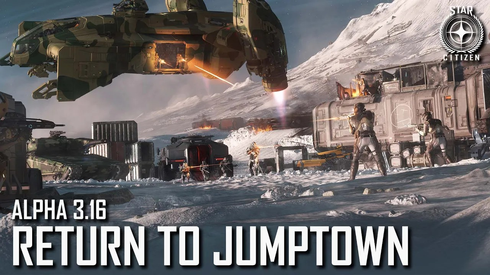

ถ้าพูดถึงอีเวนต์ที่ดุเดือดและเป็นตำนานที่สุดใน Star Citizen ชื่อของ "Jump Town" ต้องโผล่ขึ้นมาเป็นอันดับแรกๆ แน่นอนครับ 🚀❄️ ที่นี่คือสมรภูมิ PvP ขนาดใหญ่ที่ผู้เล่นจากทั่วทุกสารทิศจะแห่มารวมตัวกัน ไม่ว่าจะมาในฐานะผู้แสวงโชคที่หวังจะรวยทางลัด หรือในฐานะโจรสลัดที่คอยดักปล้นชิงของ!

## Jump Town คืออะไร?

Jump Town คือชื่อเรียกของ Outpost หรือฐานที่ตั้งผิดกฎหมายบนดวงจันทร์ต่างๆ (เช่น Yela) 🌑 ซึ่งเป็นที่ตั้งของ "เครื่องผลิตยาเสพติด" ที่จะปล่อยกล่องสินค้ามูลค่าสูงที่ชื่อว่า "Maze" ออกมาให้เราเก็บไปแบบฟรีๆ 📦

เป้าหมายของผู้เล่นทุกคนนั้นเรียบง่ายมาก: คือการเข้าไปเก็บกล่อง Maze ให้ได้มากที่สุด เพื่อเอาไปแลกเป็นเงิน aUEC จำนวนมหาศาล 💸 แต่แน่นอนว่าหนทางสู่ความรวยนั้นไม่ได้โรยด้วยกลีบกุหลาบ เพราะใครๆ ก็อยากได้ของเหมือนกัน! 💥

> **หมายเหตุ:** 🕒 Jump Town จะเปิดให้เล่นเฉพาะช่วงที่มีอีเวนต์เท่านั้น ไม่ได้เปิดตลอดเวลา หากไม่มีประกาศอีเวนต์จากทางเกม ฐานนี้จะกลายเป็นแค่แหล่งผลิตยา ที่เราต้องเสียเงินซื้อไปขายทำกำไรเอง

## รูปแบบการเล่น: เสี่ยงสูง ผลตอบแทนงาม ⚔️

Jump Town คือสนามเด็กเล่นของความโกลาหลโดยแท้จริง ผู้เล่นจะแบ่งเป็นสองฝั่งหลักๆ โดยธรรมชาติ:

1.  **ฝ่ายขนของ (The Haulers):** 🚚 คือกลุ่มผู้เล่นที่พยายามจะเข้าไปควบคุมพื้นที่รอบๆ เครื่องผลิตยา เก็บกล่อง Maze ขึ้นยาน แล้วบินหนีไปขายให้เร็วที่สุด กลุ่มนี้ต้องมีการวางแผนที่ดี ทั้งการคุ้มกันทางอากาศและการป้องกันบนภาคพื้นดิน
2.  **ฝ่ายปล้น (The Pirates):** 🏴‍☠️ คือกลุ่มผู้เล่นที่ไม่อยากเหนื่อยเก็บของเอง แต่จะใช้วิธีซุ่มโจมตี ดักยิงยานที่กำลังขนของ หรือบุกเข้ายึดพื้นที่เพื่อชิงกล่อง Maze มาเป็นของตัวเอง เป็นสายที่เน้นการต่อสู้เป็นหลัก

ความสนุกของ Jump Town คือการที่เราไม่รู้เลยว่าจะเจอกับอะไรบ้าง บางทีอาจจะเจอ Org ใหญ่ที่ยกกองทัพมาคุมพื้นที่ หรืออาจจะเป็นการต่อสู้ขนาดย่อมที่ชิงไหวชิงพริบกันตลอดเวลา

### Mission สำหรับคนดี 🫡

ถ้าเป็นคนดี เราสามารถเลือกรับ Contract จากทางการ เผื่อเข้าไปเก็บ Maze มาคืนที่สถานีวงโคจรเพื่อให้ทางการ "ทำลายทิ้ง" โดยมีค่าตอบแทนให้

สายคนดีก็จะสบายหน่อย เพราะตอนขนของลง ก็ขนได้สบายๆ ใน Hangar ของสถานี ไม่ต้องกลัวใครจะมาแย่งไป

### Mission สำหรับคนเทาๆ 😈

สำหรับสาย Pirate หรือ Hauler ที่อยากได้เงินเยอะขึ้น เราสามารถเอา Maze ไปขายที่ terminal แดงตามที่ต่างๆ ได้เหมือนของผิดกฏหมายทั่วไป เช่น Grim HEX หรือ Salvage Output อันนี้ก็ต้องระวังตัวกันหน่อย เพราะอาจจะโดนดักปล้นได้อีกทีตอนขายของ

## เคล็ดลับสู่ความสำเร็จ (หรือเอาตัวรอด)

การลุยเดี่ยวใน Jump Town เปรียบเหมือนการเดินเข้าดงเสือครับ โอกาสรอดน้อยมาก นี่คือคำแนะนำเล็กๆ น้อยๆ:

*   **รวมกันเราอยู่:** 👥 อย่าไปคนเดียว! ชวนเพื่อนหรือหา Org (องค์กร/กิลด์) ไปด้วยกัน การมีทีมเวิร์คสำคัญที่สุด แบ่งหน้าที่กันให้ชัดเจน เช่น ทีมคุ้มกันทางอากาศ (Air Cover), ทีมภาคพื้นดิน (Ground Team)
*   **เลือกยานให้ถูก:** 🛩️ ควรมียานรบเพื่อครองน่านฟ้า (เช่น Gladius, Arrow) และยานขนส่งสำหรับแบกกล่อง Maze (เช่น Cutlass Black, C2 Hercules) รถภาคพื้นดินอย่าง Ursa Rover ก็ช่วยได้มากในการบุกเข้ายึดพื้นที่
*   **เตรียมตัวให้พร้อม:** 🦺 พกปืนดีๆ เกราะหนาๆ และ MedPen ไปให้พร้อมเสมอ เพราะคุณจะได้ใช้มันแน่นอน
*   **สื่อสารกันตลอดเวลา:** 🎧 ใช้ Voice chat ในการสื่อสารกับทีม จะช่วยให้คุณตอบสนองต่อสถานการณ์ที่เปลี่ยนแปลงอย่างรวดเร็วได้ดีขึ้น



## บทสรุป

Jump Town ไม่ใช่แค่สถานที่หาเงิน แต่เป็นบทพิสูจน์ของทีมเวิร์ค ทักษะการบิน และการเล่น FPS Gameplay ที่แท้จริง มันคือประสบการณ์สุดยอดที่ชาว Citizen ทุกคนควรไปลองสัมผัสสักครั้ง! 🌟
