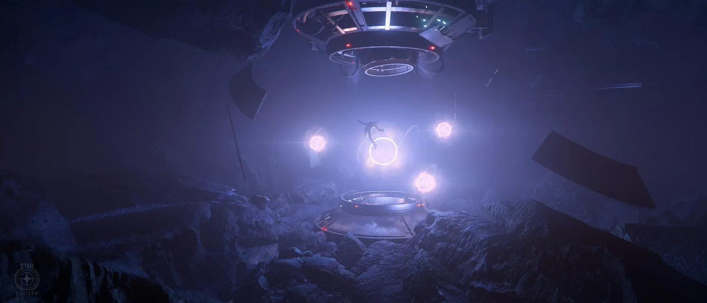

# สรุป Monthly Update เดือน ก.ค. 68

## AI ฉลาดขึ้น
ฝั่ง AI เน้นทำให้จักรวาลมีชีวิตชีวาขึ้น NPC จะมีบทพูดและพฤติกรรมตามสถานการณ์มากขึ้น (เช่นในร้านค้า) ส่วน AI ต่อสู้ก็ถูกปรับปรุงให้เก่งขึ้น ทั้งการโจมตีระยะประชิด (ผลัก), การทำงานเป็นทีม (ยิงคุ้มกัน), และมีบอสใหม่กำลังอยู่ในช่วงทดสอบครับ

## Art & Ships
- **Anvil Paladin:** อยู่ในช่วง Greybox review เจอปัญหาเรื่องการติดตั้งป้อมปืนด้านข้างนิดหน่อย แต่กำลังปรับแก้เพื่อให้เล่นได้สนุกและยังตรงคอนเซ็ปต์เดิม
- **Drake Ironclad:** ปรับปรุงทางเดินภายในยานใหม่ ทั้งลิฟต์และบันได เพื่อให้เดินทางในยานได้เร็วขึ้น ส่วนรุ่น Ironclad Assault ก็เข้าสู่ช่วง Whitebox แล้ว
- **RSI Meteor:** ปล่อยเข้า PU ให้เราได้ขับกันแล้ว! มาพร้อมกับการปรับปรุงภายในของยาน Mantis ใหม่ทั้งหมด
- **RSI Apollo (Medivac & Triage) และ RSI Perseus:** กำลังอยู่ในขั้นตอนสุดท้ายของการเก็บรายละเอียดแล้ว
- **Drake Kraken:** อยู่ในช่วงเตรียมการผลิต มีการวางแผนจะใช้ชิ้นส่วนจาก Ironclad เพื่อเร่งความเร็วในการพัฒนา
- **ยานที่ยังไม่เปิดตัว:** มีอีก 4 ลำกำลังอยู่ในสายการผลิต ซึ่งแต่ละลำก็อยู่ในขั้นตอนที่แตกต่างกันไป ตั้งแต่ Whitebox ไปจนถึงผ่าน Gate Review แล้ว รอติดตามกันได้เลย!
- **อื่นๆ:** มีการสร้างชุดเกราะใหม่ๆ และอนิเมชันการเข้า-ออกจากยานแบบใหม่ รวมถึงอนิเมชันใบหน้าของตัวละครใหม่ๆ ด้วย

## ระบบการเล่นหลัก
ระบบการเล่นหลักมีอัปเดตสำคัญที่กระทบเราโดยตรงเยอะเลยครับ:
- **ลิฟต์ขนของ (Freight Elevators):** แก้บั๊กสำคัญๆ ไปแล้ว
- **ระบบเกิด (Spawning):** กำลังพัฒนาให้เกิดในโรงเก็บยานส่วนตัว หรือจุดที่ออกเกมล่าสุดได้
- **วิศวกรรม (Engineering):** ใกล้เข้าช่วงทดสอบ แสดงผลอุณหภูมิ Thruster บนจอได้แล้ว
- **ระบบ Loot & Inventory:** ระบบ Loot ใหม่เร็วขึ้น 2 เท่า และเริ่มพัฒนาระบบ Inventory UI ใหม่แล้ว
- **การบิน & สแกน:** ปรับปรุงระบบการบินในชั้นบรรยากาศ (Fly-by-wire) และ AI จะมีปฏิกิริยาเมื่อถูกเราสแกน
- **ระบบแฮกกิง (Hacking):** เพิ่มตัวเลือกและคำแนะนำใหม่ๆ เพื่อช่วยสอนผู้เล่นให้เข้าใจวิธีการเล่นได้ง่ายขึ้น

## ระบบคราฟต์ของและไอเทม (Crafting & Items)
- **Blueprint Library:** คาดว่าเกี่ยวกับการที่เราเก็บ Blueprint ในเกมแล้วกดใช้ มันน่าจะ register เข้าไปติดตัวเราไว้เลย
- **Item Imprint:** คาดว่าเกี่ยวกับการที่ Item ที่ craft จากคนที่มี Blueprint คุณภาพต่างกัน ก็จะมีความสามารถต่างกันไป

## ภารกิจ, เศรษฐกิจ และเนื้อเรื่อง
ด้านภารกิจและเนื้อเรื่องก็มีอัปเดตเช่นกันครับ ทีมงานกำลังนำภารกิจกลับไปใส่ในสถานที่เก่าๆ, สร้างภารกิจใหม่สำหรับ Alpha 4.3, เพิ่มกระสุนให้หาซื้อง่ายขึ้นตามร้านค้า, และเขียนเนื้อเรื่องให้ตัวละครกับสถานที่ใหม่ๆ เพื่อให้จักรวาลของเราลึกซึ้งยิ่งขึ้น

## ข่าวอื่นๆ ที่น่าสนใจ
ปิดท้ายด้วยข่าวอื่นๆ ครับ Ship Showdown เริ่มแล้ว! ส่วนทีม R&D กำลังมุ่งมั่นกับการ Optimize ประสิทธิภาพเกมเป็นหลัก (ข่าวดีมากๆ) และทีม UI/VFX ก็กำลังเตรียมเนื้อหาใหม่ๆ สำหรับแพตช์หน้ากันอยู่ครับ

---

### อ้างอิง (References)

- [Star Citizen Monthly Report July 2025 (Official)](https://robertsspaceindustries.com/en/comm-link/transmission/20724-Star-Citizen-Monthly-Report-July-2025)
