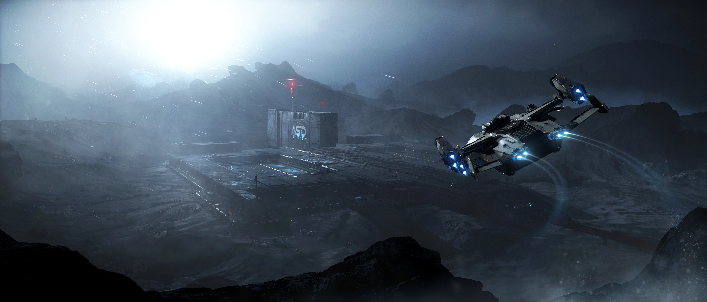

## การเปลี่ยนแปลงใน Star Citizen Alpha 4.3

Star Citizen Alpha 4.3 ได้นำการอัปเดตที่น่าสนใจมากมาย โดยเน้นที่การปรับสมดุลยานรบ, การเพิ่มส่วนประกอบใหม่ และการเปิดตัวยานใหม่ Kruger L-21 Wolf การอัปเดตครั้งนี้มีการปรับเปลี่ยนคุณสมบัติการบินของยานรบยอดนิยมหลายลำ เช่น Anvil Arrow, Aegis Gladius และ Xi'an Khartu-al โดยมีการปรับความเร็วและความคล่องแคล่ว

### ไฮไลท์สำคัญ:
- **ยานใหม่:** Kruger L-21 Wolf ยานรบใหม่ได้ถูกเพิ่มเข้ามาในจักรวาล
- **การปรับสมดุลยาน:** อัปเดตค่าพลังชีวิต (HP), ความเร็ว และความคล่องตัวของยานหลายลำ เช่น Arrow, Gladius, Hawk และ Mustang series รวมถึงการเพิ่ม HP ให้กับ 600i series อย่างมาก
- **ส่วนประกอบใหม่:** มีการเพิ่ม Missile Racks, สีลายใหม่ๆ และปืน Ballistic Gatling "Relentless L-21"
- **การปรับปรุง Flight Model:** ยานหลายลำได้รับการปรับค่า IFCS (Intelligent Flight Control System) ซึ่งส่งผลต่อความเร็ว SCM, ความเร็วสูงสุด และความเร็วในการหมุนตัว (Angular Velocity) ซึ่งเป็นจุดเน้นหลักของแพตช์นี้

---

## การเปลี่ยนแปลงของยาน (Ship Changes)

### 600i Series (600i, 600i Executive Edition, 600i Touring)
- **Hull HP:** เพิ่มขึ้นจาก 151,850 เป็น 192,250 **(+26.6%)**
- **วิเคราะห์:** การเพิ่ม HP อย่างมหาศาลทำให้ 600i ทนทานขึ้นอย่างมากในการต่อสู้ที่ยืดเยื้อ และสามารถยืนหยัดรับความเสียหายได้ดีขึ้นอย่างเห็นได้ชัด

### Anvil Arrow
- **Hull HP:** ลดลงเล็กน้อยจาก 8,680 เป็น 8,580 **(-1.15%)**
- **SCM Speed:** ลดลงเล็กน้อยจาก 232 m/s เป็น 229 m/s **(-1.3%)**
- **Max Speed:** เพิ่มขึ้นเล็กน้อยจาก 1,210 m/s เป็น 1,215 m/s **(+0.4%)**
- **Angular Velocity (Pitch/Yaw/Roll):** ปรับปรุงความคล่องตัว โดยเฉพาะ Yaw ที่เพิ่มขึ้น **+8.5%**
- **วิเคราะห์:** แม้ HP และ SCM Speed จะลดลงเล็กน้อย แต่การเพิ่มความคล่องตัว (โดยเฉพาะ Yaw) ทำให้ Arrow เป็น Dogfighter ที่อันตรายยิ่งขึ้นในระยะประชิด สามารถเปลี่ยนทิศทางและจับเป้าหมายได้เร็วกว่าเดิม

### Aegis Gladius
- **Hull HP:** ลดลงอย่างมากจาก 7,294 เป็น 6,110 **(-16.2%)**
- **Max Speed:** ลดลงจาก 1,230 m/s เป็น 1,193 m/s **(-3.0%)**
- **Angular Velocity (Pitch):** ลดลงเล็กน้อย **(-2.9%)**
- **วิเคราะห์:** การลด HP ลงอย่างมากนี้เป็นการ Nerf ที่ชัดเจน ทำให้ Gladius เปราะบางขึ้นมาก นักบินต้องใช้ความคล่องตัวที่ยังคงสูงอยู่ให้เป็นประโยชน์และหลีกเลี่ยงการรับความเสียหายตรงๆ

### Anvil Hawk
- **Hull HP:** เพิ่มขึ้นอย่างมหาศาลจาก 11,200 เป็น 16,600 **(+48.2%)**
- **Max Speed:** เพิ่มขึ้นจาก 1,175 m/s เป็น 1,217 m/s **(+3.6%)**
- **Angular Velocity (Yaw/Roll):** เพิ่มความคล่องตัวขึ้น โดยเฉพาะ Roll ที่เพิ่มขึ้น **+8.3%**
- **วิเคราะห์:** ได้รับ Buff ครั้งใหญ่! HP ที่เพิ่มขึ้นเกือบ 50% ทำให้ Hawk กลายเป็นยานที่ทนทานมาก สามารถทำภารกิจล่าค่าหัวที่มีความเสี่ยงสูงได้ดีขึ้น และยังคงความสามารถในการสร้างความเสียหายจาก EMP ได้เช่นเดิม

### Banu Defender
- **Angular Velocity (Pitch/Yaw/Roll):** เพิ่มความคล่องตัวขึ้นอย่างมาก โดยเฉพาะ Roll **(+29.8%)** และ Yaw **(+13.3%)**
- **วิเคราะห์:** การปรับปรุงความคล่องตัวนี้ทำให้ Defender สามารถหลบหลีกและจับเป้าหมายได้ดีขึ้นอย่างเห็นได้ชัด ชดเชยขนาดที่ค่อนข้างใหญ่ของมัน

### CNOU Mustang Series
- **Mustang Alpha, Beta, Delta:** เพิ่ม Hull HP ขึ้น **+14.8%** ทำให้ทนทานกว่าเดิม
- **Mustang Alpha & Beta:** เพิ่ม Max Speed ขึ้นเล็กน้อย **(+1.5%)**
- **Mustang Delta:** ลด Max Speed ลงเล็กน้อย **(-0.4%)**
- **วิเคราะห์:** Mustang รุ่นเริ่มต้นมีความน่าใช้มากขึ้นด้วย HP ที่เพิ่มขึ้น ทำให้เป็นตัวเลือกที่ดีสำหรับนักบินใหม่

### Esperia Talon & Talon Shrike
- **Hull HP:** ลดลงจาก 25,630 เป็น 24,930 **(-2.7%)**
- **Max Speed:** ลดลงจาก 1,200 m/s เป็น 1,190 m/s **(-0.8%)**
- **วิเคราะห์:** เป็นการ Nerf เล็กน้อยทั้งในด้านความทนทานและความเร็วสูงสุด อาจส่งผลให้ต้องระมัดระวังในการเข้าปะทะมากขึ้นเล็กน้อย

### Vanduul Blade
- **Hull HP:** เพิ่มขึ้นจาก 7,250 เป็น 7,950 **(+9.7%)**
- **Angular Velocity (Pitch):** เพิ่มขึ้นอย่างมีนัยสำคัญ **(+7.7%)**
- **Engineering Buff:** ได้รับ `engineeringBuffRef` ใหม่
- **วิเคราะห์:** HP ที่เพิ่มขึ้นและความคล่องตัวในการ Pitch ที่ดีขึ้น ทำให้ Blade สามารถทำ Dogfight ได้ดุดันยิ่งขึ้น สำหรับ `engineeringBuffRef` นั้นยังไม่ทราบแน่ชัดว่าใช้ทำอะไร แต่อาจเป็นสัญญาณว่าระบบ Engineering Gameplay กำลังจะมาในอนาคต

### Xi'an Khartu-al
- **Hull HP:** ลดลงเล็กน้อย **(-0.35%)**
- **Max Speed:** ลดลงจาก 1,206 m/s เป็น 1,183 m/s **(-1.9%)**
- **Angular Velocity:** ปรับเปลี่ยนความคล่องตัว โดยลด Pitch **(-10.7%)** แต่เพิ่ม Roll **(+21.8%)**
- **Afterburner:** ลดอัตราเร่ง Afterburner ในแกน Y ลง **-12.5%**
- **วิเคราะห์:** การเปลี่ยนแปลงนี้อาจทำให้สไตล์การบินของ Khartu-al เปลี่ยนไป การหลบหลีกด้วยการ Roll จะทำได้ดีขึ้น แต่การเล็งเป้าหมายด้วยการ Pitch และการใช้ Afterburner ในแนวตั้งอาจทำได้ยากขึ้นเล็กน้อย

### Anvil F7A Hornet Mk I
- **Hull HP:** เพิ่มขึ้นจาก 14,350 เป็น 16,756 **(+16.8%)**
- **วิเคราะห์:** การเพิ่ม HP ทำให้ Hornet รุ่นทหารมีความทนทานสูงขึ้นอย่างมีนัยสำคัญในการรบ ข้อน่าสังเกตคือแม้ว่า F7A Mk I จะเป็นยานรุ่นเก่าที่ไม่มีจำหน่ายแล้ว แต่ยังคงได้รับการปรับสมดุลอย่างต่อเนื่องควบคู่ไปกับยานลำอื่นๆ

### Aopoa Nox & Nox Kue
- **Hull HP:** เพิ่มขึ้นจาก 1,825 เป็น 2,231 **(+22.2%)**
- **วิเคราะห์:** การเพิ่ม HP ทำให้ยาน Grav-Lev เหล่านี้เอาตัวรอดจากการถูกยิงเฉี่ยวได้ดีขึ้นมาก

### RSI Aurora Series (All Models)
- **Afterburner Accel Multiplier (Y-axis):** ลดลง **-7.14%**
- **Afterburner Accel Multiplier (Z-axis):** เพิ่มขึ้น **+3.7%**
- **วิเคราะห์:** เป็นการปรับจูนความรู้สึกในการบิน (Flight Feel) เล็กน้อยมาก ผู้เล่นส่วนใหญ่อาจไม่รู้สึกถึงความแตกต่าง

### Tumbril Cyclone (All Models)
- **Hull HP:** เพิ่มขึ้นเล็กน้อยจาก 6,901 เป็น 6,910 **(+0.13%)**

---

## การเปลี่ยนแปลงของอาวุธและส่วนประกอบ (Weapon & Component Changes)

### อาวุธใหม่
- **Relentless L-21 (S4 Ballistic Gatling):** อาวุธใหม่ขนาด 4 สำหรับ Kruger L-21 Wolf
- **วิเคราะห์:** ปืน Gatling ขนาด 4 นี้จะสร้างแรงกดดันมหาศาลต่อเป้าหมาย แต่ต้องแลกมากับการจัดการกระสุนและความร้อน

### สีลายใหม่
- **Skullcrusher Livery:** สำหรับ Asgard, Avenger, Corsair, และ Ursa
- **Wolf Liveries:** Frost Camo, Heatsink, Riftwalker, Rosso, และ Sylvan Camo
- **Ares Star Fighter Golden Blossom Livery**
- **วิเคราะห์:** เพิ่มทางเลือกในการปรับแต่งยานให้สวยงามตามสไตล์ของแต่ละคน

### การปรับปรุงอาวุธ
- **Leonids (S5 Ballistic Cannon):** ลดรัศมีการกระทบ (Impact Radius) เหลือ 0
- **วิเคราะห์:** การนำ Splash Damage ออกไปทำให้ผู้ใช้ต้องเล็งเป้าหมายให้แม่นยำขึ้น ไม่สามารถสร้างความเสียหายต่อส่วนประกอบรอบๆ ได้อีกต่อไป

### การปรับปรุงส่วนประกอบอื่นๆ
- **Flight Controller Blades:** สำหรับยานอย่าง Arrow และ Gladius มีการปรับค่าของ Flight Blade รุ่นพิเศษ (B และ TSB) ด้วย ซึ่งมีค่าความเร็วและความคล่องตัวแตกต่างจากรุ่น Standard
- **Gimbal Mounts:** เพิ่ม VariPuck Gimbal Mounts ใหม่สำหรับ Vanduul Blade (ขนาด S2, S3) และ Kruger L-21 Wolf (ขนาด S4)
- **Tumbril Cyclone Modules:** มีการปรับเปลี่ยนค่าพลังงานและ HP ของโมดูลป้อมปืน (Turret & MT)

---

## (แถม) เปรียบเทียบ Kruger L-21 Wolf กับ Arrow, Gladius, Hawk

| ยาน | Hull HP* | Shield (x2) | SCM Speed | Max Speed | Pitch/Yaw/Roll | อาวุธหลัก | ขีปนาวุธ | จุดเด่น |
|------|---------|-------------|-----------|-----------|----------------|-----------------------------|------------------|----------|
| Arrow | 8,580 | 1,730 | 229 | 1,215 | 75/57/205 | 2x S1 Ballistic Gatling, 2x S3 Laser Repeater | 8x S2 | คล่องตัวสูงสุด |
| Gladius | 6,110 | 1,730 | 226 | 1,193 | 68/52/200 | 1x S3 Ballistic Gatling, 2x S3 Laser Repeater | 4x S3, 4x S2 | สมดุล, ขีปนาวุธเยอะ |
| Hawk | 16,600 | 1,730 | 225 | 1,217 | 63/52/190 | 2x S1 Distortion, 4x S2 Laser Repeater | EMP Device | HP สูง, มี EMP |
| L-21 Wolf | 8,500 | 1,500 | 230 | 1,225 | 75/52/210 | 2x S4 Ballistic Gatling (Relentless L-21) | 8x S1 | อาวุธใหญ่สุด, คล่องตัว |

### วิเคราะห์
- **Wolf** เป็นยานที่เน้นอาวุธหนัก (S4 Ballistic Gatling) และความคล่องตัวสูง SCM/Max/Agility ใกล้เคียง Arrow แต่ยิงหนักกว่า
- **Arrow** ยังเป็น Dogfighter ที่คล่องตัวสุด เหมาะกับการหลบหลีกและโจมตีเร็ว
- **Gladius** ถูกเนิร์ฟ HP/Speed แต่ยังสมดุลและมีขีปนาวุธเยอะ
- **Hawk** HP สูงสุดในกลุ่ม มี EMP เหมาะกับล่าค่าหัว/จับเป้าหมาย
- หากวัดกันที่ความแรงปืน Wolf เด่นสุด รองลงมาคือ Arrow/Gladius ส่วน Hawk เด่นที่ความทนทานและ utility

**สรุป:** Wolf คือยานใหม่ที่เน้นกระสุน Balistic ที่รุนแรงและความคล่องตัว เหมาะกับผู้เล่นที่ต้องการ DPS สูงและเล่นเชิงรุก ส่วน Hawk เหมาะกับสายล่าค่าหัว/รับความเสียหาย Arrow/Gladius ยังเป็นตัวเลือกที่ดีสำหรับ Dogfight แบบคลาสสิก

---

## สรุป

Alpha 4.3 เป็นการอัปเดตที่เน้นการปรับสมดุลของยานรบขนาดเล็กและขนาดกลางอย่างเห็นได้ชัด การเปลี่ยนแปลงเหล่านี้จะส่งผลต่อ Meta ของการต่อสู้ใน Arena Commander และใน Persistent Universe อย่างแน่นอน ผู้เล่นที่ใช้ยานที่ได้รับการปรับเปลี่ยนควรทดลองขับเพื่อทำความคุ้นเคยกับคุณสมบัติการบินใหม่ โดยเฉพาะผู้เล่น Gladius ที่ต้องระวังตัวมากขึ้น และผู้เล่น Hawk ที่จะมีความมั่นใจในการต่อสู้เพิ่มขึ้นอย่างมาก
