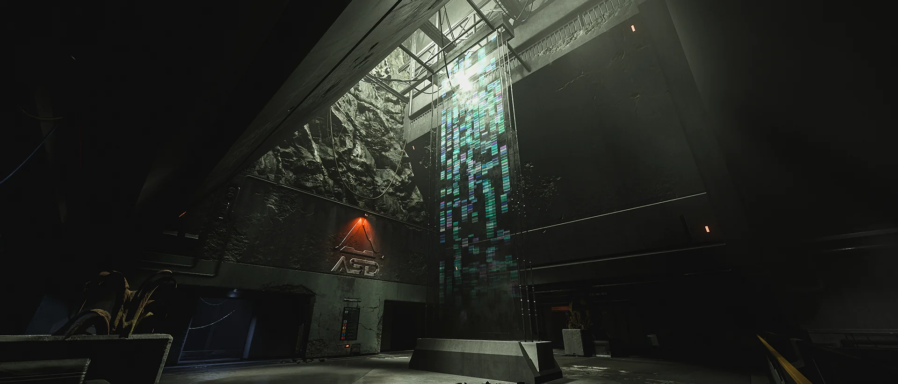
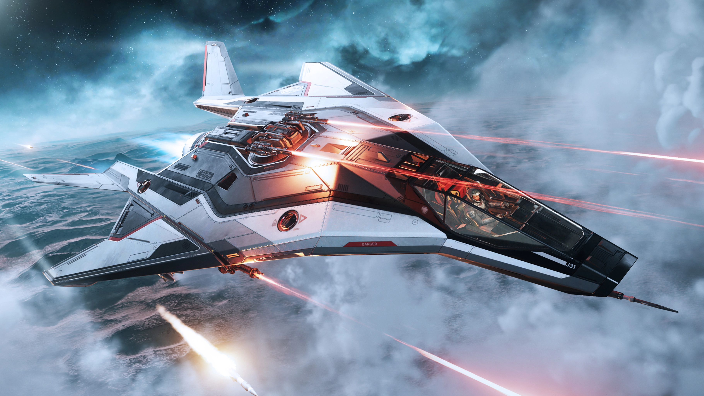
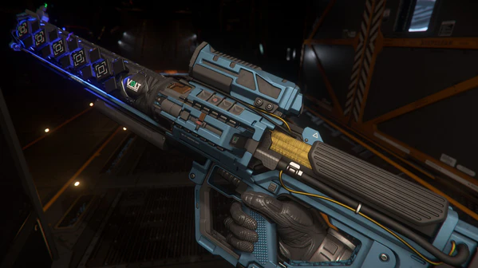

## เจาะลึก Star Citizen Alpha 4.3.0

Alpha 4.3 มาถึงแล้วพร้อมกับการอัปเดตครั้งใหญ่ที่ผู้เล่นรอคอย! แพทช์นี้ไม่ได้มีแค่การแก้ไขบั๊ก แต่มาพร้อมกับระบบภารกิจสืบสวนใหม่ล่าสุดใน **Onyx Facilities**, การปรับปรุงการบินของยาน Light Fighter ทั้งคลาส, อาวุธและไอเท็มใหม่ๆ รวมถึงการปรับปรุงคุณภาพชีวิต (Quality of Life) อีกมากมาย

---

### Onyx Facilities: ไขปริศนา Regen Crisis



ระบบภารกิจใหม่แกะกล่องที่จะพาผู้เล่นไปสืบสวนในสถานีวิจัยร้างของ Associated Sciences and Development (ASD) ที่ถูกทิ้งร้างกว่า 100 แห่งทั่ว Stanton
- **ผู้มอบภารกิจใหม่:** Arken Mallor จาก Hockrow Agency จะเป็นผู้มอบหมายให้คุณเข้าไปค้นหาข้อมูลการวิจัยที่ยังหลงเหลืออยู่ และเปิดโปงความจริงเบื้องหลังการทดลองใน Regen Crisis
- **เนื้อเรื่องต่อเนื่อง:** ใน Alpha 4.3 จะเปิดให้เล่น 2 ส่วนแรกของภารกิจ และบทสรุปจะตามมาใน Alpha 4.3.1
- **รูปแบบภารกิจ:**
    - **Research Labs:** ค้นหาและรวบรวมข้อมูลจาก data points และ audio logs เพื่อไขปริศนาว่าเกิดอะไรขึ้นในสถานี
    - **Engineering:** เผชิญหน้ากับระบบพลังงานที่ไม่เสถียรและพื้นที่ปนเปื้อนรังสี ต้องใช้ความระมัดระวังในการสำรวจ

### การอัปเดตระบบ Gameplay หลัก

- **Mission Distribution Tech:** ปรับปรุงระบบกระจายภารกิจประเภทที่ทำซ้ำได้ไม่จำกัด (เช่น Hauling, Wikelo, และภารกิจ Onyx) ให้ผู้เล่นกระจายตัวไปตามสถานที่ต่างๆ ได้ดีขึ้น ลดการแย่งกันทำภารกิจในที่เดียว
- **Wikelo Rewards:** อัปเดตเงื่อนไขรางวัลครั้งใหญ่ พร้อมเพิ่มยานพิเศษ (exclusive ships) เป็นรางวัล
- **เพิ่มความจุ Inventory:** เพิ่มความจุคลังสินค้า (Cargo) สูงสุดที่ Landing Zones และสถานีอวกาศเป็น **5000 SCU**
- **Personal Instanced Hangar:** ตอนนี้ผู้เล่นจะโหลดเข้าสู่โรงเก็บยานส่วนตัว (Personal Hangar) ที่ Instanced โดยตรงเมื่ออยู่ที่ Home Location ของตัวเอง

---

### ปรับใหญ่! Light Fighter Flight Tuning

การปรับปรุงโมเดลการบินครั้งใหญ่สำหรับยาน Light Fighter ทั้งคลาส เพื่อสร้างความหลากหลายและสมดุลในการต่อสู้ทางอากาศ

**ยานที่ได้รับการปรับปรุง:**
- Aegis Gladius (และรุ่นย่อย)
- Anvil Arrow & Hawk
- Banu Defender
- Esperia Talon (และ Shrike)
- Vanduul Blade
- Aopoa Khartu-Al
- C.O. Mustang (ทุกรุ่น)

**รายละเอียดการเปลี่ยนแปลง:**
- **ความเร็ว (Speeds):** ปรับความเร็ว SCM และ NAV ใหม่เพื่อสร้างความแตกต่างและเอกลักษณ์ให้ยานแต่ละลำ
- **อัตราเร่ง (Accelerations):** ปรับปรุงอัตราเร่งทั้งแนวตรงและเชิงมุม (Linear/Angular) เพื่อให้ยานแต่ละลำมีลักษณะการบินที่โดดเด่นและมีทางเลือกในการใช้งานมากขึ้น
- **พลังชีวิต (Health Pools):** ปรับค่าพลังชีวิตของยานบางลำให้สอดคล้องกับสมดุลโดยรวม
- **การเปลี่ยนแปลงเฉพาะรุ่น:**
    - **Gladius:** รวมจุด Critical Hitpoint เหลือจุดเดียวที่ลำตัว (Body) และปรับสมดุล HP ใหม่
    - **Hawk:** เพิ่ม HP ของปีกให้ทนทานขึ้น
    - **Talon/Shrike:** ปรับปรุงความคล่องตัว (Maneuverability) และลดค่า Cross Section เพื่อเสริมความสามารถในการล่องหน (Stealth)
    - **Blade:** ลดบัฟ Capacitor ลงเล็กน้อยจากแพทช์ก่อนหน้า

### ของใหม่ในจักรวาล

- **ยานที่เพิ่มเข้า Shop:** DRAKE Golem, MISC Fortune, Mirai Guardian, ANVIL Hornet F7CS Mk II, และ Anvil Hornet F7A Ball Turret



- **อาวุธใหม่: VOLT Laser Sniper "Zenith"**
    - ปืนสไนเปอร์เลเซอร์ที่ยิงได้ทั้งแบบชาร์จเพื่อพลังทำลายล้างสูง หรือยิงแบบกึ่งอัตโนมัติเพื่อความแม่นยำต่อเนื่อง
    - มีระบบชาร์จอัตโนมัติเมื่อถือไว้ แต่จะสร้างเสียงที่ศัตรูอาจได้ยิน
    - มาพร้อมกล้องเล็ง (Optic) ที่มีตัวติดตามความร้อนและการชาร์จในตัว การจัดการความร้อนเป็นสิ่งสำคัญ!

- **ไอเท็มใหม่:** เพิ่มจำนวนกระสุนชนิดต่างๆ ในร้านค้า และเพิ่ม **Radiation Pen** ในร้านค้าและร้านขายยาทั่ว Stanton
- **ทรงผมใหม่:** เพิ่มทรงผมใหม่ 3 ทรง (สั้น 2, ยาวปานกลาง 1)

---

### การปรับปรุงคุณภาพชีวิต (QoL) และเทคโนโลยี

- **Dynamic Snow:** หิมะจะตกแบบไดนามิกตามสภาพอากาศบนดาวเคราะห์อย่าง microTech (เหมือนระบบฝนตก)



- **Ladder Improvements:** ยกเครื่องระบบบันไดใหม่ทั้งหมด!
    - มองไปรอบๆ ได้ขณะอยู่บนบันได
    - เข้า/ออกจากบันไดที่จุดกึ่งกลางได้
    - กระโดดออกจากบันไดไปในทิศทางที่มองได้
    - ฟังก์ชันเอนตัวหลบสิ่งกีดขวาง



- **แก้ไขบั๊กสำคัญกว่า 100 รายการ:** แก้ไขปัญหาใหญ่ๆ ที่ผู้เล่นรายงานเข้ามามากมาย เช่น:
    - ลิฟต์ขนส่งสินค้า (Freight Elevator) แสดงข้อผิดพลาด
    - ภารกิจบางอย่างไม่คืบหน้า หรือให้รางวัลไม่ถูกต้อง
    - การเคลมยานที่ถูกทำลายจาก ASOP Terminal มีปัญหา
    - จรวด (Missiles) สร้างความเสียหายทะลุเกราะ (Shield)
    - และอื่นๆ อีกมากมาย

### ปัญหาที่ทราบ (Known Issues)

ทีมพัฒนารับทราบถึงปัญหาบางอย่างที่ยังคงอยู่ในเวอร์ชันนี้ เช่น:
- **Error Code 41070:** ไม่สามารถเชื่อมต่อเข้า PU ได้
- **Orison Tutorial:** บทช่วยสอนสำหรับผู้เล่นใหม่ไม่เริ่ม
- **AI:** AI ในบางพื้นที่ยังคงมีปัญหา เช่น ยิงทะลุกำแพง หรือไม่เกิดในบางโซน
- **ภารกิจ ASD:** อาจเจอปัญหา Server Blade เก็บไม่ได้, Fabricator สร้างของผิด, หรือ UI แสดงผลไม่ถูกต้อง

---

## สรุป

Alpha 4.3 เป็นแพทช์ขนาดใหญ่ที่มอบเนื้อหาใหม่ๆ และการปรับปรุงที่สำคัญมากมายให้กับผู้เล่น ตั้งแต่ภารกิจสืบสวนที่น่าติดตามไปจนถึงการยกเครื่องการต่อสู้ของยาน Light Fighter นี่คือช่วงเวลาที่ยอดเยี่ยมในการกลับเข้ามาสำรวจจักรวาล Star Citizen

สำหรับรายละเอียดการเปลี่ยนแปลงทั้งหมด สามารถอ่านได้จาก [Patch Notes ฉบับเต็ม](https://robertsspaceindustries.com/en/comm-link/Patch-Notes/20728-Star-Citizen-Alpha-430) จาก RSI โดยตรง