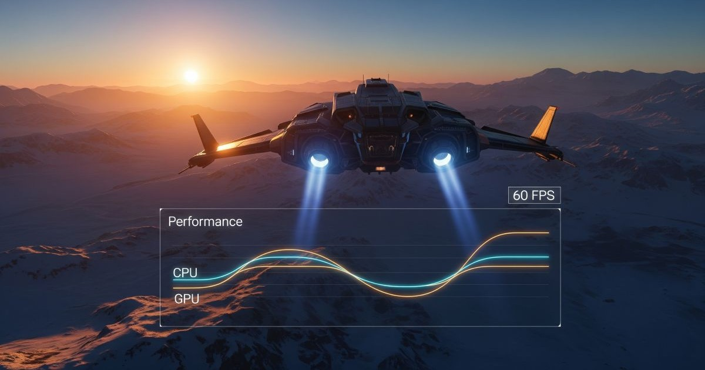
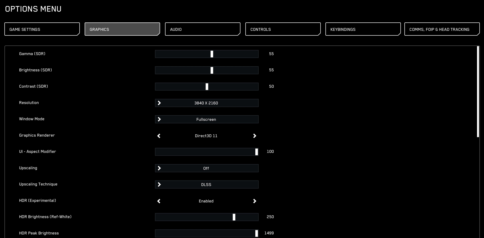
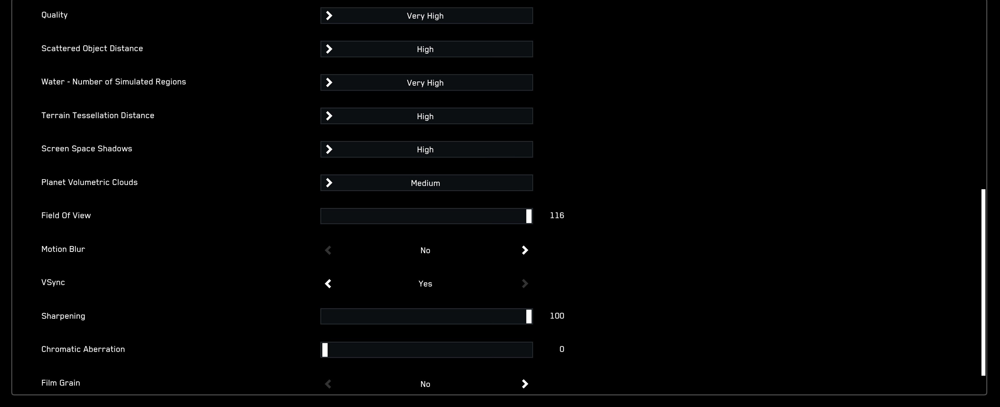
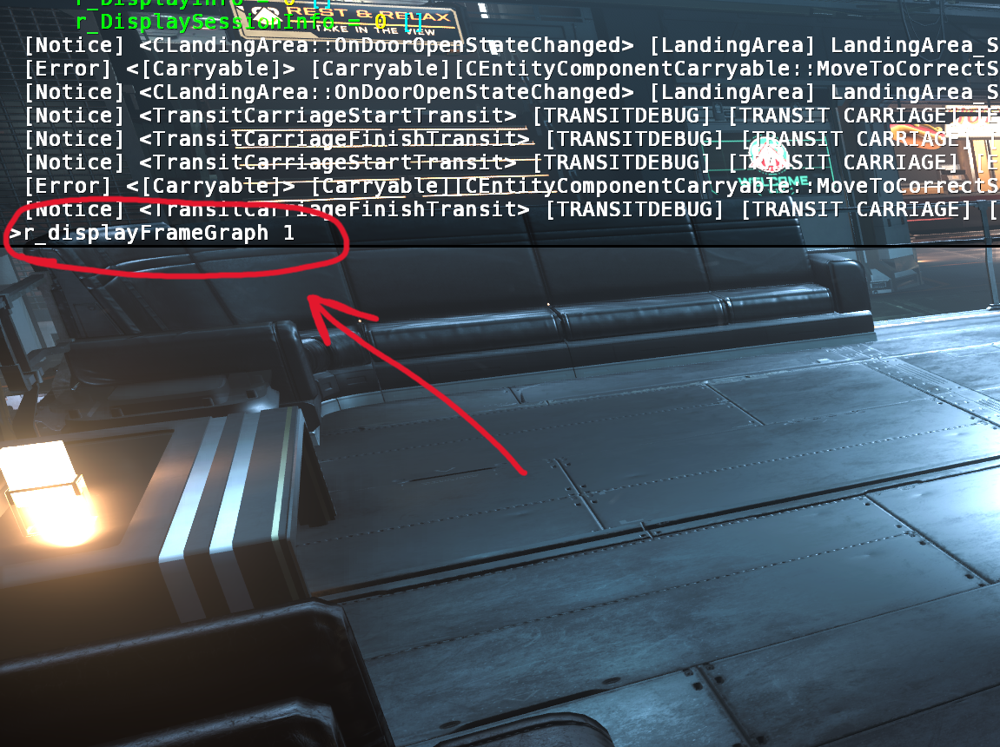
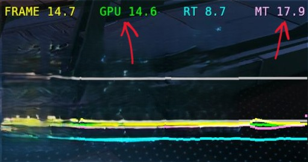
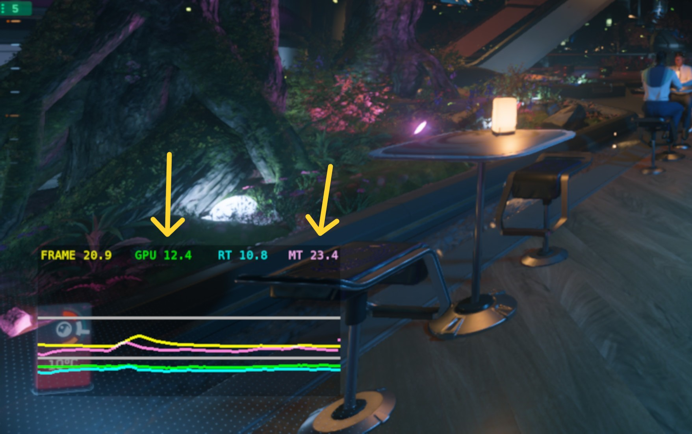
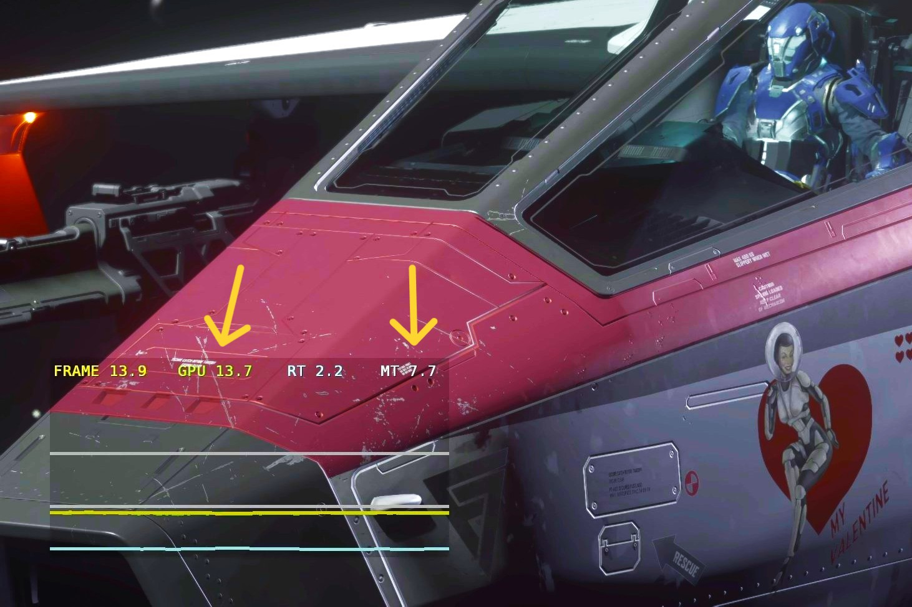
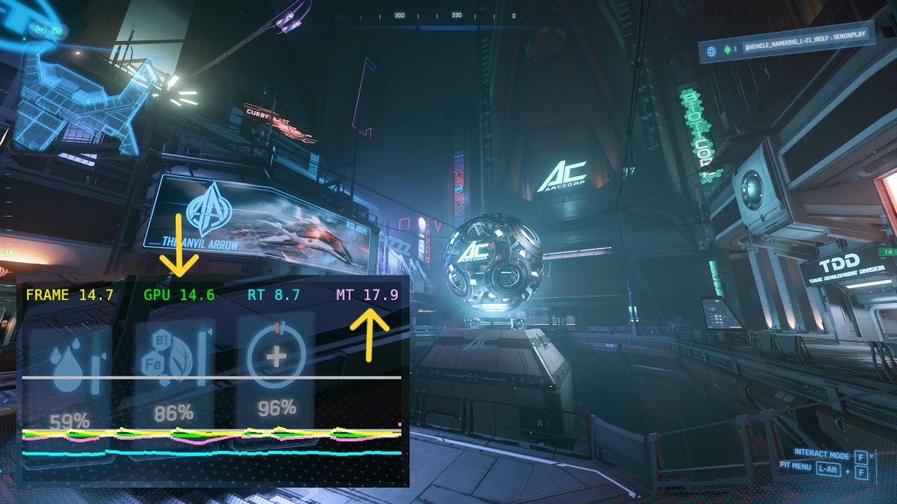

## 🚀 เข้าใจธรรมชาติของ Performance ใน Star Citizen

การปรับแต่งประสิทธิภาพใน *Star Citizen* นั้นไม่เหมือนเกมอื่น ส่วนใหญ่แล้วเกมนี้จะถูกจำกัดด้วยประสิทธิภาพของ **CPU (CPU-bound)** ไม่ใช่การ์ดจอ (GPU) โดยเฉพาะในเวอร์ชัน Alpha ปัจจุบัน ดังนั้นเป้าหมายหลักของเราคือการ **ย้ายภาระงานจาก CPU ที่ทำงานหนักอยู่แล้ว ไปให้ GPU ที่มักจะยังมีกำลังเหลือ** เพื่อให้ได้ Frame Rate ที่นิ่งขึ้น

> 🔮 **อนาคตของ Performance:** ขณะนี้ CIG กำลังพัฒนา Renderer ที่ใช้ **Vulkan API** ซึ่งจะช่วยให้เกมใช้ประโยชน์จาก CPU หลาย Core ได้ดีขึ้น และอาจจะเปลี่ยนแนวทางการปรับแต่งไปอย่างสิ้นเชิง แต่สำหรับตอนนี้ เราจะเน้นที่การปรับแต่งสำหรับตัวเกมปัจจุบันเป็นหลัก

---

## 📊 Step 1: ตรวจสอบอาการคอขวดของเครื่องคุณ

ก่อนจะเริ่มปรับอะไร เราต้องรู้ก่อนว่า PC ของเรามีอาการคอขวดที่ CPU หรือ GPU โดยใช้เครื่องมือในเกมที่ชื่อว่า **Display Frame Graph**

**วิธีเปิด Frame Graph:**
1. กดปุ่ม `~` (ปุ่มเปลี่ยนภาษา) เพื่อเปิด Console
2. พิมพ์คำสั่ง `r_displayFrameGraph 1` แล้วกด Enter
   - ใส่ `1` จะเป็นการแสดงกราฟ ถ้าจะปิด เปลี่ยนเป็น `r_displayFrameGraph 0`
3. Frame Graph จะแสดงขึ้นมาที่มุมล่างซ้ายของจอ

**ค่าที่ต้องดู:**
- **MT (Main Thread):** เวลาที่ CPU ใช้ประมวลผล 
- **GPU:** เวลาที่ GPU ใช้ประมวลผล

> ⏱️ ค่าเหล่านี้คือ **ระยะเวลาในการประมวลผล** หน่วยเป็น millisecond หมายความว่า **ยิ่งน้อยยิ่งดี**

### **MT > GPU** แปลว่า คอขวดที่ CPU
ถ้าค่า MT มากกว่า GPU อย่างชัดเจน แปลว่า Main Thread (CPU) ใช้เวลาประมวลผลนานกว่าที่ GPU จะเรนเดอร์ภาพเสร็จ นี่คืออาการ **คอขวดที่ CPU** ซึ่งเป็นกรณีที่พบบ่อยที่สุดใน Star Citizen

###  **GPU > MT** แปลว่า คอขวดที่ GPU
ถ้าค่า GPU มากกว่า MT อย่างชัดเจน แปลว่าการ์ดจอของคุณทำงานหนักและใช้เวลาเรนเดอร์นานกว่าที่ CPU จะเตรียมข้อมูลเฟรมถัดไปให้ นี่คืออาการ **คอขวดที่ GPU**

### **MT ≈ GPU** แปลว่า CPU-GPU สมดุล
ในสถานการณ์ที่ดีที่สุด ค่า MT และ GPU จะใกล้เคียงกันมาก ซึ่งหมายความว่าทั้งสองส่วนทำงานประสานกันได้อย่างมีประสิทธิภาพ ไม่มีใครต้องรอใคร แต่ก็ไม่ได้หมายความว่าคุณจะได้ FPS สูงเสมอไป แค่หมายความว่าคุณใช้ฮาร์ดแวร์ได้เต็มศักยภาพแล้ว

เมื่อรู้แล้วว่าคอขวดอยู่ที่ไหน ก็ไปสู่ขั้นตอนต่อไปได้เลย

---

## ⚙️ Step 2: ปรับแต่งการตั้งค่าตามอาการคอขวด

### 2.1 ถ้าคุณมีอาการ คอขวดที่ CPU

ให้ปรับการตั้งค่าต่อไปนี้ตามลำดับ เพื่อย้ายภาระงานไปให้ GPU:

1.  **Quality:** ตั้งเป็น **High** หรือ **Very High**
    - **สำคัญที่สุด:** การตั้งค่านี้ให้สูงจะบังคับให้ GPU ทำงานเรนเดอร์มากขึ้น ซึ่งจะช่วยลดภาระของ CPU ที่ทำงานหนักอยู่แล้วได้
2.  **Scattered Object Distance:** ตั้งเป็น **Low** หรือ **Medium**
    - ลดจำนวนวัตถุเล็กๆ เช่น ก้อนหิน หรือพืช ที่ CPU ต้องคอยติดตามและประมวลผล
3.  **Water - Number of Simulated Regions:** ตั้งเป็น **Medium** หรือต่ำกว่า
    - ลดความซับซ้อนของการประมวลผลฟิสิกส์ของน้ำ ซึ่งใช้ CPU ค่อนข้างมาก
4.  **Field of View (FOV):** ลองลดค่าลงเล็กน้อย
    - FOV ที่แคบลงหมายถึง CPU ต้องประมวลผลวัตถุในฉากน้อยลง แต่ควรปรับเท่าที่ยังรู้สึกสบายตา

### 2.2 ถ้าคุณมีอาการ คอขวดที่ GPU

ให้ปรับการตั้งค่าต่อไปนี้ตามลำดับ เพื่อลดภาระงานของการ์ดจอ:

1.  🌥️ **Planet Volumetric Clouds:** ตั้งเป็น **Medium** หรือ **Off**
    - นี่คือตัวกินสเปคการ์ดจออันดับหนึ่ง การลดหรือปิดจะช่วยเพิ่ม FPS ได้อย่างมหาศาล
2.  📉 **Resolution:** ลดความละเอียดหน้าจอลง
    - เป็นวิธีที่ตรงไปตรงมาที่สุดในการลดภาระ GPU เช่น ลดจาก 4K เป็น 1440p
3.  ✨ **Upscaling (DLSS/FSR):** เปิดใช้งาน
    - หากการ์ดจอรองรับ การเปิด DLSS หรือ FSR จะช่วยให้เกมเรนเดอร์ที่ความละเอียดต่ำกว่าแล้วค่อยขยายภาพขึ้น ทำให้ GPU ทำงานน้อยลงและได้ FPS เพิ่มขึ้น
4.  **Screen Space Shadows:** ตั้งเป็น **Medium**
    - ลดคุณภาพของเงาบางประเภทเพื่อลดภาระการเรนเดอร์ของ GPU

---

## 🎯 Step 3: วัดผลและทำซ้ำ

หลังจากปรับการตั้งค่าแล้ว ให้กลับเข้าไปในเกมและสังเกตค่า **MT** และ **GPU** บน Frame Graph อีกครั้ง

- **เป้าหมายคือ** ทำให้ค่า MT และ GPU ใกล้เคียงกันมากที่สุดเท่าที่จะทำได้ โดยที่ยังพอใจกับคุณภาพของภาพและเฟรมเรตที่ได้
- **ทำซ้ำ:** 🔁 ลองปรับเปลี่ยนการตั้งค่าทีละอย่าง แล้วดูผลกระทบที่เกิดขึ้น ทำซ้ำไปเรื่อยๆ จนกว่าจะเจอจุดที่ลงตัวที่สุดสำหรับเครื่องของคุณ

---

## 📝 ตารางสรุป: การตั้งค่ากราฟิกโดยละเอียด

| การตั้งค่า | ใช้ทรัพยากรหลัก | คำแนะนำสำหรับ CPU Bottleneck | คำแนะนำสำหรับ GPU Bottleneck |
|:---|:--:|:-----|:-----|
| **Quality** | **GPU** | **High หรือ Very High** - ย้ายงานไปให้ GPU | ลดเป็น Medium ได้ แต่ลด Resolution หรือใช้ FSR/DLSS Upscaling จะได้ผลมากกว่า |
| **Planet Volumetric Clouds** | **GPU (สูงมาก)** | Medium (เพื่อภาพสวย) | **Medium หรือ Off** - ลดนี้ก่อนอย่างอื่น |
| **Resolution** | **GPU** | 
 - 
 | **ลดลง** - วิธีที่มีประสิทธิภาพที่สุด |
| **Upscaling (DLSS/FSR)** | **GPU** | 
 - 
 | **เปิดใช้งาน** - ช่วยลด GPU load มาก |
| **Scattered Object Distance** | **CPU** | **Low หรือ Medium** - ลด object ที่ต้องติดตาม |
 - 
 |
| **Water - Simulated Regions** | **CPU & GPU** | **Medium หรือต่ำกว่า** - ลดภาระ CPU | Medium หรือต่ำกว่า |
| **Field of View (FOV)** | **CPU & GPU** | ลดได้เล็กน้อย เอาที่สบายตา | ลดเล็กได้เล็กน้อย เอาที่สบายตา |
| **Screen Space Shadows** | **GPU** | 
 - 
 | **Medium** - ลดจาก High |
| **Terrain Tessellation** | **GPU (น้อยมาก)** | 
 - 
 | ตั้งได้ตามต้องการ |
| **Motion Blur** | **GPU** | **Off** - เพื่อภาพชัด | **Off** - ประหยัด GPU |
| **V-Sync** | **GPU** | **Off** - หลีกเลี่ยง input lag | **Off** - หลีกเลี่ยง input lag |
| **Sharpening** | **GPU (น้อยมาก)** | ตั้งตามความชอบ | ตั้งตามความชอบ |
| **Chromatic Aberration** | **ไม่มีผล** | **Off** - ภาพสะอาดตา | **Off** - ภาพสะอาดตา |
| **Film Grain** | **ไม่มีผล** | **Off** - ภาพสะอาดตา | **Off** - ภาพสะอาดตา |

---

## การตั้งค่าที่แนะนำสำหรับคนส่วนใหญ่ - CPU Bottleneck

สำหรับผู้เล่นส่วนใหญ่ที่ประสบปัญหาคอขวดที่ CPU การตั้งค่าเริ่มต้นที่แนะนำคือ:

### การตั้งค่าลำดับความสำคัญ:
1. **Quality:** High หรือ Very High (สำคัญที่สุด)
2. **Scattered Object Distance:** Low หรือ Medium
3. **Water - Number of Simulated Regions:** Medium
4. **Field of View:** เอาที่สบายตาเป็นหลัก

### การตั้งค่าเสริม:
- **Planet Volumetric Clouds:** Medium หรือ Off
- **Motion Blur, Film Grain, Chromatic Aberration:** Off (เพื่อภาพที่สะอาดตา)
- **V-Sync:** Off (หลีกเลี่ยง input lag)

---

## คอมสเปคต่างกัน ก็ต้องปรับ setting ต่างกัน

สุดท้ายนี้ อย่าลืมว่าการปรับแต่งกราฟิกคือการเดินทางที่ต้องอาศัยการทดลองและสังเกตผลด้วยตัวเอง 🛠️ ใช้คำแนะนำนี้เป็นจุดเริ่มต้น แล้วปรับเปลี่ยนให้เหมาะกับสไตล์การเล่นและฮาร์ดแวร์ของคุณเอง ✨ ทุกการปรับเล็กน้อยอาจนำไปสู่ประสบการณ์ Star Citizen ที่ดีที่สุดสำหรับคุณ ขอให้สนุกกับการบินและสำรวจจักรวาลครับ!
