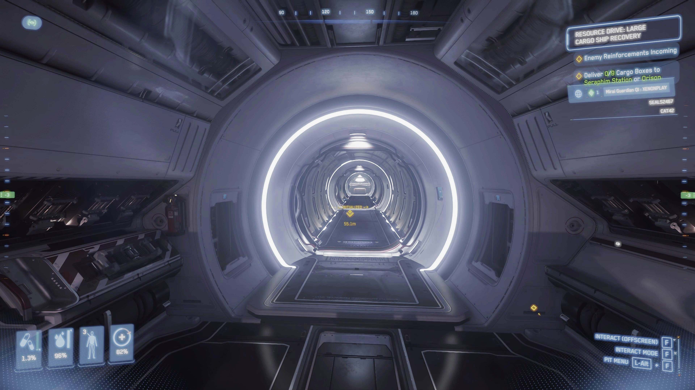

## บทนำ

ใครที่เคยขับ Hercules คงรู้ดีว่ากว่าจะเดินจากห้องนักบินลงไปถึงพื้น ใช้เวลานานจนน่าหงุดหงิด โดยเฉพาะเวลาต้องรีบออกไปทำธุระข้างนอก คู่มือนี้จะมาแชร์เทคนิคง่าย ๆ ที่ช่วยให้คุณออกจาก Hercules C2, M2 หรือ A2 ได้เร็วขึ้นแบบไม่ต้องรอประตูหรือรอลิฟต์ให้เสียเวลา



### ขั้นตอนที่ 1: เปิดประตูทุกบานก่อนลงจอด

ก่อนจะลงจอด แนะนำให้กด "Open All Doors" ไปเลย ประตูและทางลาดทุกบานจะเปิดพร้อมกัน ไม่ต้องเสียเวลารอประตูเปิดทีละบาน

### ขั้นตอนที่ 2: วิ่งไปที่บันได (Ladder)

ลงจอดเสร็จแล้ว ลุกจากเก้าอี้นักบินแล้วรีบวิ่งไปที่ลิฟต์ ด้านขวาของลิฟต์จะมีบันได นี่แหละทางลัดของเรา

### ขั้นตอนที่ 3: กระโดดลงบันไดแบบไม่ต้องปีน

ไม่ต้องเสียเวลาปีนลงบันได แค่ยืนหันหลังให้บันได (ยืนบนประตูแอร์ล็อคเล็ก ๆ ด้านบนช่องบันได) รอสักแป๊บ ประตูจะเปิดเองแล้วคุณจะร่วงลงไปที่ห้องเก็บของด้านล่างทันที

### ขั้นตอนที่ 4: วิ่งออกทางลาดท้ายยาน

จากห้องเก็บของ วิ่งตรงไปที่ทางลาด (Ramp) ที่เปิดอยู่ได้เลย ออกนอกยานแบบไม่ต้องรออะไรทั้งนั้น!

---

## สรุป

เทคนิคนี้ช่วยให้คุณออกจาก Hercules ได้เร็วขึ้น ไม่ต้องรอลิฟต์หรือประตูทีละบาน เหมาะมากสำหรับคนที่ต้องการความรวดเร็ว หรือเวลามีเหตุฉุกเฉิน ลองใช้ดูแล้วจะติดใจ!
