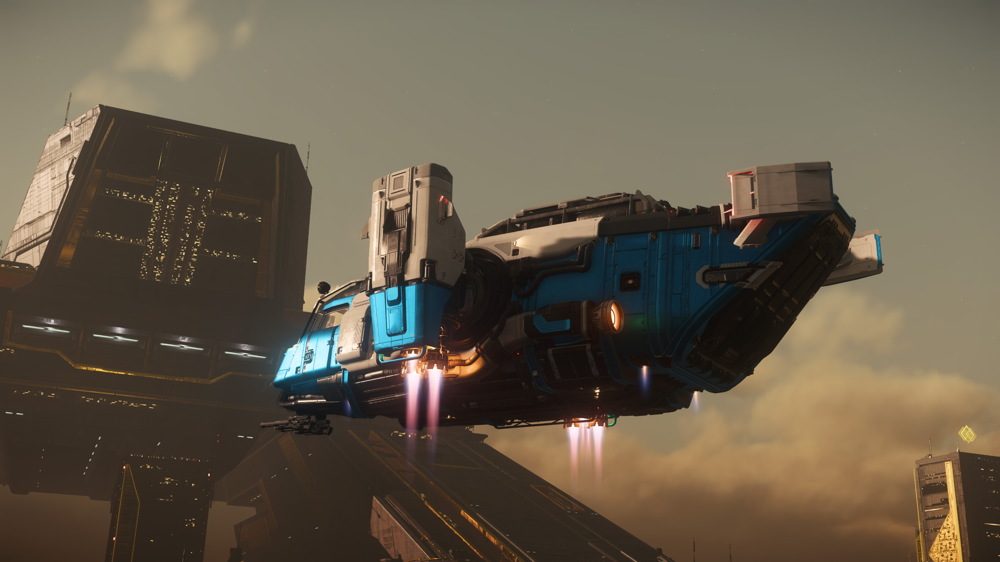
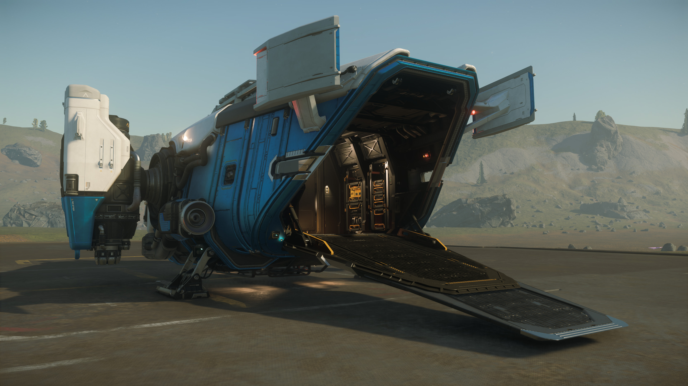

## ทำความรู้จักยานลำนี้ {#overview}

Drake Cutter Rambler เป็นยานสำรวจขนาดเล็กจาก Drake Interplanetary ที่ต่อยอดจากรุ่น Cutter ดั้งเดิม เพิ่มความสะดวกสบายและพื้นที่เก็บของส่วนตัวมากขึ้น เหมาะกับผู้เล่นสาย Solo ที่ต้องการยานเริ่มต้นสำหรับการสำรวจและเดินทางไกลใน Star Citizen โดยยังคงความสามารถบรรทุกของ 2 SCU และฟีเจอร์ที่ตอบโจทย์การใช้ชีวิตระยะยาว

Rambler โดดเด่นเรื่องความอึดและความครบเครื่องด้านการใช้ชีวิตในยาน เหมาะกับสายสำรวจหรือผู้เล่นที่เน้นความอยู่รอดและความสะดวกสบาย แม้จะไม่ได้เร็วหรือคล่องตัวที่สุดในกลุ่ม starter แต่ตอบโจทย์คนที่อยากใช้ชีวิตในอวกาศแบบจริงจัง

**จุดเด่น/ข้อควรระวังของ Cutter Rambler**

**จุดเด่น:**
- โครงสร้างแข็งแรง อึดทน ใช้ชีวิตในยานได้จริง เหมาะกับสาย Solo และผู้ที่ต้องการความอยู่รอด
- มีพื้นที่เก็บของ 2 SCU และที่เก็บของส่วนตัวขนาดใหญ่ รองรับทั้งสัมภาระและไอเทมส่วนตัว
- เดินทางไกลข้ามระบบได้จริงด้วย Quantum Fuel Capacity 2.2 หน่วย มากกว่ายาน starter อื่น ๆ ถึง 2 เท่า ไม่ต้องแวะเติมน้ำมันบ่อย

**ข้อควรระวัง/จุดด้อย:**
- เกราะและอาวุธเน้นป้องกันตัว ไม่เหมาะกับการรบหนักหรือ PvP จริงจัง
- พื้นที่บรรทุก 2 SCU เหมาะกับของชิ้นเล็กหรือภารกิจส่งของขนาดเล็ก ไม่เหมาะกับการขนส่งปริมาณมาก

## ปรัชญาการออกแบบ {#design-philosophy}
Drake เน้นความคุ้มค่าและความอเนกประสงค์ ยานรุ่นนี้ออกแบบให้ใช้งานได้หลากหลาย ทั้งสำรวจ, เดินทาง, ขนส่งของเล็กน้อย และใช้ชีวิตระยะยาวในอวกาศ

## ทัวร์รอบยาน: จากภายนอกสู่ห้องนักบิน {#ship-tour}

Cutter Rambler ยังคงเอกลักษณ์ของ Drake ที่เน้นการใช้งานและความทนทาน แต่เสริมความสะดวกสบายสำหรับการเดินทางไกลเข้ามา นี่คือการสำรวจทุกซอกทุกมุมของยานลำนี้

### ดีไซน์ภายนอก {#exterior}

มองจากภายนอก Rambler มีรูปทรงกล่องสี่เหลี่ยม ดูแข็งๆ ทื่อๆ เน้นใช้งานตามสไตล์ Drake ที่เป็นเอกลักษณ์เฉพาะตัว body ยานเต็มไปด้วย panel หลายๆ ชิ้นมาต่อกัน มีท่อและสายไฟเดินอยู่ภายนอกบางส่วน บ่งบอกถึงการออกแบบที่ไม่ประณีต แต่ราคาถูก ซ่อมแซมได้ง่าย ไม่ซ่อนความซับซ้อน

ด้านบนของจะเป็น Quantum Fuel Tank เพิ่มเติม เป็น Tank พิเศษที่มีเฉพาะ Rambler เท่านั้น 

**Main Engines:** เครื่องยนต์หลักซ้ายขวา สามารถหมุนชี้ลงเป็น VTOL mode ได้เพื่อให้ขึ้นลงในแนวดิ่งได้ง่ายขึ้น

**อาวุธ:** ใต้คาง ติดตั้งปืนเลเซอร์ CF-227 Badger ขนาด S2 สองกระบอกบน Gimbal Mount

ช่องใต้ตัวยานมี Missile Rack แบบเปิดออกได้ สำหรับขีปนาวุธขนาด S1 จำนวน 4 ลูก

**ทางเข้า:** ทางเข้าหลักของยานมีเพียงทางเดียวคือ **ประตูท้ายที่เป็นทางลาด (Rear Ramp)** กดเปิดได้จากปุ่มทั้ง 2 ข้าง

### ประตูท้ายและพื้นที่เก็บของ {#ramp-and-cargo}

เมื่อเปิดประตูท้ายที่เป็นทางลาดลงมา จะพบกับพื้นที่อเนกประสงค์

- **พื้นที่บรรทุก (Cargo Bay):** พื้นที่ส่วนนี้รองรับการบรรทุกสินค้าได้ 2 SCU ซึ่งลดลงจากรุ่นปกติเพื่อแลกกับพื้นที่ใช้สอยที่มากขึ้น แต่ยังเพียงพอสำหรับภารกิจส่งของเล็กๆ น้อยๆ หรือวางกล่องอุปกรณ์ส่วนตัว

- **การขนย้ายยานพาหนะ:** ทางลาดท้ายยานกว้างกว่ายานเริ่มต้นส่วนใหญ่ แต่พื้นที่ภายในไม่ลึกมากนัก อาจจะพอดีสำหรับ Hoverbike คันเล็กๆ เช่น Mirai Pulse แต่ต้องใช้ความระมัดระวังในการนำขึ้น-ลงเพื่อไม่ให้ชน

- **จุดเข้าถึงส่วนประกอบ (Component Access):** บริเวณผนังด้านในของโซนนี้ จะมีแผงสำหรับเข้าถึงส่วนประกอบหลักๆ ของยาน เช่น Power Plant, Cooler และ Shield Generator ทำให้การซ่อมบำรุงหรือสับเปลี่ยนทำได้จากภายในยาน

- **Component ด้านซ้าย:**
    - Shield
    - Battery (ยังไม่ใช้งานใน patch aplha-4.3)
    - Power Plant

- **Component ด้านขวา:**
    - Cooler
    - Quantum Drive
    - Relay (ยังไม่ใช้งานใน patch aplha-4.3)
    - Radar
    - Gravity Generator (ยังไม่ใช้งานใน patch aplha-4.3)

### พื้นที่ใช้สอย (Habitation Area) {#habitation}

เมื่อเดินผ่านประตูจากโซนเก็บของเข้ามา จะพบกับพื้นที่ใช้สอยที่เป็นหัวใจของ Rambler ซึ่งออกแบบมาสำหรับการเดินทางไกลโดยเฉพาะ

ทางขวามือเราจะเห็น Weapon Rack ใส่ Rifle ได้ 2 กระบอก, ปืนพก 2 กระบอก, และ Heavy Weapon อีก 1 กระบอก

ถัดมาจะเป็น Suit Locker ที่ยังใช้งานไม่ได้ใน patch alpha-4.3 นี้ ถัดมาเป็นเตียง สามารถใช้ logout ได้

- **ที่นั่งสำหรับผู้โดยสาร:** นอกจากที่นั่งนักบินแล้ว ยังมีที่นั่งสำหรับผู้โดยสารอีก 3 จุด คือเก้าอี้พับ (Jumpseat), ที่นั่งข้างโต๊ะ และบนเตียง ส่วนใครจะนั่งในห้องน้ำอีกที่นึง ก็...แล้วแต่ความกล้า (ฮา)

- **สิ่งอำนวยความสะดวก:** มีเตียงสำหรับ 1 คน, โต๊ะ, ห้องน้ำ (WC) พร้อม Suit Locker, และ **Food Processor** ซึ่งแม้ฟังก์ชันเหล่านี้ (ห้องน้ำ, การทำอาหาร, ผลของการใส่ชุด) จะยังไม่สมบูรณ์ในแพตช์ปัจจุบัน แต่มันแสดงให้เห็นว่ายานถูกออกแบบมาเพื่อรองรับ Gameplay Loop ที่จะเพิ่มเข้ามาในอนาคต

- **ที่เก็บของส่วนตัว (Personal Storage):** มีที่เก็บของขนาดใหญ่มากถึง **1050k micro SCU (1.05 SCU)** เพียงพอสำหรับเก็บชุดเกราะหลายชุด, อาวุธ, กระสุนสำรอง หรือไอเทมที่เก็บมาจากภารกิจได้อย่างสบายๆ

- **ชั้นวางอาวุธ (Weapon Rack):** ในโซนนี้มีชั้นวางอาวุธขนาดใหญ่ สามารถเก็บปืนพกได้ 4 กระบอก, ปืนไรเฟิล 2 กระบอก, และปืนหนัก (Heavy Weapon) 1 กระบอก

### ห้องนักบิน (Cockpit) {#cockpit}

ห้องนักบินของ Rambler ถูกแยกออกจากส่วนอื่น เพิ่มความเป็นส่วนตัวและความปลอดภัย

- **ที่นั่งนักบิน:** มีที่นั่งเดียวตามสไตล์ยาน Solo
- **ทัศนวิสัย:** กระจกห้องนักบินให้มุมมองที่กว้างและชัดเจน เหมาะสำหรับการสำรวจและการลงจอด
- **แผงควบคุม (MFDs):** มีหน้าจอ MFDs 3 จอสำหรับแสดงข้อมูลการบิน, สถานะยาน, และเป้าหมาย
- **ชั้นวางอาวุธ (Weapon Rack):** ภายในห้องนักบินมีชั้นวางอาวุธอีก 1 จุด สามารถเก็บปืนพกได้ 2 กระบอก, ปืนไรเฟิล 1 กระบอก, และปืนหนัก 1 กระบอก
- **Component เพิ่มเติม:** ทางซ้ายของห้องนักบิน มี Component เพิ่มอีก 2 อย่าง
    - Life Support (ยังไม่ใช้งานใน patch aplha-4.3)
    - Avionics (ยังไม่ใช้งานใน patch aplha-4.3)

Rambler มีการจัดวางพื้นที่ภายในที่ลงตัว ทำให้เป็นยานเริ่มต้นที่ให้ความรู้สึกเหมือน "บ้าน" มากกว่ายานลำอื่นๆ ในระดับเดียวกัน เหมาะสำหรับผู้เล่นที่ต้องการใช้ชีวิตในอวกาศอย่างแท้จริง

## การบินและสมรรถนะ {#flight-characteristics}

| สถิติการบิน | Normal | Boost |
|---|---|---|
| Nav Speed | 1010 m/s | - |
| SCM Speed | 180 m/s | 380 m/s |
| Pitch | 36° | 43.2° |
| Yaw | 36° | 43.2° |
| Roll | 100° | 120° |

Cutter Rambler มีลักษณะการบินที่เน้นความมั่นคงและควบคุมง่ายมากกว่าความเร็วหรือความคล่องตัว เมื่อเปรียบเทียบกับยาน starter อื่นๆ Rambler จัดอยู่ในอันดับท้ายๆ เรื่องความเร็วและความคล่องตัว

**จุดแข็งการบิน:** ความมั่นคงและเสถียร เหมาะกับการเดินทางไกล การลงจอดในสถานที่ที่ต้องการความแม่นยำ และการขนส่งที่ต้องการความปลอดภัย ควบคุมง่าย เหมาะกับมือใหม่ที่อยากเรียนรู้พื้นฐานการบิน

**ข้อจำกัด:** ความเร็วและความคล่องตัวต่ำที่สุดในกลุ่ม starter หากต้องหนีจากการไล่ล่าหรือทำ dogfight แบบใกล้ชิด อาจจะเสียเปรียบ ควรเลี่ยงการปะทะโดยตรงและใช้กลยุทธ์การเอาตัวรอดแทน

## Components และการอัปเกรด {#components}

| Component         | จำนวน | ขนาด | ชื่อ         | Class        | Grade |
|-------------------|-------|------|------------|--------------|-------|
| Power Plant       | 1     | 1   | LightBlossom | Civilian     | C     |
| Cooler            | 1     | 1   | BlastChill   | Civilian     | D     |
| Shield Generator  | 1     | 1   | HEX          | Civilian     | B     |
| Quantum Drive     | 1     | 1   | FoxFire      | Competition  | B     |
| Jump Drive        | 1     | 1   | Explorer     | Civilian     | A     |
| Radar             | 1     | 1   | Ecouter      | Military     | A     |

Component หลักสามารถอัปเกรดได้ทั้งหมด สำหรับ Patch นี้ แนะนำให้อัปเกรด Shield ก่อนเป็นอันดับแรก เพื่อเพิ่มความอึดและความปลอดภัย รองลงมาคือ Quantum Drive ควรเลือกแบบที่วาร์ปได้เร็ว จะช่วยให้เดินทางได้ไวขึ้น แม้จะกินน้ำมันมากกว่า แต่ Rambler ก็มี Quantum Fuel Tank ขนาดใหญ่รองรับอยู่แล้ว

หากต้องการขับสบาย ไม่ต้องคอยปรับพลังงาน สามารถอัปเกรด Power Plant ให้แรงขึ้นได้อีก ส่วน Cooler ยังไม่จำเป็นต้องเปลี่ยนใน Patch นี้ ใช้ของเดิมได้เลย

## อาวุธและระบบป้องกัน {#defenses}

| ประเภท         | จำนวน | ขนาด | ชื่อ/รายละเอียด         | หมายเหตุ |
|----------------|-------|-------|--------------------------|----------|
| ปืนหลัก         | 2     | S2    | CF-227 Badger (Gimbal)    | ยิงง่ายและแม่นยำ |
| ขีปนาวุธ         | 4     | S1    | Spark I                  | 2 ลูกต่อข้าง |
| Shield         | 1     | S1    | HEX                      | 1500 HP |
| Flare          | 48    | -     | -                        | สำหรับหลบขีปนาวุธ |
| Chaff          | 5     | -     | -                        | สำหรับรบกวน radar/ล็อกเป้าศัตรู |

Fire Power ของ Rambler อยู่ในระดับล่างๆ เมื่อเทียบกับยาน starter ลำอื่นๆ เหมาะกับการป้องกันตัวมากกว่าการรบจริงจัง

## เทคนิคการเล่นและเอาตัวรอด {#tactics}

Rambler ไม่ใช่ยานรบ แต่เป็นเหมือนบ้านเคลื่อนที่ขนาดย่อมที่พาเราไปไหนก็ได้ในจักรวาล จุดเด่นของมันคือความอึดและความสะดวกสบาย เหมาะกับคนที่ชอบเดินทางไกลหรือใช้ชีวิตในอวกาศแบบชิล ๆ

- **เข้าใจจุดเด่นของ Rambler:** ยานลำนี้ไม่ได้เกิดมาเพื่อสู้รบกับใคร ถ้าเจอศัตรูหรือโดนโจมตี สิ่งที่ควรทำคือหาทางหนีเอาตัวรอด ไม่ใช่ดวลปืนกับเขา เพราะอาวุธและเกราะมีไว้ป้องกันตัวเท่านั้น

- **เลือกภารกิจให้เหมาะกับยาน:** Rambler เหมาะกับงานส่งของ ภารกิจบังเกอร์ หรือขับรับ-ส่งเพื่อนมากกว่าการออกไปลุยรบ ด้วยขนาดที่เล็กและประตูท้ายที่ใช้งานง่าย ทำให้ขนของหรือขึ้น-ลงสะดวก

- **อัปเกรดเพื่อความอุ่นใจ:** สิ่งแรกที่ควรเปลี่ยนคือ Shield Generator ให้เป็นเกรดดี ๆ (เช่น FR-66) จะช่วยให้ยานทนมือทนเท้า เวลาต้องหนีจะมีเวลาชาร์จ Quantum Drive ได้ทัน

- **ใช้ countermeasures ให้ถูกจังหวะ:** ถ้าโดนขีปนาวุธตาม ให้ปล่อย Flare หรือ Chaff สลับกัน อย่ากดทีเดียวหมด จะได้มีเหลือใช้ในจังหวะสำคัญ

- **เดินทางไกลแบบไม่ต้องกังวล:** ถังน้ำมันควอนตัมของ Rambler ใหญ่กว่ายานเริ่มต้นทั่วไป ถ้าอัปเกรด Quantum Drive ให้เร็วขึ้น (เช่น Spectre หรือ VK-00) จะเดินทางข้ามระบบได้สบาย ไม่ต้องแวะเติมน้ำมันบ่อย

- **เป็นยานสำรองที่ไว้ใจได้:** เวลายานหลักจอดไกลหรือโดนทำลาย Rambler เคลมได้เร็วมาก แค่ 1 นาที (หรือจ่าย Expedite ก็รับได้เลยทันที) ก็พร้อมออกเดินทางใหม่ เหมาะกับการใช้เป็น shuttle รับ-ส่งตัวเองหรือเพื่อน

**สรุป:** ถ้าเลี่ยงการรบ เน้นภารกิจที่ไม่ต้องใช้กำลังมาก อัปเกรด Shield กับ Quantum Drive ให้ดี Rambler จะเป็นยานคู่ใจที่พาเราไปได้ทุกที่แบบสบายใจ เหมาะกับคนที่ชอบความเรียบง่ายและอยู่รอดในอวกาศ

Rambler เหมาะกับคนที่ชอบความสบายและความปลอดภัย ไม่เหมาะกับสายบู๊หรือชอบดวล dogfight

## เทียบกับยานรุ่นอื่น {#comparisons}

Cutter Rambler อยู่ในกลุ่มยานสำรวจขนาดเล็กเทียบกับ Aurora MR, Mustang Alpha, และ Cutter ปกติ

### Cutter Rambler vs Aurora MR

- Rambler ได้เปรียบเรื่องความอึด (Hull HP สูงกว่า) และความสะดวกสบายในยานมากกว่า
- Aurora MR ราคาถูกกว่าและคล่องตัวกว่าเล็กน้อย แต่พื้นที่ใช้สอยและความอึดน้อยกว่า
- Rambler เหมาะกับผู้เล่นที่เน้นสำรวจและใช้ชีวิตในยานมากกว่า

### Cutter Rambler vs Mustang Alpha

- Mustang Alpha เร็วกว่าและคล่องตัวกว่าอย่างชัดเจน แต่พื้นที่เก็บของและความอึดน้อยกว่า
- Rambler มีระบบป้องกันและอุปกรณ์สำรวจครบกว่า เหมาะกับสายสำรวจและอยู่ยาว
- Mustang เหมาะกับผู้เล่นที่เน้นความเร็วและสไตล์การบิน

### Cutter Rambler vs Cutter ปกติ

- Rambler เน้นความสะดวกสบายและพื้นที่ส่วนตัวมากกว่า Cutter ปกติ
- Cutter ปกติขนของได้มากกว่า (4 SCU vs 2 SCU) แต่ interior ไม่สบายเท่า Rambler
- ทั้งสองลำเหมาะกับสาย Solo แต่ Rambler เหมาะกับคนที่เน้นใช้ชีวิตในยานจริง ๆ

> อ่านบทความเทียบยาน Starter ทั้งหมดได้ที่ [เปรียบเทียบ Starter Ship ทุกลำใน Star Citizen Alpha 4.3 (2025)](../alpha-4.3-starter-compare/)

## ยานลำนี้เหมาะกับใคร? {#who-is-this-for}

### เหมาะสำหรับ: {#suitable-for}

*   **มือใหม่สายสำรวจ:** ต้องการยานเริ่มต้นที่อยู่สบายและมีอุปกรณ์ครบ เน้นความอึดและความอยู่รอด
*   **Solo player:** ชอบเดินทางคนเดียวและใช้ชีวิตในยาน
*   **ผู้เล่นที่ต้องการความสะดวกสบายมากกว่าความเร็ว**

### ไม่เหมาะสำหรับ: {#not-suitable-for}

*   **กลุ่มใหญ่หรือสายรบ:** พื้นที่จำกัดและระบบป้องกันไม่เหมาะกับการรบหนัก
*   **ผู้เล่นที่ต้องการขนส่งสินค้าปริมาณมาก:** เพราะขนได้แค่ 2 SCU
*   **สาย PvP หรือ Dogfight:** ความเร็วและ DPS ต่ำรั้งท้ายในกลุ่ม starter

### สรุปผลการประเมิน {#final-verdict}

Cutter Rambler คือยานสำรวจขนาดเล็กที่ครบเครื่องสำหรับมือใหม่และสาย Solo จุดเด่นคือความอึด ความสะดวกสบาย และความอเนกประสงค์ เหมาะกับการใช้ชีวิตในอวกาศและภารกิจสำรวจระยะไกล หากคุณต้องการยานที่อยู่รอดง่ายและใช้ชีวิตในยานได้จริง Rambler คือคำตอบที่ดีในกลุ่ม starter

