---
title: "เปรียบเทียบ Light Fighter ทุกลำใน Star Citizen Alpha 4.3 (2025)"
subtitle: "เจาะลึกจุดเด่น จุดด้อย และความแตกต่างของยานรบเบาแห่งปี 2955!"
date: "2025-08-18"
lastmod: "2025-08-18"
draft: false
game_version: "Alpha 4.3"
tags: ["light fighter", "ship compare", "star citizen 4.3", "ยานรบเบา"]
categories: ["ships"]
author: "Star Citizen Handbook Team"
weight: 1
image: "ships/alpha-4.3-light-fighter-compare/img/thumbnail.jpg"
description: "บทความเปรียบเทียบยาน Light Fighter ทุกลำใน Star Citizen Alpha 4.3 พร้อมสรุปจุดเด่น จุดด้อย และคำแนะนำสำหรับนักบินทุกระดับ"
---

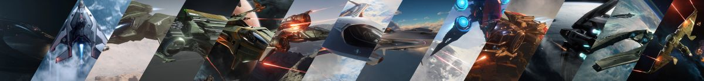

## เปรียบเทียบ Light Fighter ทุกลำใน Star Citizen Alpha 4.3

ใน Star Citizen Alpha 4.3 ยาน Light Fighter (LF) คือกลุ่มยานรบเบาที่เน้นความคล่องตัว ความเร็ว และการต่อสู้แบบ Dogfight โดยเฉพาะ เหมาะกับทั้งมือใหม่และนักบินสาย PvP/PvE ที่ต้องการความมันส์แบบ 1v1 หรือเข้าร่วมศึก Squadron Battle วันนี้เราจะมาเจาะลึกจุดเด่น จุดด้อย และความแตกต่างของ Light Fighter ทั้ง 14 ลำในแพตช์ล่าสุดนี้!

## รายชื่อ Light Fighter ทั้งหมดใน Alpha 4.3

- [Aegis Gladius](https://robertsspaceindustries.com/pledge/ships/aegis-gladius/Gladius)
- [Anvil Arrow](https://robertsspaceindustries.com/pledge/ships/anvil-arrow/Arrow)
- [Anvil Hawk](https://robertsspaceindustries.com/pledge/ships/anvil-hawk/Hawk)
- [Aopoa Khartu-al](https://robertsspaceindustries.com/pledge/ships/aopoa-khartu-al/Khartu-Al)
- [Banu Defender](https://robertsspaceindustries.com/pledge/ships/banu-defender/Defender)
- [Consolidated Outland Mustang Delta](https://robertsspaceindustries.com/pledge/ships/mustang-delta/Mustang-Delta)
- [Drake Buccaneer](https://robertsspaceindustries.com/en/pledge/ships/drake-buccaneer/Buccaneer)
- [Esperia Blade](https://robertsspaceindustries.com/en/pledge/ships/vanduul-blade/Blade)
- [Kruger L-21 Wolf](https://robertsspaceindustries.com/en/pledge/ships/wolf/L-21-Wolf)
- [MISC Reliant Tana](https://robertsspaceindustries.com/en/pledge/ships/reliant/Reliant-Tana)
- [Origin 125a](https://robertsspaceindustries.com/en/pledge/ships/origin-100/125a)
- [RSI Aurora LN](https://robertsspaceindustries.com/en/pledge/ships/rsi-aurora/aurora-ln)

---

## จุดเด่นและจุดด้อยของแต่ละลำ : Key Stats & Highlights

| 
Ship
 | 
Hull HP
 | 
Shield
 | 
Main Weapons
 | 
Stock DPS
 | 
Missiles
 | 
Nav Speed (m/s)
 | 
SCM Speed (Boost)
 | 
Pitch/Yaw/Roll (Boosted)
 | 
Price (aUEC)
 |
|:---:|:---:|:---:|:---:|:---:|:---:|:---:|:---:|:---:|:---:|
| Gladius | 6,110 | 2x S1 | 3x S3 | 891 | 2x S3, 4x S2 | 1,193 | 226 (520) | 68/52/200 (81.6/62.4/240) | 2,381,400 |
| Arrow | 8,580 | 1x S1 | 2x S3, 2x S1 (turret) | 855 | 6x S2 | 1,215 | 229 (515) | 75/57/205 (90/68.4/246) | 1,984,500 |
| Hawk | 16,600 | 2x S1 | 4x S2, 2x S1 (distortion) | 780 | 0 | 1,217 | 225 (490) | 63/52/190 (75.6/62.4/228) | 2,646,000 |
| Khartu-al | 14,100 | 2x S1 | 2x S4 | 872 | 0 | 1,183 | 224 (504) | 67/67/210 (80.4/80.4/252) | 7,229,250 |
| Defender | 13,800 | 1x S2 | 4x S3 (Tachyon) | 1,130 | 4x S2 | 1,175 | 222 (480) | 61/61/170 (73.2/73.2/204) | 6,237,000 |
| Mustang Delta | 10,080 | 2x S1 | 4x S2 | 1,000 | 2x S3 Rocket Pods | 1,195 | 226 (500) | 69/52/202 (82.8/62.4/242.4) | 1,228,500 |
| Buccaneer | 9,480 | 1x S1 | 1x S4, 2x S3, 2x S1 | 1,699 | 4x S2 | 1,400 | 240 (600) | 49/42/155 (58.8/50.4/186) | 1,663,200 |
| Blade | 7,950 | 2x S1 | 2x S3, 2x S2 (Plasma) | 1,656 | 8x S1 | 1,191 | 227 (500) | 70/52/195 (84/62.4/234) | 7,796,250 |
| L-21 Wolf | 8,500 | 2x S1 | 2x S4 (Bespoke Gatling) | 1,354 | 8x S1 | 1,225 | 230 (510) | 75/52/210 (90/62.4/252) | N/A |
| Reliant Tana | 14,860 | 2x S1 | 2x S3, 4x S2 | 932 | 20x S2 | 1,150 | 222 (480) | 58/45/155 (69.6/54/186) | 1,984,500 |
| 125a | 3,900 | 1x S1 | 2x S3 | 582 | 8x S2 | 1,425 | 260 (610) | 70/52/200 (84/62.4/240) | 1,587,600 |
| Aurora LN | 5,740 | 2x S1 | 4x S1 | 467 | 4x S2 | 1,200 | 225 (450) | 65/59/146 (78/70.8/175.2) | 907,200 |

---

## วิเคราะห์เจาะลึก : In-Depth Analysis

นี่คือการวิเคราะห์ยานแต่ละลำโดยอิงจากข้อมูลในตารางสถิติ เพื่อให้เห็นภาพรวมจุดแข็งและจุดอ่อนของยานแต่ละลำในสนามรบ

### **[Aegis Gladius](https://robertsspaceindustries.com/pledge/ships/aegis-gladius/Gladius)**
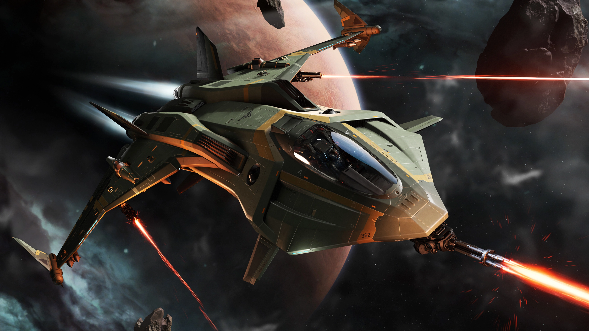
Gladius คือมาตรฐานทองคำของยาน Dogfighter ที่สมดุล แม้จะไม่ได้มีเกราะหนาที่สุดหรือพลังทำลายล้างสูงสุด แต่จุดแข็งของมันคือความคล่องตัวที่ยอดเยี่ยม (Pitch 81.6°/s, Roll 240°/s) ทำให้เป็นยานที่ควบคุมได้ดั่งใจและตอบสนองดีเยี่ยมในสนามรบ เป็นตัวเลือกที่สมบูรณ์แบบสำหรับนักบินที่ให้ความสำคัญกับความสมดุลและความน่าเชื่อถือ

### **[Aopoa Khartu-al](https://robertsspaceindustries.com/pledge/ships/aopoa-khartu-al/Khartu-Al)**
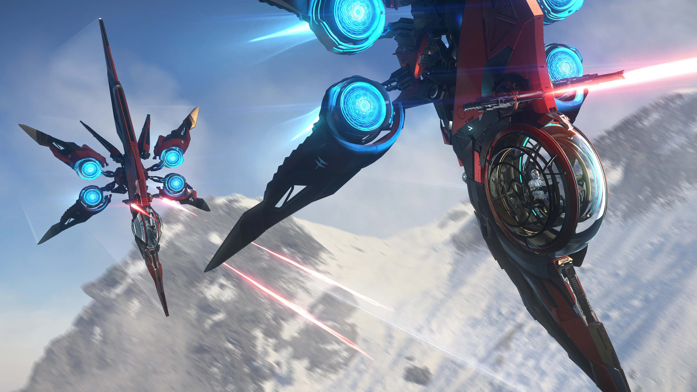
ยานรบสัญชาติ Xi'an ลำนี้โดดเด่นด้วยความทนทานที่น่าประทับใจ (HP 14,100) และความสามารถในการหลบหลีกที่ไม่มีใครเทียบได้ ด้วย Yaw (80.4°/s) และ Roll (252°/s) ที่สูงที่สุดในคลาส ทำให้มันเคลื่อนที่ในแนวข้างและหมุนตัวได้เร็วกว่ายานลำอื่นอย่างเห็นได้ชัด แม้พลังยิง (DPS 872) จะไม่สูงมาก แต่ความสามารถในการเอาตัวรอดและสร้างความสับสนให้คู่ต่อสู้คือจุดแข็งที่แท้จริง

### **[Anvil Arrow](https://robertsspaceindustries.com/pledge/ships/anvil-arrow/Arrow)**
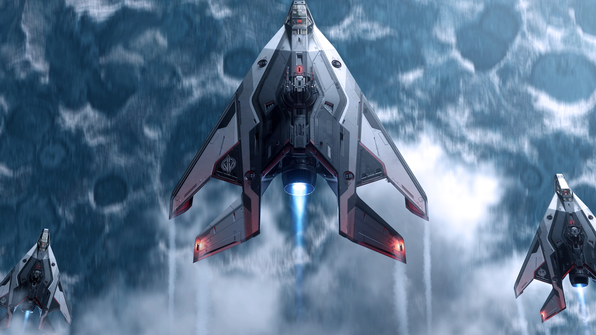
Arrow คือสุดยอดนักสู้ที่เน้นความคล่องตัวและการหลบหลีก มันเปรียบเสมือน "มีดผ่าตัด" ที่ต้องการความแม่นยำสูง มี Pitch ที่สูงที่สุดในคลาส (90°/s) ทำให้มันเป็นหนึ่งในยานที่เข้าโค้งและหลบหลีกได้ดีที่สุด แต่ความสามารถนี้ต้องแลกมาด้วยความเปราะบางอย่างยิ่ง ด้วยเกราะ 1x S1 ที่เป็นจุดอ่อน และ Hull HP ที่ค่อนข้างน้อย (8,580) แม้ DPS (855) จะไม่โดดเด่น แต่มันชดเชยด้วยขนาดที่เล็กและบาง ทำให้เป็นเป้าที่ยิงได้ยากมาก เหมาะสำหรับนักบินที่มีทักษะการบินสูง

### **[Anvil Hawk](https://robertsspaceindustries.com/pledge/ships/anvil-hawk/Hawk)**
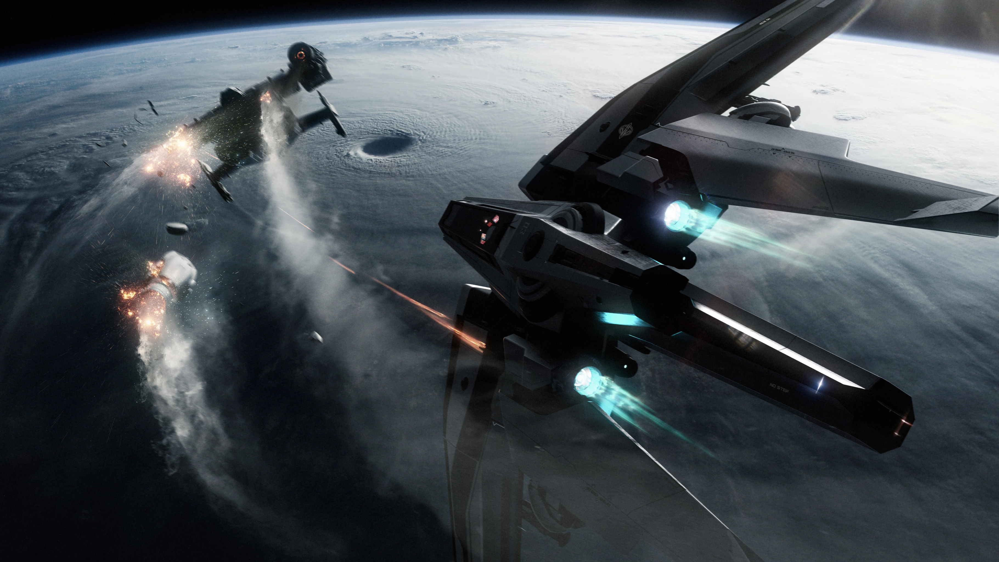
Hawk คือยานที่ทนทานที่สุดในสนามรบ ด้วย Hull HP ที่สูงที่สุดในคลาสถึง 16,600 มันถูกสร้างมาเพื่อรับความเสียหายและอยู่รอดได้นานกว่าใคร แต่ความแข็งแกร่งนี้ต้องแลกมาด้วยพลังทำลายล้างที่ค่อนข้างน้อย (DPS 780) และความคล่องตัวที่ต่ำ (Pitch 75.6°/s) นอกจากนี้ยังมี EMP สำหรับหยุดการเคลื่อนไหวของศัตรู ทำให้มันเป็นนักล่าค่าหัวที่สมบูรณ์แบบ

### **[Banu Defender](https://robertsspaceindustries.com/pledge/ships/banu-defender/Defender)**
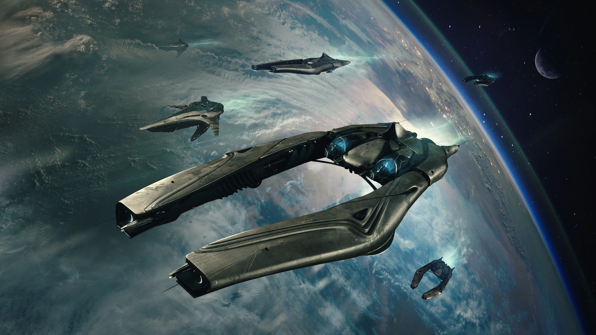
Defender เป็นยานรบหนักที่โดดเด่นด้วยความทนทานและอาวุธที่ไม่เหมือนใคร มี Hull HP สูงถึง 13,800 และเป็นยานเดียวในคลาสที่มีเกราะ S2 ทำให้มันแข็งแกร่งกว่าใคร นอกจากนี้ยังมีพลังทำลายล้างที่น่าประทับใจ (DPS 1,130) จากปืน Tachyon Cannon แต่ความทนทานนี้ก็ต้องแลกมาด้วยความคล่องตัวที่ค่อนข้างต่ำ (Pitch 73.2°/s) ทำให้มันเหมาะกับการเป็นยานคุ้มกันมากกว่า Dogfighter

### **[Consolidated Outland Mustang Delta](https://robertsspaceindustries.com/pledge/ships/mustang-delta/Mustang-Delta)**
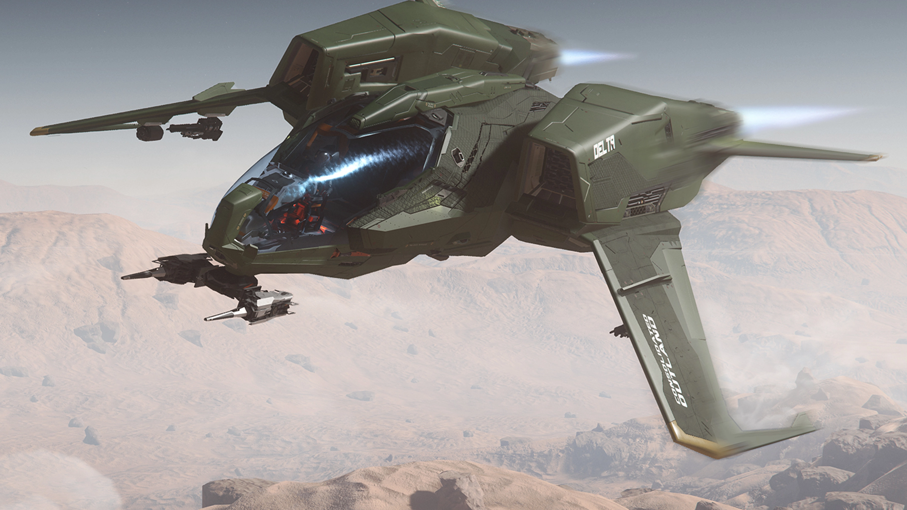
Mustang Delta เป็นยานที่สมดุลและมีความคล่องตัวสูง มีความทนทาน (HP 10,080) และพลังยิง (DPS 1,000) ในระดับที่ดี แต่จุดเด่นของมันคือความคล่องตัวที่ยอดเยี่ยม (Pitch 82.8°/s) และ Rocket Pods ที่ให้ Burst Damage รุนแรง ทำให้มันเป็นตัวเลือกที่ยอดเยี่ยมสำหรับนักบินที่ชอบสไตล์ "Hit and Run"

### **[Drake Buccaneer](https://robertsspaceindustries.com/en/pledge/ships/drake-buccaneer/Buccaneer)**
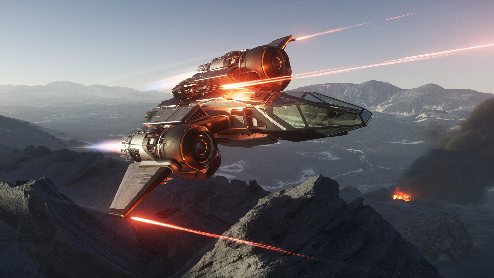
Buccaneer คือ "ปืนใหญ่ติดเครื่องยนต์" อย่างแท้จริง มี DPS สูงที่สุดในคลาส (1,699) และความเร็ว SCM Boost ที่สูงมาก (600 m/s) แต่พลังทำลายล้างและความเร็วนี้ต้องแลกมาด้วยความเปราะบาง ด้วย Hull HP ที่ไม่สูงนัก (9,480) และความคล่องตัวที่ต่ำที่สุดในคลาส (Pitch 58.8°/s) ทำให้มันเป็นยานที่ต้องอาศัยการโจมตีที่รุนแรงและรวดเร็วเพื่อจบการต่อสู้

### **[Esperia Blade](https://robertsspaceindustries.com/en/pledge/ships/vanduul-blade/Blade)**
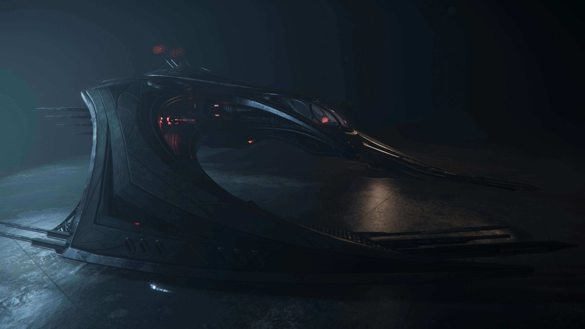
Blade คือเครื่องจักรสังหารที่มีความสมดุลระหว่างพลังทำลายล้างและความคล่องตัว มี DPS สูงที่สุดเป็นอันดับสอง (1,656) และความคล่องตัวที่ยอดเยี่ยม (Pitch 84°/s) ทำให้มันสามารถไล่ล่าและจัดการเป้าหมายได้อย่างรวดเร็ว แต่ก็มีความเปราะบางด้วย Hull HP ที่ค่อนข้างน้อย (7,950) เหมาะสำหรับนักบินที่ต้องการพลังทำลายล้างสูงแต่ยังคงความสามารถในการ Dogfight ที่ดีเยี่ยม

### **[Kruger L-21 Wolf](https://robertsspaceindustries.com/en/pledge/ships/wolf/L-21-Wolf)**
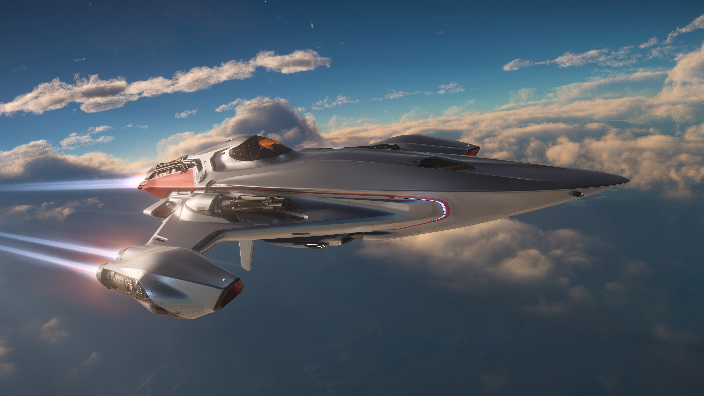
L-21 Wolf คือนักล่าที่อันตรายที่สุดในสนามรบ มี DPS สูงเป็นอันดับสาม (1,354) จากปืน Ballistic Gatling S4 คู่ และมีความคล่องตัวที่สูงที่สุดในคลาส (Pitch 90°/s, Roll 252°/s) เทียบเท่ากับ Arrow และ Khartu-al แต่ก็มีความเปราะบางด้วย Hull HP ที่ค่อนข้างน้อย (8,500) ทำให้มันเป็นยานที่ต้องอาศัยทักษะการบินสูงเพื่อดึงประสิทธิภาพสูงสุดออกมา

### **[MISC Reliant Tana](https://robertsspaceindustries.com/en/pledge/ships/reliant/Reliant-Tana)**
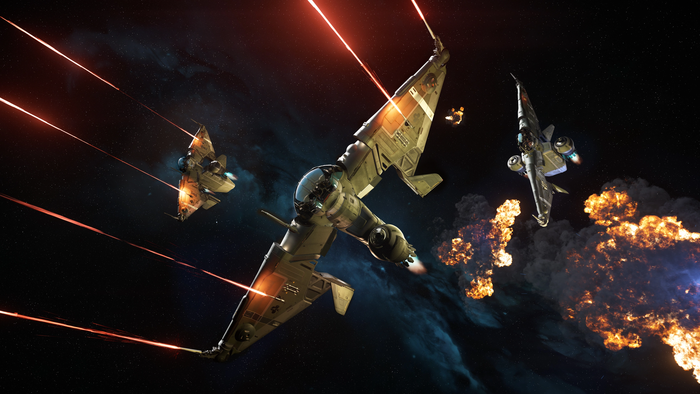
Tana คือ "เรือบรรทุกมิสไซล์" ที่ทนทานที่สุดในคลาส มี Hull HP สูงถึง 14,860 และ Missile มากที่สุดถึง 20 ลูก แต่ความทนทานและคลังแสงนี้ต้องแลกมาด้วยความคล่องตัวที่ค่อนข้างต่ำ (Pitch 69.6°/s) และ DPS จากปืนหลักที่ไม่สูงนัก (932) ทำให้มันเหมาะกับการต่อสู้ระยะไกลและการสนับสนุนทีมมากกว่าการ Dogfight แบบ 1v1

### **[Origin 125a](https://robertsspaceindustries.com/en/pledge/ships/origin-100/125a)**
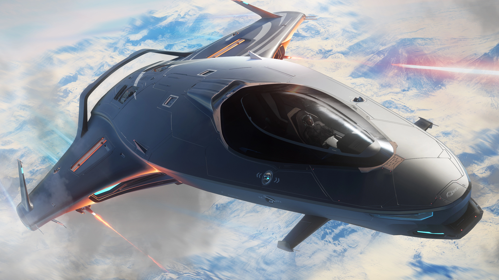
125a คือยานที่เร็วที่สุดในคลาสอย่างไม่มีใครเทียบได้ มี Nav Speed (1,425 m/s) และ SCM Boost (610 m/s) ที่สูงที่สุด แต่ความเร็วนี้ต้องแลกมาด้วย Hull HP ที่ต่ำที่สุดในคลาส (3,900) และ DPS ที่ต่ำมาก (582) ทำให้มันเป็นยานที่เปราะบางมาก เหมาะสำหรับนักบินที่มั่นใจในฝีมือการหลบหลีกและต้องการความเร็วสูงสุดในการเข้าและออกจากการต่อสู้

### **[RSI Aurora LN](https://robertsspaceindustries.com/en/pledge/ships/rsi-aurora/aurora-ln)**
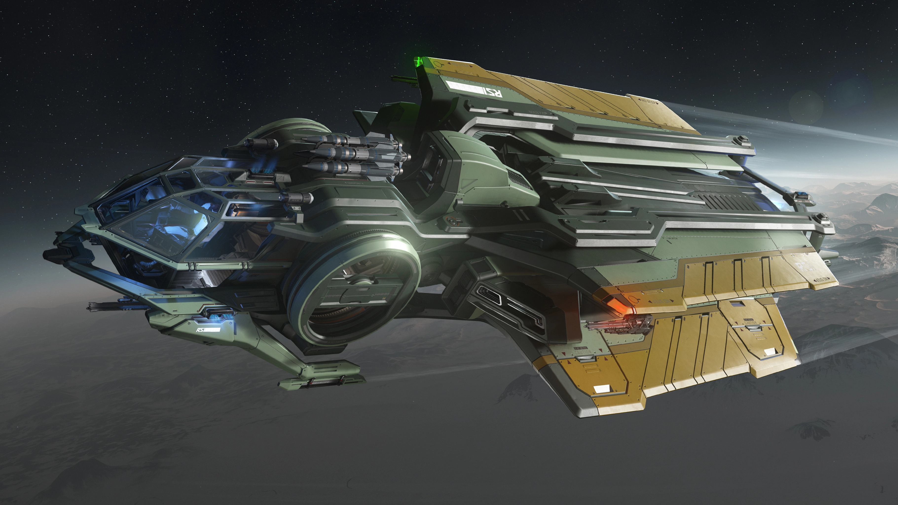
Aurora LN คือยานเริ่มต้นที่แข็งแกร่งเกินตัว แม้จะมี Hull HP (5,740) และ DPS (467) ที่ต่ำที่สุดในคลาส แต่ก็มีความสมดุลที่ดีและราคาที่เข้าถึงง่ายที่สุด มันเป็นยานที่เหมาะสำหรับนักบินใหม่ที่ต้องการเรียนรู้พื้นฐานการต่อสู้และทำงานต่างๆ ในจักรวาล Star Citizen โดยไม่ต้องลงทุนสูง

---

## ภาพรวมและคำแนะนำ : Summary & Recommendations

Light Fighter ใน Alpha 4.3 มีความหลากหลายมาก การเลือกยานที่ใช่ขึ้นอยู่กับสไตล์การเล่นและงบประมาณของคุณ นี่คือการจัดกลุ่มตามความถนัด:

### **สาย Dogfight เน้นความคล่องตัว**
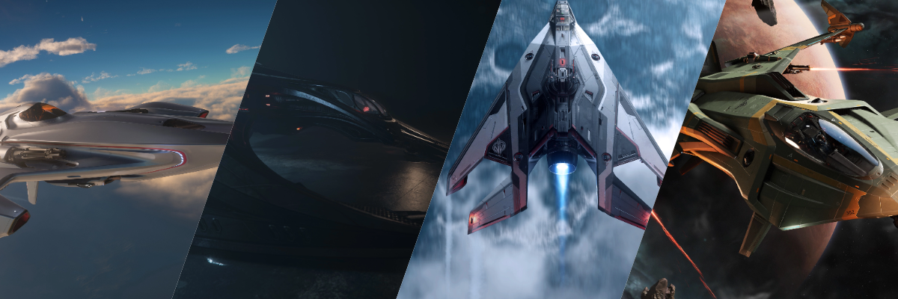
ถ้าคุณชอบการต่อสู้แบบตัวต่อตัวที่ต้องใช้ทักษะการบินสูง ยานเหล่านี้คือคำตอบ
- **Aegis Gladius:** ที่สุดของความสมดุล เป็นยาน Meta ที่นักบิน PvP เลือกใช้
- **Anvil Arrow:** คล่องตัวที่สุดในเกม แต่เปราะบางมาก เหมาะกับนักบินที่มั่นใจในฝีมือหลบหลีก
- **Kruger L-21 Wolf:** ความคล่องตัวสูงเทียบเท่า Arrow แต่มาพร้อมปืน Gatling S4 สองกระบอก
- **Esperia Blade:** ยานดีไซน์ Vanduul ที่มีความเร็วและความคล่องตัวสูง

### **สาย Tank เน้นความทนทาน**
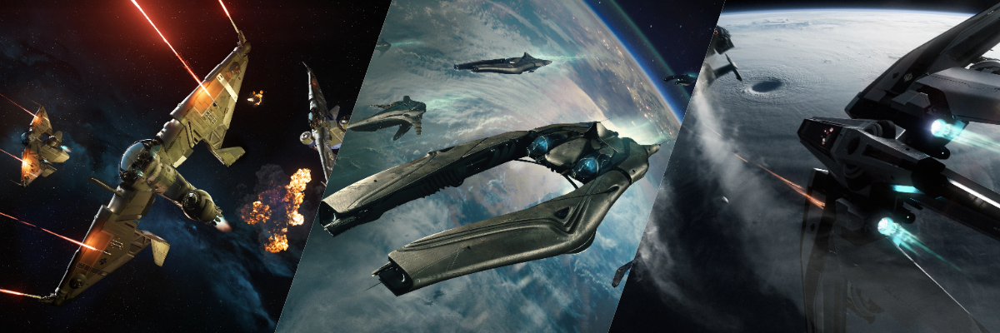
สำหรับนักบินที่ชอบแลกหมัดซึ่งๆ หน้าและต้องการยานที่อึดทนทาน
- **Anvil Hawk:** HP สูงที่สุดในคลาส (16,600) พร้อม EMP สำหรับควบคุมศัตรู
- **MISC Reliant Tana:** HP สูง (14,860) และเป็นเรือบรรทุกมิสไซล์ (20x S2)
- **Banu Defender:** เกราะหนา (HP 13,800) และเป็นยานเดียวในคลาสที่มี Shield ขนาด S2

### **สาย Firepower เน้นพลังทำลายล้าง**
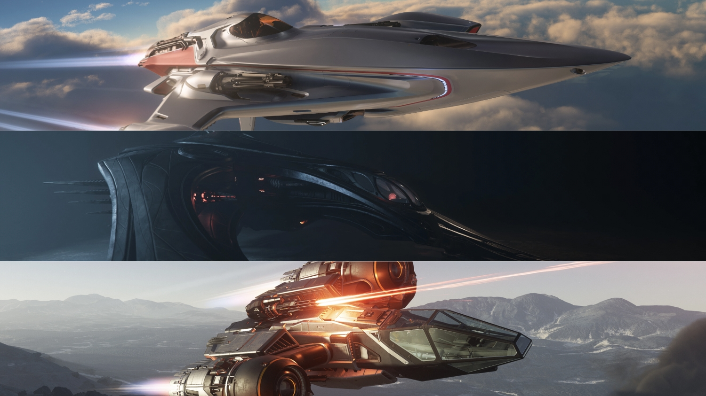
เมื่อ DPS คือทุกสิ่ง ยานเหล่านี้ตอบโจทย์
- **Drake Buccaneer:** "ปืนใหญ่ติดเครื่องยนต์" มี DPS สูงสุดในคลาส แต่แลกมาด้วยความเปราะ
- **Esperia Blade:** อาวุธ Plasma Cannon ที่รุนแรงให้ DPS สูงเป็นอันดับสองในคลาส
- **Kruger L-21 Wolf:** ปืน S4 สองกระบอกให้พลังทำลายล้างมหาศาลเป็นอันดับสาม

### **สายความเร็วสูง Hit & Run**
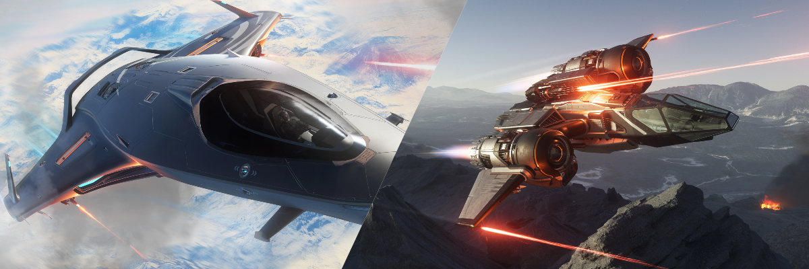
สำหรับนักบินที่ชื่นชอบความเร็วสูงในการเข้าโจมตีและหลบหนี
- **Origin 125a:** เร็วที่สุดในคลาสทั้ง Nav และ SCM Boost แต่มี HP ต่ำที่สุด
- **Drake Buccaneer:** มี SCM Boost สูงถึง 600 m/s ทำให้เข้าออกจากการต่อสู้ได้ไว

### **สายเริ่มต้น คุ้มค่าสำหรับมือใหม่**
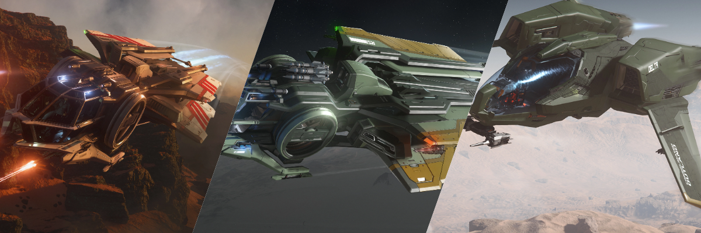
ยานที่เหมาะสำหรับผู้เล่นใหม่ในราคาที่เข้าถึงง่าย
- **Mustang Delta:** มี Rocket Pods สำหรับ Burst Damage ในราคาที่จับต้องได้
- **RSI Aurora LN:** ทนทานเกินตัวสำหรับยานเริ่มต้น มีอาวุธและมิสไซล์ครบเครื่อง (มีรุ่น MR ที่ถูกกว่าแต่อาวุธน้อยกว่า)

---

## สรุป

Light Fighter คือหัวใจของ Dogfight ใน Star Citizen ไม่ว่าคุณจะเป็นมือใหม่หรือโปร การเลือกยานที่เหมาะสมจะช่วยให้คุณสนุกกับเกมมากขึ้น หวังว่าบทความนี้จะช่วยให้คุณตัดสินใจได้ง่ายขึ้น!
