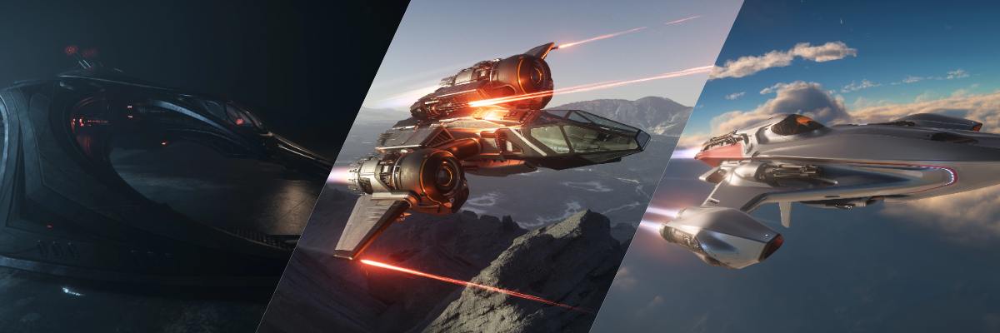

---
title: "เปรียบเทียบ Light Fighter ทุกลำใน Star Citizen Alpha 4.3 (2025)"
subtitle: "เจาะลึกจุดเด่น จุดด้อย และความแตกต่างของยานรบเบาแห่งปี 2955!"
date: "2025-08-18"
lastmod: "2025-08-18"
draft: false
game_version: "Alpha 4.3"
tags: ["light fighter", "ship compare", "star citizen 4.3", "ยานรบเบา"]
categories: ["ships"]
author: "Star Citizen Handbook Team"
weight: 1
image: "ships/alpha-4.3-light-fighter-compare/img/thumbnail.jpg"
description: "บทความเปรียบเทียบยาน Light Fighter ทุกลำใน Star Citizen Alpha 4.3 พร้อมสรุปจุดเด่น จุดด้อย และคำแนะนำสำหรับนักบินทุกระดับ"
---

## เปรียบเทียบ Light Fighter ทุกลำใน Star Citizen Alpha 4.3

ใน Star Citizen Alpha 4.3 ยาน Light Fighter (LF) คือกลุ่มยานรบเบาที่เน้นความคล่องตัว ความเร็ว และการต่อสู้แบบ Dogfight โดยเฉพาะ เหมาะกับทั้งมือใหม่และนักบินสาย PvP/PvE ที่ต้องการความมันส์แบบ 1v1 หรือเข้าร่วมศึก Squadron Battle วันนี้เราจะมาเจาะลึกจุดเด่น จุดด้อย และความแตกต่างของ Light Fighter ทั้ง 14 ลำในแพตช์ล่าสุดนี้!

## รายชื่อ Light Fighter ทั้งหมดใน Alpha 4.3

- [Aegis Gladius](https://robertsspaceindustries.com/pledge/ships/aegis-gladius/Gladius)
- [Anvil Arrow](https://robertsspaceindustries.com/pledge/ships/anvil-arrow/Arrow)
- [Anvil Hawk](https://robertsspaceindustries.com/pledge/ships/anvil-hawk/Hawk)
- [Aopoa Khartu-al](https://robertsspaceindustries.com/pledge/ships/aopoa-khartu-al/Khartu-Al)
- [Banu Defender](https://robertsspaceindustries.com/pledge/ships/banu-defender/Defender)
- [Consolidated Outland Mustang Delta](https://robertsspaceindustries.com/pledge/ships/mustang-delta/Mustang-Delta)
- [Drake Buccaneer](https://robertsspaceindustries.com/en/pledge/ships/drake-buccaneer/Buccaneer)
- [Esperia Blade](https://robertsspaceindustries.com/en/pledge/ships/vanduul-blade/Blade)
- [Kruger L-21 Wolf](https://robertsspaceindustries.com/en/pledge/ships/wolf/L-21-Wolf)
- [MISC Reliant Tana](https://robertsspaceindustries.com/en/pledge/ships/reliant/Reliant-Tana)
- [Origin 125a](https://robertsspaceindustries.com/en/pledge/ships/origin-100/125a)
- [RSI Aurora LN](https://robertsspaceindustries.com/en/pledge/ships/rsi-aurora/aurora-ln)

---

## จุดเด่นและจุดด้อยของแต่ละลำ : Key Stats & Highlights

| 
Ship
 | 
Hull HP
 | 
Shield
 | 
Main Weapons
 | 
Stock DPS
 | 
Missiles
 | 
Nav Speed (m/s)
 | 
SCM Speed (Boost)
 | 
Pitch/Yaw/Roll (Boosted)
 | 
Price (aUEC)
 |
|:---:|:---:|:---:|:---:|:---:|:---:|:---:|:---:|:---:|:---:|
| Gladius | 6,110 | 2x S1 | 3x S3 | 891 | 2x S3, 4x S2 | 1,193 | 226 (520) | 68/52/200 (81.6/62.4/240) | 2,381,400 |
| Arrow | 8,580 | 1x S1 | 2x S3, 2x S1 (turret) | 855 | 6x S2 | 1,215 | 229 (515) | 75/57/205 (90/68.4/246) | 1,984,500 |
| Hawk | 16,600 | 2x S1 | 4x S2, 2x S1 (distortion) | 780 | 0 | 1,217 | 225 (490) | 63/52/190 (75.6/62.4/228) | 2,646,000 |
| Khartu-al | 14,100 | 2x S1 | 2x S4 | 872 | 0 | 1,183 | 224 (504) | 67/67/210 (80.4/80.4/252) | 7,229,250 |
| Defender | 13,800 | 1x S2 | 4x S3 (Tachyon) | 1,130 | 4x S2 | 1,175 | 222 (480) | 61/61/170 (73.2/73.2/204) | 6,237,000 |
| Mustang Delta | 10,080 | 2x S1 | 4x S2 | 1,000 | 2x S3 Rocket Pods | 1,195 | 226 (500) | 69/52/202 (82.8/62.4/242.4) | 1,228,500 |
| Buccaneer | 9,480 | 1x S1 | 1x S4, 2x S3, 2x S1 | 1,699 | 4x S2 | 1,400 | 240 (600) | 49/42/155 (58.8/50.4/186) | 1,663,200 |
| Blade | 7,950 | 2x S1 | 2x S3, 2x S2 (Plasma) | 1,656 | 8x S1 | 1,191 | 227 (500) | 70/52/195 (84/62.4/234) | 7,796,250 |
| L-21 Wolf | 8,500 | 2x S1 | 2x S4 (Bespoke Gatling) | 1,354 | 8x S1 | 1,225 | 230 (510) | 75/52/210 (90/62.4/252) | N/A |
| Reliant Tana | 14,860 | 2x S1 | 2x S3, 4x S2 | 932 | 20x S2 | 1,150 | 222 (480) | 58/45/155 (69.6/54/186) | 1,984,500 |
| 125a | 3,900 | 1x S1 | 2x S3 | 582 | 8x S2 | 1,425 | 260 (610) | 70/52/200 (84/62.4/240) | 1,587,600 |
| Aurora LN | 5,740 | 2x S1 | 4x S1 | 467 | 4x S2 | 1,200 | 225 (450) | 65/59/146 (78/70.8/175.2) | 907,200 |

---

## วิเคราะห์เจาะลึก : In-Depth Analysis

### **[Aegis Gladius](https://robertsspaceindustries.com/pledge/ships/aegis-gladius/Gladius)**

หากคุณมองหาสุดยอด Dogfighter ที่เป็น "Meta" ในปัจจุบัน Gladius คือคำตอบ ด้วยความสมดุลที่ยอดเยี่ยมระหว่างความเร็ว, ความคล่องตัว (Pitch/Yaw 68/52), และอำนาจการยิง (ปืน S3 สามกระบอก) ทำให้มันเป็นตัวเลือกแรกๆ ของนักบิน PvP ชั้นเซียน แม้จะมี Hull HP ไม่สูงนัก (6,110) แต่ประสิทธิภาพที่เชื่อถือได้ในสนามรบก็คุ้มค่า มันคือมาตรฐานของยานรบเบาที่ทุกลำต้องเปรียบเทียบด้วย
*หมายเหตุ: ยังมีรุ่นย่อยอีก 2 รุ่นคือ **Gladius Pirate** และ **Gladius Valiant** ซึ่งมี Loadout และสีที่แตกต่างกันไป แต่ใช้โครงยานเดียวกัน*

### **[Aopoa Khartu-al](https://robertsspaceindustries.com/pledge/ships/aopoa-khartu-al/Khartu-Al)**

ยานสอดแนมจากเผ่า Xi'an ที่มีดีไซน์ไม่เหมือนใคร ด้วยเครื่องยนต์ทรัสเตอร์ที่ขยับได้รอบทิศทาง ทำให้มันมีความคล่องตัวในแนวตั้งและแนวข้าง (Strafe) สูงที่สุดในเกมอย่างน่าเหลือเชื่อ และมีค่า Yaw ที่เท่ากับ Pitch (67/67) ซึ่งหาได้ยากในยานมนุษย์ แม้จะไม่มี Missile แต่ปืน S4 สองกระบอกก็อันตรายมาก การขับ Khartu-al ต้องใช้ทักษะสูง แต่ถ้าเชี่ยวชาญแล้ว มันคือยานที่คาดเดาทิศทางได้ยากที่สุดในสนามรบ

### **[Anvil Arrow](https://robertsspaceindustries.com/pledge/ships/anvil-arrow/Arrow)**

หนึ่งในยานที่คล่องตัวที่สุดในเกม (Pitch/Yaw 75/57) Arrow มีขนาดเล็กและบางมาก ทำให้เป็นเป้าที่ยิงได้ยากสุดๆ ป้อมปืน (Turret) ด้านบนที่ติดตั้งปืน S1 สองกระบอกได้ทำให้มันมีอำนาจการยิงที่ยืดหยุ่น แต่ต้องแลกมาด้วย Shield ที่มีเพียง 1x S1 เท่านั้น มันคือนิยามของ "Glass Cannon" ที่แท้จริง แม้ HP จะอยู่ที่ 8,580 แต่ก็ยังต้องอาศัยความคล่องตัวเป็นหลักในการเอาตัวรอด

### **[Anvil Hawk](https://robertsspaceindustries.com/pledge/ships/anvil-hawk/Hawk)**

นักล่าค่าหัวโดยกำเนิด Hawk มี Hull HP สูงที่สุดในคลาสนี้ถึง 16,600 ทำให้มันทนทานอย่างไม่น่าเชื่อ มาพร้อมกับอุปกรณ์ EMP ที่สามารถปิดระบบยานเป้าหมายได้ชั่วคราว และมีที่นั่งสำหรับนักโทษ (Prisoner Pod) โดยเฉพาะ แม้อาวุธหลักจะเป็นแค่ S2 สี่กระบอกและ S1 อีกสอง แต่ความสามารถในการควบคุมศัตรูด้วย EMP และความทนทานของมัน ทำให้มันเป็นตัวเลือกที่อันตรายมากในการต่อสู้แบบ 1v1

### **[Banu Defender](https://robertsspaceindustries.com/pledge/ships/banu-defender/Defender)**

ยานรบจากเผ่า Banu ที่ออกแบบมาเพื่อคุ้มกันยานขนส่ง Merchantman จุดเด่นคือเกราะที่ทนทาน (HP 13,800) และ Shield ขนาด S2 หนึ่งเดียวในกลุ่มนี้ ปืน Singe Tachyon Cannon S3 ถึงสี่กระบอกของมันยิงทะลุเกราะได้ดี แม้จะไม่คล่องตัวเท่า LF ลำอื่น (Pitch/Yaw 61/61) แต่ความทนทานและอำนาจการยิงของมันทำให้เป็นยานคุ้มกันที่ยอดเยี่ยม

### **[Consolidated Outland Mustang Delta](https://robertsspaceindustries.com/pledge/ships/mustang-delta/Mustang-Delta)**

รุ่นอัพเกรดของ Mustang ที่เน้นการต่อสู้มากขึ้น ด้วยชุดเกราะที่เพิ่ม HP เป็น 10,080 และอาวุธจรวด **Rocket Pods ขนาด S3 สองชุด** ทำให้มันสามารถสร้างความเสียหายแบบ Burst Damage ได้ดีในจังหวะแรกของการปะทะ เป็นตัวเลือกที่น่าสนใจสำหรับนักบินที่ชอบสไตล์ "Hit and Run" ในราคาที่จับต้องได้

### **[Drake Buccaneer](https://robertsspaceindustries.com/en/pledge/ships/drake-buccaneer/Buccaneer)**

"ปืนใหญ่ติดเครื่องยนต์" คือคำนิยามของ Buccaneer ยานลำนี้มีความเร็ว SCM Boost สูงถึง 600 m/s และยึดมั่นในปรัชญาของ Drake คือ "ติดปืนให้เยอะที่สุดเท่าที่จะทำได้" ด้วย Hardpoint จำนวนมาก (S4 x 1, S3 x 2, และ S1 x 2) ทำให้มันมี DPS สูงสุดในคลาสนี้ แต่ก็ต้องแลกมากับความเปราะบาง (HP 9,480, 1x S1 Shield) และความคล่องตัวที่ต่ำที่สุด (Pitch/Yaw 49/42) ไม่มีเกราะ ไม่มีลูกเล่น มีแต่ปืนและความเร็วล้วนๆ

### **[Esperia Blade](https://robertsspaceindustries.com/en/pledge/ships/vanduul-blade/Blade)**

ยานจำลองของ Vanduul Blade ที่สร้างโดย Esperia มันคือยานรบที่เน้นความคล่องตัวสูง (Pitch/Yaw 70/52) มีดีไซน์ที่ดุดันและอาวุธ Plasma Cannon ที่รุนแรง (2x S3, 2x S2) เหมาะกับการโจมตีแบบฉาบฉวย สร้างความเสียหายหนักแล้วถอยออกมาก่อนที่ศัตรูจะตอบโต้ทัน

### **[Kruger L-21 Wolf](https://robertsspaceindustries.com/en/pledge/ships/wolf/L-21-Wolf)**

ยานรบรุ่นใหม่ล่าสุดจาก Kruger ที่เปิดตัวอย่างสวยงามด้วยอาวุธ Bespoke Ballistic Gatling ขนาด S4 ถึงสองกระบอก ทำให้มันมีอำนาจการยิงที่น่าเกรงขามที่สุดในกลุ่มนี้ และมีความคล่องตัวสูงมาก (Pitch/Yaw 75/52) เทียบเท่ากับ Anvil Arrow แม้จะเป็นยานใหม่ แต่ก็สร้างชื่อเสียงได้อย่างรวดเร็วในฐานะนักล่าที่อันตราย เหมาะกับนักบินที่ชอบพลังทำลายล้างสูง

### **[MISC Reliant Tana](https://robertsspaceindustries.com/en/pledge/ships/reliant/Reliant-Tana)**

ยานรบสองที่นั่งจาก MISC ที่มีจุดเด่นคือความยืดหยุ่น ด้วยปีกที่หมุนได้และ Missile จำนวนมหาศาล (20x S2) ทำให้มันเป็น "Missile Boat" ที่น่ากลัวที่สุดในคลาสนี้ นอกจากนี้ยังมีที่นั่งสำหรับ Co-pilot ที่สามารถควบคุมป้อมปืนแยกได้ ทำให้มันรับมือกับศัตรูได้หลากหลายรูปแบบ แม้ความคล่องตัวจะต่ำ (Pitch/Yaw 58/45) แต่ HP ที่สูงถึง 14,860 ก็ทำให้มันทนทานพอสมควร

### **[Origin 125a](https://robertsspaceindustries.com/en/pledge/ships/origin-100/125a)**

ยานเริ่มต้นสายหรูจาก Origin ที่มาพร้อมกับความเร็วสูงสุดในคลาส Light Fighter ทั้ง Nav Speed (1,425 m/s) และ SCM Boost (610 m/s) และยังมีระบบเติมเชื้อเพลิงไฮโดรเจนในตัว (AIR System) แต่ต้องแลกมาด้วย Hull HP ที่ต่ำที่สุดเพียง 3,900 เท่านั้น แม้จะมีอาวุธ S3 สองกระบอก แต่ความเปราะบางของมันก็เป็นจุดที่ต้องระวัง เหมาะกับนักบินที่มั่นใจในฝีมือการหลบหลีกและชอบความเร็วเป็นชีวิตจิตใจ

### **[RSI Aurora LN](https://robertsspaceindustries.com/en/pledge/ships/rsi-aurora/aurora-ln)**

"Legionnaire" คือรุ่นอัพเกรดของ Aurora ที่เน้นการต่อสู้โดยเฉพาะ ด้วยอาวุธ S1 ถึง 4 กระบอก และ Missile S2 อีก 4 ลูก ทำให้มันเป็นยานเริ่มต้นที่แข็งแกร่งและทนทานเกินตัว (HP 5,740) สามารถรับมือกับภารกิจต่อสู้เบื้องต้นได้สบายๆ และยังมีที่นอนกับ Cargo เล็กน้อยติดมาให้ด้วย

*หมายเหตุ: ยังมีรุ่น **[RSI Aurora MR](https://robertsspaceindustries.com/pledge/ships/rsi-aurora/aurora-mr)** (ราคา 680,400 aUEC) ที่เป็นโครงยานเดียวกันแต่ติดอาวุธน้อยกว่า (2x S1 + 2x S1 Missile) เหมาะกับผู้เล่นที่ต้องการยานอเนกประสงค์ในราคาถูก*

---

## ภาพรวมและคำแนะนำ : Summary & Recommendations

Light Fighter ใน Alpha 4.3 มีความหลากหลายมาก การเลือกยานที่ใช่ขึ้นอยู่กับสไตล์การเล่นและงบประมาณของคุณ นี่คือการจัดกลุ่มตามความถนัด:

### **สาย Dogfight เน้นความคล่องตัว**

ถ้าคุณชอบการต่อสู้แบบตัวต่อตัวที่ต้องใช้ทักษะการบินสูง ยานเหล่านี้คือคำตอบ
    - **Aegis Gladius:** ที่สุดของความสมดุล เป็นยาน Meta ที่นักบิน PvP เลือกใช้
    - **Anvil Arrow:** คล่องตัวที่สุดในเกม แต่เปราะบางมาก เหมาะกับนักบินที่มั่นใจในฝีมือหลบหลีก
    - **Kruger L-21 Wolf:** ความคล่องตัวสูงเทียบเท่า Arrow แต่มาพร้อมปืน Gatling S4 สองกระบอก
    - **Esperia Blade:** ยานดีไซน์ Vanduul ที่มีความเร็วและความคล่องตัวสูง

### **สาย Tank เน้นความทนทาน**

สำหรับนักบินที่ชอบแลกหมัดซึ่งๆ หน้าและต้องการยานที่อึดทนทาน
    - **Anvil Hawk:** HP สูงที่สุดในคลาส (16,600) พร้อม EMP สำหรับควบคุมศัตรู
    - **MISC Reliant Tana:** HP สูง (14,860) และเป็นเรือบรรทุกมิสไซล์ (20x S2)
    - **Banu Defender:** เกราะหนา (HP 13,800) และเป็นยานเดียวในคลาสที่มี Shield ขนาด S2

### **สาย Firepower เน้นพลังทำลายล้าง**

เมื่อ DPS คือทุกสิ่ง ยานเหล่านี้ตอบโจทย์
    - **Drake Buccaneer:** "ปืนใหญ่ติดเครื่องยนต์" มี DPS สูงสุดในคลาส แต่แลกมาด้วยความเปราะ
    - **Kruger L-21 Wolf:** ปืน S4 สองกระบอกให้พลังทำลายล้างมหาศาล
    - **Aopoa Khartu-al:** ปืน S4 สองกระบอกบนยานที่เคลื่อนไหวได้คาดเดายาก

### **สายความเร็วสูง Hit & Run**

สำหรับนักบินที่ชื่นชอบความเร็วสูงในการเข้าโจมตีและหลบหนี
    - **Origin 125a:** เร็วที่สุดในคลาสทั้ง Nav และ SCM Boost แต่มี HP ต่ำที่สุด
    - **Drake Buccaneer:** มี SCM Boost สูงถึง 600 m/s ทำให้เข้าออกจากการต่อสู้ได้ไว

### **สายเริ่มต้น คุ้มค่าสำหรับมือใหม่**

ยานที่เหมาะสำหรับผู้เล่นใหม่ในราคาที่เข้าถึงง่าย
    - **Mustang Delta:** มี Rocket Pods สำหรับ Burst Damage ในราคาที่จับต้องได้
    - **RSI Aurora LN:** ทนทานเกินตัวสำหรับยานเริ่มต้น มีอาวุธและมิสไซล์ครบเครื่อง (มีรุ่น MR ที่ถูกกว่าแต่อาวุธน้อยกว่า)

---

## สรุป

Light Fighter คือหัวใจของ Dogfight ใน Star Citizen ไม่ว่าคุณจะเป็นมือใหม่หรือโปร การเลือกยานที่เหมาะสมจะช่วยให้คุณสนุกกับเกมมากขึ้น หวังว่าบทความนี้จะช่วยให้คุณตัดสินใจได้ง่ายขึ้น!
