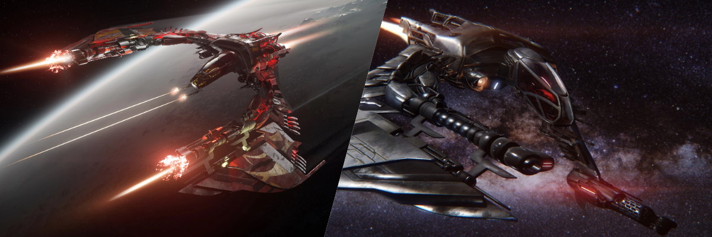

## เปรียบเทียบ Medium Fighter ทุกลำใน Star Citizen Alpha 4.3

ใน Star Citizen Alpha 4.3 ยาน Medium Fighter (MF) คือกลุ่มยานรบกลางที่เน้นพลังทำลายล้าง ความทนทาน และความเก่งกาจหลายด้าน เหมาะกับทั้งนักบิน Solo และ Squadron ที่ต้องการความแข็งแกร่งในการต่อสู้แบบ Multi-role วันนี้เราจะมาเจาะลึกจุดเด่น จุดด้อย และความแตกต่างของ Medium Fighter ทั้ง 20 ลำในแพตช์ล่าสุดนี้!

## รายชื่อ Medium Fighter ทั้งหมดใน Alpha 4.3

### Military Variants (UEE Navy Only)
- [Anvil F7A Hornet Mk I](https://robertsspaceindustries.com/pledge/ships/anvil-hornet/F7A-Hornet) - **Military Only**
- [Anvil F7A Hornet Mk II](https://robertsspaceindustries.com/pledge/ships/anvil-hornet/F7A-Hornet) - **Military Only**

### Civilian Available Ships
- [Anvil F7C Hornet Mk I](https://robertsspaceindustries.com/pledge/ships/anvil-hornet/Hornet)
- [Anvil F7C Hornet Wildfire Mk I](https://robertsspaceindustries.com/pledge/ships/anvil-hornet/Hornet-Wildfire) - **Special Edition**
- [Anvil F7C-M Hornet Heartseeker Mk I](https://robertsspaceindustries.com/pledge/ships/anvil-hornet/Hornet-Heartseeker)
- [Anvil F7C-M Hornet Heartseeker Mk II](https://robertsspaceindustries.com/pledge/ships/anvil-hornet/Hornet-Heartseeker)
- [Anvil F7C-M Super Hornet Mk I](https://robertsspaceindustries.com/pledge/ships/anvil-hornet/Super-Hornet)
- [Anvil F7C-M Super Hornet Mk II](https://robertsspaceindustries.com/pledge/ships/anvil-hornet/Super-Hornet)
- [Anvil F7C-R Hornet Tracker Mk I](https://robertsspaceindustries.com/pledge/ships/anvil-hornet/Hornet-Tracker)
- [Anvil F7C-R Hornet Tracker Mk II](https://robertsspaceindustries.com/pledge/ships/anvil-hornet/Hornet-Tracker)
- [Anvil F7C-S Hornet Ghost Mk I](https://robertsspaceindustries.com/pledge/ships/anvil-hornet/Hornet-Ghost)
- [Anvil F7C-S Hornet Ghost Mk II](https://robertsspaceindustries.com/pledge/ships/anvil-hornet/Hornet-Ghost)
- [Anvil F7C Hornet Mk II](https://robertsspaceindustries.com/pledge/ships/anvil-hornet/Hornet)
- [Aopoa San'tok.yāi](https://robertsspaceindustries.com/pledge/ships/santok-yai/San-tok-yai)
- [Drake Cutlass Black](https://robertsspaceindustries.com/pledge/ships/drake-cutlass/Cutlass-Black)
- [Drake Cutlass Blue](https://robertsspaceindustries.com/pledge/ships/drake-cutlass/Cutlass-Blue)
- [Esperia Glaive](https://robertsspaceindustries.com/pledge/ships/glaive/Glaive)
- [RSI Meteor](https://robertsspaceindustries.com/pledge/ships/meteor/Meteor)
- [Esperia Scythe](https://robertsspaceindustries.com/pledge/ships/scythe/Scythe)

---

## จุดเด่นและจุดด้อยของแต่ละลำ : Key Stats & Highlights

| 
Ship
 | 
Hull HP
 | 
Shield
 | 
Stock Shield HP
 | 
Main Weapons
 | 
Stock DPS
 | 
Missiles
 | 
Nav Speed (m/s)
 | 
SCM Speed (Boost)
 | 
Pitch/Yaw/Roll (Boosted)
 | 
Price (aUEC)
 |
|:---:|:---:|:---:|:---:|:---:|:---:|:---:|:---:|:---:|:---:|:---:|
| F7A Hornet Mk II | 13,051 | 2x S1 | 3,460 | 4x S3 2x S4 | 2,823 | 8x S2 | 1,146 | 220 (479) | 50/40/143 (60/48/171.6) | **Military Only** |
| F7C Hornet Mk II | 16,050 | 2x S1 | 3,460 | 2x S4 | 1,688 | 8x S1 | 1,150 | 220 (480) | 52/43/148 (62.4/51.6/177.6) | 4,895,100 |
| Hornet Tracker Mk II | 12,751 | 2x S1 | 3,460 | 2x S4 | 1,688 | 8x S1 | 1,150 | 220 (480) | 52/43/148 (62.4/51.6/177.6) | N/A |
| Super Hornet Mk II | 15,250 | 3x S1 | 5,190 | 4x S3 2x S4 | 2,825 | 8x S2 | 1,125 | 215 (465) | 50/40/140 (60/48/168) | N/A |
| Hornet Heartseeker Mk II | 15,250 | 3x S1 | 5,190 | 2x S3 4x S4 | 3,404 | 8x S2 | 1,125 | 215 (465) | 50/40/140 (60/48/168) | N/A |
| Hornet Ghost Mk II | 12,551 | 2x S1 | 3,460 | 2x S4 | 1,688 | 8x S1 | 1,150 | 220 (480) | 51/42/147 (61.2/50.4/176.4) | 5,384,600 |
| San'tok.yāi | 11,476 | 1x S2 | 4,740 | 4x S3 | 870 | 8x S2 | 1,161 | 227 (493) | 58/58/160 (69.6/69.6/192) | 9,355,500 |
| Glaive | 10,962 | 2x S1 | 3,460 | 2x S1 2x S5 | 1,670 | 8x S2 | 1,150 | 218 (480) | 60/43/155 (72/51.6/186) | N/A |
| Meteor | 30,150 | 2x S1 | 3,460 | 4x S3 2x S5 | 3,351 | 8x S2 | 1,405 | 229 (570) | 46/38/155 (55.2/45.6/186) | N/A |
| Scythe | 11,701 | 2x S1 | 3,460 | 2x S1 2x S5 | 1,012 | 8x S1 | 1,150 | 222 (480) | 56/52/147 (67.2/62.4/176.4) | N/A |

**Anvil Hornet Mk I Series** เป็นยานตกรุ่น ความสามารถส่วนใหญ่จะด้อยกว่า Mk II และ Mk II มักจะถูกพูดถึงและแนะนำมากกว่า จึงขอแยกตาราง Mk I ออกมา

| 
Ship
 | 
Hull HP
 | 
Shield
 | 
Stock Shield HP
 | 
Main Weapons
 | 
Stock DPS
 | 
Missiles
 | 
Nav Speed (m/s)
 | 
SCM Speed (Boost)
 | 
Pitch/Yaw/Roll (Boosted)
 | 
Price (aUEC)
 |
|:---:|:---:|:---:|:---:|:---:|:---:|:---:|:---:|:---:|:---:|:---:|
| F7A Hornet Mk I | 16,756 | 2x S1 | 3,000 | 2x S2 2x S4 2x S3 Turret | 2,594 | 4x S1 4x S2 | 1,146 | 220 (479) | 53/42/147 (63.6/50.4/176.4) | **Military Only** |
| F7C Hornet Mk I | 15,550 | 2x S1 | 3,000 | 2x S3 | 582 | 4x S2 4x S1 | 1,150 | 220 (480) | 55/44/149 (66/52.8/178.8) | 2,910,600 |
| F7C Hornet Wildfire Mk I | 15,550 | 2x S1 | 3,000 | 2x S3 1x S4 | 1,463 | 4x S2 4x S1 | 1,150 | 220 (480) | 55/44/149 (66/52.8/178.8) | 4,630,500 |
| Hornet Tracker Mk I | 15,550 | 2x S1 | 3,000 | 2x S3 | 582 | 4x S2 4x S1 | 1,142 | 219 (477) | 56/45/150 (67.2/54/180) | 3,210,480 |
| Super Hornet Mk I | 15,450 | 2x S1 | 3,460 | 2x S1 2x S2 2x S3 | 1,201 | 8x S1 | 1,142 | 219 (477) | 53/42/145 (63.6/50.4/174) | 4,762,800 |
| Hornet Heartseeker Mk I | 15,450 | 2x S1 | 3,460 | 2x S1 2x S3 1x S4 | 1,490 | 4x S2 | 1,142 | 219 (477) | 53/42/145 (63.6/50.4/174) | N/A |
| Hornet Ghost Mk I | 15,350 | 2x S1 | 3,000 | 2x S3 | 582 | 4x S2 4x S1 | 1,142 | 219 (477) | 55/44/149 (66/52.8/178.8) | 3,307,500 |

**Cutlass Series** เป็น Multi-Role (Medium Fighter + Medium Freight) แต่ด้วยค่าความที่ความสามารถต่างๆ ออกไปทางยานขนาด Medium ซะมากกว่า เลยขอแยกออกมาเป็นอีกตาราง 

| 
Ship
 | 
Hull HP
 | 
Shield
 | 
Stock Shield HP
 | 
Main Weapons
 | 
Stock DPS
 | 
Missiles
 | 
Nav Speed (m/s)
 | 
SCM Speed (Boost)
 | 
Pitch/Yaw/Roll (Boosted)
 | 
Price (aUEC)
 |
|:---:|:---:|:---:|:---:|:---:|:---:|:---:|:---:|:---:|:---:|:---:|
| Cutlass Black | 29,760 | 1x S2 | 4,130 | 4x S3 2x S3 Turret | 1,206 | 8x S2 8x S3 | 1,150 | 217 (465) | 39/35/110 (46.8/42/132) | 2,116,800 |
| Cutlass Blue | 35,770 | 1x S2 | 5,760 | 4x S3 2x S3 Turret | 1,140 | 24x S2 | 1,165 | 220 (467) | 38/34/110 (45.6/40.8/132) | 3,704,400 |

---

## วิเคราะห์เจาะลึก : In-Depth Analysis

นี่คือการวิเคราะห์ยานแต่ละลำโดยอิงจากข้อมูลในตารางสถิติ พร้อมคำแนะนำสไตล์การเล่น เพื่อให้เห็นภาพรวมจุดแข็งและจุดอ่อนของยานแต่ละลำในสนามรบ

### **ตระกูล Anvil Hornet Mk II: The Modern Standard**

ตระกูล Hornet Mk II คือการยกระดับของยานรบระดับตำนานที่ได้รับการปรับปรุงใหม่ทั้งหมดเพื่อสนามรบยุคใหม่ มีพลังทำลายล้าง, ความทนทาน และเทคโนโลยีที่เหนือกว่ารุ่น Mk I อย่างชัดเจน ทำให้เป็นตัวเลือกอันดับต้นๆ สำหรับนักบินที่ต้องการประสิทธิภาพสูงสุด

- **F7A Hornet Mk II**: **ยุทธศาสตร์ยุคใหม่** แม้จะมี Hull HP ที่ต่ำกว่า Mk I (13,051) แต่มี DPS สูงถึง 2,823 และมิสไซล์ 8x S2 ทำให้เป็นยานที่เน้นความเร็วในการจัดการเป้าหมาย
    - **คำแนะนำและสไตล์การเล่น:** **Modern Military Precision** เหมาะสำหรับภารกิจที่ต้องการความแม่นยำและพลังทำลายล้างสูง

- **F7C Hornet Mk II**: **รุ่นมาตรฐานที่สมดุลที่สุด** มี Hull HP (16,050) และ DPS (1,688) ที่ดีในระดับเริ่มต้นของ Mk II ทำให้เป็นยานที่เหมาะสำหรับนักบินที่ต้องการความยืดหยุ่นและประสิทธิภาพที่เชื่อถือได้ในทุกสถานการณ์
    - **คำแนะนำและสไตล์การเล่น:** เหมาะสำหรับนักบินที่ชอบสไตล์ **Balanced** และ **Flexible** เป็นยานที่ทำได้ดีในทุกสถานการณ์ ไม่ว่าจะเป็นการต่อสู้, ภารกิจคุ้มกัน หรือลาดตระเวน เป็นตัวเลือกที่ยอดเยี่ยมสำหรับผู้ที่ต้องการยานลำเดียวที่จบครบทุกอย่าง

- **Super Hornet Mk II**: **Brawler ที่แท้จริง** โดดเด่นด้วย DPS ที่สูงถึง 2,825 และเป็นยานที่นั่งคู่ (Two-Seater) ทำให้มีป้อมปืน (Turret) สำหรับพลปืนคนที่สอง เพิ่มพลังการยิงและครอบคลุมพื้นที่ได้ 360 องศา แม้จะแลกมาด้วยความคล่องตัวที่ลดลง แต่ก็เหมาะอย่างยิ่งสำหรับการต่อสู้แบบทีม
    - **คำแนะนำและสไตล์การเล่น:** เหมาะสำหรับสาย **Heavy Firepower** ที่เล่นกับเพื่อน (Co-op) การมีพลปืนช่วยยิงจะทำให้ยานลำนี้แสดงศักยภาพสูงสุด

- **Heartseeker Mk II**: **นักล่าที่อันตรายที่สุดในกลุ่ม Modern Fighter** โดยพื้นฐานแล้วคือ Super Hornet Mk II ที่ติดตั้งชุดอัปเกรดพิเศษ มาพร้อมกับปืน Ballistic Gatling คู่บนป้อมปืน (Turret) และสกินที่เป็นเอกลักษณ์ ทำให้มี **DPS สูงที่สุดในกลุ่มถึง 3,404** เหมาะสำหรับนักบินที่ต้องการพลังทำลายล้างสูงสุดและไม่เกรงกลัวที่จะเข้าปะทะ
    - **คำแนะนำและสไตล์การเล่น:** สำหรับนักบินสาย **Aggressive** และ **Heavy Firepower** ที่ต้องการปิดเกมให้เร็วที่สุด ยานลำนี้คือเครื่องมือสังหารชั้นยอด

- **Ghost Mk II**: **นักฆ่าในเงามืด** แม้จะมี Hull HP ที่ต่ำที่สุดในบรรดา Mk II (12,551) แต่ก็ชดเชยด้วยอุปกรณ์ Stealth ที่ดีที่สุด ทำให้ตรวจจับได้ยาก เหมาะสำหรับภารกิจลอบโจมตี, สอดแนม, หรือการโจมตีแบบฉาบฉวยที่ศัตรูไม่ทันตั้งตัว
    - **คำแนะนำและสไตล์การเล่น:** เหมาะสำหรับภารกิจ **Stealth** และ **Ambush** โดยเฉพาะ เป็นยานสำหรับนักบินที่ชอบเล่นแบบมีกลยุทธ์และชิงความได้เปรียบจากความเงียบ

- **Tracker Mk II**: **ผู้สอดแนมแห่งสมรภูมิ** มาพร้อมกับระบบสแกนและเรดาร์ขั้นสูงที่เหนือกว่ารุ่นอื่น ทำให้สามารถตรวจจับและติดตามเป้าหมายได้จากระยะไกล แม้จะมี Hull HP ที่เปราะบาง (12,751) แต่ก็เป็นตัวเลือกที่ยอดเยี่ยมสำหรับภารกิจลาดตระเวนและรวบรวมข้อมูลข่าวกรอง (ยังไม่มีในเกมตอนนี้)
    - **คำแนะนำและสไตล์การเล่น:** เหมาะสำหรับภารกิจ **Recon** และ **Intelligence Gathering** เป็นดวงตาของทีมในสนามรบ

### **Aopoa San'tok.yāi: The Agile Alien Fighter**

- **San'tok.yāi** คือยานรบจากเผ่า Xi'an ที่โดดเด่นด้วยเทคโนโลยีและความคล่องตัว แม้จะมีจุดอ่อนที่ **Hull HP ต่ำ (11,476)** และ **ขนาดตัวยานที่ใหญ่** ทำให้เป็นเป้าได้ง่าย แต่ก็เป็นยานเดียวในกลุ่ม Modern Fighter ที่มีโล่ S2 ทำให้ทนทานกว่าที่เห็น จุดเด่นที่สุดคือ **ความคล่องตัวที่สูงและสมดุล (Pitch/Yaw 58/58)** และ **SCM Speed ที่เร็ว (227 m/s)** ทำให้เป็นยานที่หลบหลีกและควบคุมได้ดีเยี่ยม
    - **คำแนะนำและสไตล์การเล่น:** เหมาะสำหรับนักบินสาย **Agile Dogfighter** ที่เน้นทักษะการบินสูง สามารถใช้ความคล่องตัวเพื่อหลบหลีกและโจมตีจากมุมที่ศัตรูคาดไม่ถึง

### **Vanduul Alien Ships: The Glass Cannons**

- **Esperia Glaive**: เครื่องจักรสังหาร Vanduul ที่มี **Hull HP ต่ำที่สุดในกลุ่ม Modern Fighter (10,962)** แต่มี **DPS สูงถึง 1,670** และ **ความคล่องตัวในแกน Pitch ที่สูง (60/72)** ทำให้เป็นยานที่อันตรายอย่างยิ่งในมือของนักบินที่มีทักษะ
- **Esperia Scythe**: ยาน Vanduul อีกลำที่มี **Hull HP ต่ำ (11,701)** และ DPS ที่ 1,012 แต่มีความโดดเด่นที่ **ความคล่องตัวในแกน Yaw ที่สูง (52/62.4)** ทำให้ควบคุมได้ดีในแนวระนาบ
    - **คำแนะนำและสไตล์การเล่น:** ทั้งสองลำเป็น **Glass Cannons** เหมาะสำหรับนักบินที่มีทักษะสูง (High-Skill Ceiling) ที่สามารถใช้ประโยชน์จากความคล่องตัวที่โดดเด่นในแต่ละแกนเพื่อสร้างความได้เปรียบและหลีกเลี่ยงการถูกโจมตี

### **RSI Meteor: The Flying Fortress**

- **Meteor** คือ "ป้อมปราการบินได้" อย่างแท้จริง มี **Hull HP สูงที่สุดในกลุ่ม Modern Fighter (30,150)** และ **DPS สูงเป็นอันดับสองที่ 3,351** (รองจาก Heartseeker Mk II) นอกจากนี้ยังมี **ความเร็วที่สูงที่สุด (Nav 1,405 m/s, SCM 229/570)** แต่ต้องแลกมาด้วย **ความคล่องตัวที่ต่ำที่สุดในทุกแกน**
    - **คำแนะนำและสไตล์การเล่น:** เหมาะสำหรับสาย **Heavy Firepower** ที่เน้นการโจมตีแบบซึ่งๆ หน้า (Head-on Attack) และไม่เหมาะกับการ Dogfight ที่ต้องใช้ความคล่องตัวสูง เป็นยานที่แข็งแกร่งและทรงพลังในการปะทะตรงๆ

### **กลุ่ม Anvil Hornet Mk I: The Classic Fighters**

ยาน Hornet รุ่นแรกทั้งหมด (F7A, F7C, Wildfire, Super Hornet, Heartseeker, Tracker, Ghost) คือมรดกที่ถูกส่งต่อมา แม้จะเคยเป็นยานที่โดดเด่นในอดีต แต่ในปัจจุบันมีประสิทธิภาพที่ด้อยกว่ารุ่น Mk II อย่างมาก โดยเฉพาะในด้านพลังทำลายล้าง (DPS) ที่ต่ำกว่าอย่างเห็นได้ชัด ทำให้ไม่เหมาะกับการใช้งานในสนามรบสมัยใหม่
- **คำแนะนำและสไตล์การเล่น:** เป็นตัวเลือกที่ยอดเยี่ยมสำหรับ **นักบินใหม่ที่มีงบจำกัด** หรือ **นักสะสม** ที่ชื่นชอบดีไซน์คลาสสิก แม้ประสิทธิภาพจะด้อยกว่า แต่ก็ยังคงใช้งานได้ดีในสถานการณ์ส่วนใหญ่ โดย **Heartseeker Mk I** เป็นตัวเลือกที่น่าสนใจที่สุดในกลุ่มนี้ด้วย DPS ที่สูงสุด

### **กลุ่ม Cutlass Series: The Versatile Powerhouses**

- **Cutlass Black**: "กบฏแห่งวงการ" ที่มาพร้อมความอเนกประสงค์ มี **Hull HP สูงถึง 29,760** และมิสไซล์ 8x S2 + 8x S3 ทำให้เป็นยานที่ทรงพลังและทนทาน แต่ต้องแลกมาด้วย **ความคล่องตัวที่ต่ำ**
    - **คำแนะนำและสไตล์การเล่น:** **Jack-of-all-trades** ที่แท้จริง เหมาะสำหรับผู้เล่นใหม่ที่ต้องการความยืดหยุ่น สามารถทำได้ทั้งการต่อสู้, ขนส่งสินค้า หรือแม้แต่บรรทุกยานพาหนะขนาดเล็ก
- **Cutlass Blue**: รุ่น Law Enforcement ที่มี **Hull HP สูงที่สุดในกลุ่ม (35,770)** และมิสไซล์มากถึง 24x S2 ทำให้เป็นป้อมปราการลอยฟ้าที่แท้จริง แต่ก็ยังคงมี **ความคล่องตัวที่ต่ำ** เช่นเดียวกับ Cutlass Black
    - **คำแนะนำและสไตล์การเล่น:** **Tanker** ที่แท้จริง เหมาะสำหรับภารกิจที่ต้องการความทนทานสูง เช่น การล่าค่าหัว (Bounty Hunting) หรือภารกิจ Law Enforcement