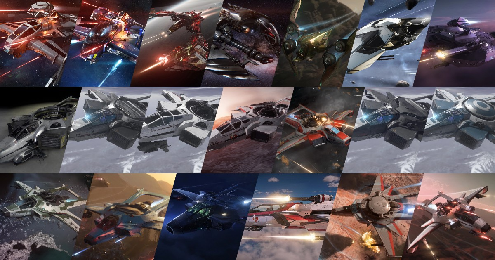

## เปรียบเทียบ Medium Fighter ทุกลำใน Star Citizen Alpha 4.3

ใน Star Citizen Alpha 4.3 ยาน Medium Fighter (MF) คือกลุ่มยานรบกลางที่เน้นพลังทำลายล้าง ความทนทาน และความเก่งกาจหลายด้าน เหมาะกับทั้งนักบิน Solo และ Squadron ที่ต้องการความแข็งแกร่งในการต่อสู้แบบ Multi-role วันนี้เราจะมาเจาะลึกจุดเด่น จุดด้อย และความแตกต่างของ Medium Fighter ทั้ง 17 ลำในแพตช์ล่าสุดนี้!

## รายชื่อ Medium Fighter ทั้งหมดใน Alpha 4.3

- [Anvil F7C Hornet Mk I](https://robertsspaceindustries.com/pledge/ships/anvil-hornet/Hornet)
- [Anvil F7C-M Hornet Heartseeker Mk I](https://robertsspaceindustries.com/pledge/ships/anvil-hornet/Hornet-Heartseeker)
- [Anvil F7C-M Hornet Heartseeker Mk II](https://robertsspaceindustries.com/pledge/ships/anvil-hornet/Hornet-Heartseeker)
- [Anvil F7C-M Super Hornet Mk I](https://robertsspaceindustries.com/pledge/ships/anvil-hornet/Super-Hornet)
- [Anvil F7C-M Super Hornet Mk II](https://robertsspaceindustries.com/pledge/ships/anvil-hornet/Super-Hornet)
- [Anvil F7C-R Hornet Tracker Mk I](https://robertsspaceindustries.com/pledge/ships/anvil-hornet/Hornet-Tracker)
- [Anvil F7C-R Hornet Tracker Mk II](https://robertsspaceindustries.com/pledge/ships/anvil-hornet/Hornet-Tracker)
- [Anvil F7C-S Hornet Ghost Mk I](https://robertsspaceindustries.com/pledge/ships/anvil-hornet/Hornet-Ghost)
- [Anvil F7C-S Hornet Ghost Mk II](https://robertsspaceindustries.com/pledge/ships/anvil-hornet/Hornet-Ghost)
- [Anvil F7C Hornet Mk II](https://robertsspaceindustries.com/pledge/ships/anvil-hornet/Hornet)
- [Aopoa San'tok.yāi](https://robertsspaceindustries.com/pledge/ships/santok-yai/San-tok-yai)
- [Drake Cutlass Black](https://robertsspaceindustries.com/pledge/ships/drake-cutlass/Cutlass-Black)
- [Drake Cutlass Blue](https://robertsspaceindustries.com/pledge/ships/drake-cutlass/Cutlass-Blue)
- [Esperia Glaive](https://robertsspaceindustries.com/pledge/ships/glaive/Glaive)
- [RSI Meteor](https://robertsspaceindustries.com/pledge/ships/meteor/Meteor)
- [Esperia Scythe](https://robertsspaceindustries.com/pledge/ships/scythe/Scythe)

---

## จุดเด่นและจุดด้อยของแต่ละลำ : Key Stats & Highlights

| 
Ship
 | 
Hull HP
 | 
Shield
 | 
Main Weapons
 | 
Stock DPS
 | 
Missiles
 | 
Nav Speed (m/s)
 | 
SCM Speed (Boost)
 | 
Pitch/Yaw/Roll (Boosted)
 | 
Price (aUEC)
 |
|:---:|:---:|:---:|:---:|:---:|:---:|:---:|:---:|:---:|:---:|
| F7C Hornet Mk II | 16,050 | 2x S1 | 2x S4 | 1,688 | 8x S1 | 1,150 | 220 (480) | 52/43/148 (62.4/51.6/177.6) | 4,895,100 |
| Hornet Tracker Mk II | 12,751 | 2x S1 | 2x S4 | 1,688 | 8x S1 | 1,150 | 220 (480) | 52/43/148 (62.4/51.6/177.6) | N/A |
| Super Hornet Mk II | 15,250 | 3x S1 | 4x S3 2x S4 | 2,825 | 8x S2 | 1,125 | 215 (465) | 50/40/140 (60/48/168) | N/A |
| Hornet Heartseeker Mk II | 15,250 | 3x S1 | 2x S3 4x S4 | 3,404 | 8x S2 | 1,125 | 215 (465) | 50/40/140 (60/48/168) | N/A |
| Hornet Ghost Mk II | 12,551 | 2x S1 | 2x S4 | 1,688 | 8x S1 | 1,150 | 220 (480) | 51/42/147 (61.2/50.4/176.4) | 5,384,600 |
| San'tok.yāi | 11,476 | 1x S2 | 4x S3 | 870 | 8x S2 | 1,161 | 227 (493) | 58/58/160 (69.6/69.6/192) | 9,355,500 |
| Glaive | 10,962 | 2x S1 | 2x S1 2x S5 | 1,670 | 8x S2 | 1,150 | 218 (480) | 60/43/155 (72/51.6/186) | N/A |
| Meteor | 30,150 | 2x S1 | 4x S3 2x S5 | 3,351 | 8x S2 | 1,405 | 229 (570) | 46/38/155 (55.2/45.6/186) | N/A |
| Scythe | 11,701 | 2x S1 | 2x S1 2x S5 | 1,012 | 8x S1 | 1,150 | 222 (480) | 56/52/147 (67.2/62.4/176.4) | N/A |

**Anvil Hornet Mk I Series** เป็นยานตกรุ่น ความสามารถส่วนใหญ่จะด้อยกว่า Mk II และ Mk II มักจะถูกพูดถึงและแนะนำมากกว่า จึงขอแยกตาราง Mk I ออกมา

| 
Ship
 | 
Hull HP
 | 
Shield
 | 
Main Weapons
 | 
Stock DPS
 | 
Missiles
 | 
Nav Speed (m/s)
 | 
SCM Speed (Boost)
 | 
Pitch/Yaw/Roll (Boosted)
 | 
Price (aUEC)
 |
|:---:|:---:|:---:|:---:|:---:|:---:|:---:|:---:|:---:|:---:|
| F7C Hornet Mk I | 15,550 | 2x S1 | 2x S3 | 582 | 4x S2 4x S1 | 1,150 | 220 (480) | 55/44/149 (66/52.8/178.8) | 2,910,600 |
| Hornet Tracker Mk I | 15,550 | 2x S1 | 2x S3 | 582 | 4x S2 4x S1 | 1,142 | 219 (477) | 56/45/150 (67.2/54/180) | 3,210,480 |
| Super Hornet Mk I | 15,450 | 2x S1 | 2x S1 2x S2 2x S3 | 1,201 | 8x S1 | 1,142 | 219 (477) | 53/42/145 (63.6/50.4/174) | 4,762,800 |
| Hornet Heartseeker Mk I | 15,450 | 2x S1 | 2x S1 2x S3 1x S4 | 1,490 | 4x S2 | 1,142 | 219 (477) | 53/42/145 (63.6/50.4/174) | N/A |
| Hornet Ghost Mk I | 15,350 | 2x S1 | 2x S3 | 582 | 4x S2 4x S1 | 1,142 | 219 (477) | 55/44/149 (66/52.8/178.8) | 3,307,500 |

**Cutlass Series** เป็น Multi-Role (Medium Fighter + Medium Freight) แต่ด้วยค่าความที่ความสามารถต่างๆ ออกไปทางยานขนาด Medium ซะมากกว่า เลยขอแยกออกมาเป็นอีกตาราง 

| 
Ship
 | 
Hull HP
 | 
Shield
 | 
Main Weapons
 | 
Stock DPS
 | 
Missiles
 | 
Nav Speed (m/s)
 | 
SCM Speed (Boost)
 | 
Pitch/Yaw/Roll (Boosted)
 | 
Price (aUEC)
 |
|:---:|:---:|:---:|:---:|:---:|:---:|:---:|:---:|:---:|:---:|
| Cutlass Black | 29,760 | 1x S2 | 4x S3 2x S3 Turret | 1,206 | 8x S2 8x S3 | 1,150 | 217 (465) | 39/35/110 (46.8/42/132) | 2,116,800 |
| Cutlass Blue | 35,770 | 1x S2 | 4x S3 2x S3 Turret | 1,140 | 24x S2 | 1,165 | 220 (467) | 38/34/110 (45.6/40.8/132) | 3,704,400 |

---

## วิเคราะห์เจาะลึก : In-Depth Analysis

นี่คือการวิเคราะห์ยานแต่ละลำโดยอิงจากข้อมูลในตารางสถิติ เพื่อให้เห็นภาพรวมจุดแข็งและจุดอ่อนของยานแต่ละลำในสนามรบ

### **ตระกูล Anvil Hornet Mk II: The Modern Standard**

ตระกูล Hornet Mk II คือการยกระดับของยานรบระดับตำนานที่ได้รับการปรับปรุงใหม่ทั้งหมดเพื่อสนามรบยุคใหม่ มีพลังทำลายล้าง, ความทนทาน และเทคโนโลยีที่เหนือกว่ารุ่น Mk I อย่างชัดเจน ทำให้เป็นตัวเลือกอันดับต้นๆ สำหรับนักบินที่ต้องการประสิทธิภาพสูงสุด
- **F7C Hornet Mk II**: **รุ่นมาตรฐานที่สมดุลที่สุด** มี Hull HP (16,050) และ DPS (1,688) ที่ดีในระดับเริ่มต้นของ Mk II ทำให้เป็นยานที่เหมาะสำหรับนักบินที่ต้องการความยืดหยุ่นและประสิทธิภาพที่เชื่อถือได้ในทุกสถานการณ์
- **Super Hornet Mk II**: **Brawler ที่แท้จริง** โดดเด่นด้วย DPS ที่สูงถึง 2,825 และเป็นยานที่นั่งคู่ (Two-Seater) ทำให้มีป้อมปืน (Turret) สำหรับพลปืนคนที่สอง เพิ่มพลังการยิงและครอบคลุมพื้นที่ได้ 360 องศา แม้จะแลกมาด้วยความคล่องตัวที่ลดลง แต่ก็เหมาะอย่างยิ่งสำหรับการต่อสู้แบบทีม
- **Heartseeker Mk II**: **นักล่าที่อันตรายที่สุดในกลุ่ม Modern Fighter** โดยพื้นฐานแล้วคือ Super Hornet Mk II ที่ติดตั้งชุดอัปเกรดพิเศษ มาพร้อมกับปืน Ballistic Gatling คู่บนป้อมปืน (Turret) และสกินที่เป็นเอกลักษณ์ ทำให้มี **DPS สูงที่สุดในกลุ่มถึง 3,404** เหมาะสำหรับนักบินที่ต้องการพลังทำลายล้างสูงสุดและไม่เกรงกลัวที่จะเข้าปะทะ
- **Ghost Mk II**: **นักฆ่าในเงามืด** แม้จะมี Hull HP ที่ต่ำที่สุดในบรรดา Mk II (12,551) แต่ก็ชดเชยด้วยอุปกรณ์ Stealth ที่ดีที่สุด ทำให้ตรวจจับได้ยาก เหมาะสำหรับภารกิจลอบโจมตี, สอดแนม, หรือการโจมตีแบบฉาบฉวยที่ศัตรูไม่ทันตั้งตัว
- **Tracker Mk II**: **ผู้สอดแนมแห่งสมรภูมิ** มาพร้อมกับระบบสแกนและเรดาร์ขั้นสูงที่เหนือกว่ารุ่นอื่น ทำให้สามารถตรวจจับและติดตามเป้าหมายได้จากระยะไกล แม้จะมี Hull HP ที่เปราะบาง (12,751) แต่ก็เป็นตัวเลือกที่ยอดเยี่ยมสำหรับภารกิจลาดตระเวนและรวบรวมข้อมูลข่าวกรอง (ยังไม่มีในเกมตอนนี้)

### **Aopoa San'tok.yāi: The Agile Alien Fighter**

- **San'tok.yāi** คือยานรบจากเผ่า Xi'an ที่โดดเด่นด้วยเทคโนโลยีและความคล่องตัว แม้จะมีจุดอ่อนที่ **Hull HP ต่ำ (11,476)** และ **ขนาดตัวยานที่ใหญ่** ทำให้เป็นเป้าได้ง่าย แต่ก็เป็นยานเดียวในกลุ่ม Modern Fighter ที่มีโล่ S2 ทำให้ทนทานกว่าที่เห็น จุดเด่นที่สุดคือ **ความคล่องตัวที่สูงและสมดุล (Pitch/Yaw 58/58)** และ **SCM Speed ที่เร็ว (227 m/s)** ทำให้เป็นยานที่หลบหลีกและควบคุมได้ดีเยี่ยม เหมาะสำหรับนักบินที่ชอบสไตล์ Dogfight ที่เน้นทักษะ

### **Vanduul Alien Ships: The Glass Cannons**
- **Esperia Glaive**: เครื่องจักรสังหาร Vanduul ที่มี **Hull HP ต่ำที่สุดในกลุ่ม Modern Fighter (10,962)** แต่มี **DPS สูงถึง 1,670** และ **ความคล่องตัวในแกน Pitch ที่สูง (60/72)** ทำให้เป็นยานที่อันตรายอย่างยิ่งในมือของนักบินที่มีทักษะ
- **Esperia Scythe**: ยาน Vanduul อีกลำที่มี **Hull HP ต่ำ (11,701)** และ DPS ที่ 1,012 แต่มีความโดดเด่นที่ **ความคล่องตัวในแกน Yaw ที่สูง (52/62.4)** ทำให้ควบคุมได้ดีในแนวระนาบ

### **RSI Meteor: The Flying Fortress**

- **Meteor** คือ "ป้อมปราการบินได้" อย่างแท้จริง มี **Hull HP สูงที่สุดในกลุ่ม Modern Fighter (30,150)** และ **DPS สูงเป็นอันดับสองที่ 3,351** (รองจาก Heartseeker Mk II) นอกจากนี้ยังมี **ความเร็วที่สูงที่สุด (Nav 1,405 m/s, SCM 229/570)** แต่ต้องแลกมาด้วย **ความคล่องตัวที่ต่ำที่สุดในทุกแกน** ทำให้เป็นยานที่เหมาะสำหรับการโจมตีแบบซึ่งๆ หน้ามากกว่าการ Dogfight

---
### **กลุ่ม Anvil Hornet Mk I: The Classic Fighters**
ยาน Hornet รุ่นแรกทั้งหมด (F7C, Super, Tracker, Heartseeker, Ghost) คือมรดกที่ถูกส่งต่อมา แม้จะเคยเป็นยานที่โดดเด่นในอดีต แต่ในปัจจุบันมีประสิทธิภาพที่ด้อยกว่ารุ่น Mk II อย่างมาก โดยเฉพาะในด้านพลังทำลายล้าง (DPS) ที่ต่ำกว่าอย่างเห็นได้ชัด ทำให้ไม่เหมาะกับการใช้งานในสนามรบสมัยใหม่ แต่ยังคงเป็นตัวเลือกที่ยอดเยี่ยมสำหรับนักบินใหม่ที่มีงบจำกัด หรือนักสะสมที่ชื่นชอบดีไซน์คลาสสิก
- **F7C Hornet Mk I**: รุ่นพื้นฐานที่มีความสมดุลในกลุ่ม Mk I มี **Hull HP สูง (15,550)** แต่ DPS ค่อนข้างต่ำ
- **Super Hornet Mk I**: รุ่นที่เน้นพลังยิงมากขึ้นในตระกูล Mk I มี DPS ที่ 1,201 ซึ่งสูงกว่ารุ่นอื่นในกลุ่มเดียวกัน
- **Heartseeker Mk I**: มี **DPS สูงที่สุดในตระกูล Mk I (1,490)** ทำให้เป็นตัวเลือกที่อันตรายที่สุดในกลุ่มนี้
- **Ghost Mk I & Tracker Mk I**: รุ่นพิเศษสำหรับภารกิจลอบเร้นและสอดแนมตามลำดับ ยังคงคุณสมบัติเฉพาะทางไว้ แต่มีประสิทธิภาพโดยรวมที่ด้อยกว่ารุ่น Mk II

---
### **กลุ่ม Cutlass Series: The Versatile Powerhouses**

- **Cutlass Black**: "กบฏแห่งวงการ" ที่มาพร้อมความอเนกประสงค์ มี **Hull HP สูงถึง 29,760** และมิสไซล์ 8x S2 + 8x S3 ทำให้เป็นยานที่ทรงพลังและทนทาน แต่ต้องแลกมาด้วย **ความคล่องตัวที่ต่ำ**
- **Cutlass Blue**: รุ่น Law Enforcement ที่มี **Hull HP สูงที่สุดในกลุ่ม (35,770)** และมิสไซล์มากถึง 24x S2 ทำให้เป็นป้อมปราการลอยฟ้าที่แท้จริง แต่ก็ยังคงมี **ความคล่องตัวที่ต่ำ** เช่นเดียวกับ Cutlass Black

---

## ภาพรวมและคำแนะนำ : Summary & Recommendations

Medium Fighter ใน Alpha 4.3 มีความหลากหลายสูง การเลือกยานที่ใช่ขึ้นอยู่กับสไตล์การเล่น งบประมาณ และภารกิจที่ต้องการ นี่คือการจัดกลุ่มตามความถนัดโดยอิงจากตารางใหม่

### **สาย Heavy Firepower พลังทำลายล้างสูงสุด**

  - **Anvil Heartseeker Mk II:** DPS สูงที่สุดในกลุ่ม (3,404) เหมาะสำหรับนักบินที่ต้องการปิดเกมเร็ว
  - **RSI Meteor:** DPS สูงเป็นอันดับสอง (3,351) และทนทานมาก แต่ความคล่องตัวต่ำ
  - **Anvil Super Hornet Mk II:** DPS สูง (2,825) และมีพลปืนคนที่สองช่วยยิง
### **สาย Agile Fighter Dogfight คล่องตัวสูง**

  - **Aopoa San'tok.yāi:** ความคล่องตัวสมดุลและสูงที่สุด (Pitch/Yaw 69.6°/s) เหมาะกับการต่อสู้ที่เน้นทักษะ
  - **Esperia Glaive:** Pitch rate สูง (72°/s) ทำให้เข้าโจมตีจากมุมสูงหรือต่ำได้ดีเยี่ยม
  - **Esperia Scythe:** Yaw rate สูง (62.4°/s) ควบคุมในแนวระนาบได้ดี
### **สาย Balanced สมดุลและยืดหยุ่น**

  - **Anvil F7C Hornet Mk II:** เป็นยานที่สมดุลที่สุดในกลุ่ม มีทุกอย่างในระดับที่ดี
### **สาย Specialized ภารกิจเฉพาะทาง**

  - **Anvil Ghost Mk II:** สำหรับภารกิจลอบเร้น (Stealth)
  - **Anvil Tracker Mk II:** สำหรับการสอดแนมและลาดตระเวน (Recon)

### **กลุ่ม Anvil Hornet Mk I: The Classics**

ยานกลุ่มนี้เป็นตัวเลือกที่ยอดเยี่ยมสำหรับนักบินใหม่ หรือผู้ที่ชื่นชอบดีไซน์คลาสสิกและมีงบประมาณจำกัด แม้ประสิทธิภาพโดยรวมจะด้อยกว่า Mk II แต่ก็ยังคงใช้งานได้ดีในสถานการณ์ส่วนใหญ่

- **Anvil Heartseeker Mk I:** มี DPS สูงที่สุดในกลุ่ม Mk I (1,490)
- **Anvil Super Hornet Mk I:** เป็นรุ่นที่มี DPS รองลงมา (1,201) และเป็น Two-Seater
- **Anvil F7C Hornet Mk I:** รุ่นมาตรฐานที่สมดุลและมี Hull HP สูงที่สุดในกลุ่ม

### **กลุ่ม Cutlass Series: Multi-Role Powerhouses**

ยานในตระกูล Cutlass เน้นความหลากหลายและความทนทาน เหมาะสำหรับผู้ที่ต้องการยานที่ทำได้มากกว่าการต่อสู้

- **Drake Cutlass Blue:** **Tanker ที่แท้จริง** มี Hull HP สูงที่สุดในบรรดายานในกลุ่ม (35,770) และมีมิสไซล์จำนวนมาก เหมาะสำหรับภารกิจ Law Enforcement
- **Drake Cutlass Black:** **Jack-of-all-trades** มีความทนทานสูงและสามารถบรรทุกสินค้าหรือยานพาหนะขนาดเล็กได้ ทำให้เป็นยานเริ่มต้นที่ยอดเยี่ยมสำหรับผู้เล่นใหม่ที่ต้องการความยืดหยุ่น

---

## สรุป

การแยกตารางระหว่าง Modern Fighters, Hornet Mk I, และ Cutlass Series ทำให้เห็นภาพชัดเจนขึ้นว่ายานแต่ละกลุ่มถูกออกแบบมาเพื่อวัตถุประสงค์ที่แตกต่างกัน

- **Modern Fighters** คือกลุ่มยานที่มีประสิทธิภาพสูงสุด เหมาะสำหรับนักบินที่ต้องการความได้เปรียบในสนามรบ
- **Hornet Mk I Series** คือตัวเลือกที่คุ้มค่าสำหรับนักบินใหม่และนักสะสม
- **Cutlass Series** คือยานสำหรับผู้ที่ต้องการความหลากหลายและทนทาน

การเลือกยานควรพิจารณาจากสไตล์การเล่น งบประมาณ และภารกิจหลักที่ต้องการทำ หวังว่าบทความที่ปรับปรุงใหม่นี้จะช่วยให้คุณตัดสินใจได้ง่ายขึ้นในการเลือก "สหาย" ลำใหม่!