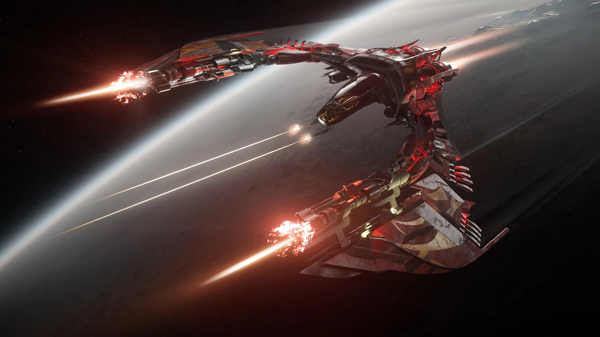
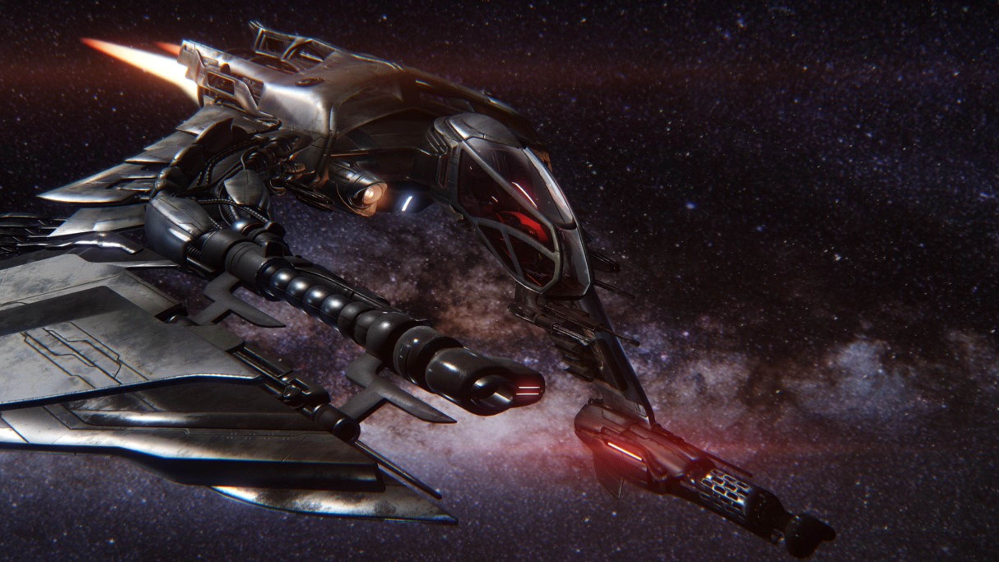
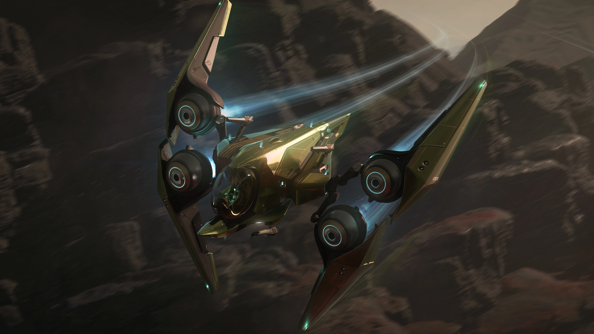
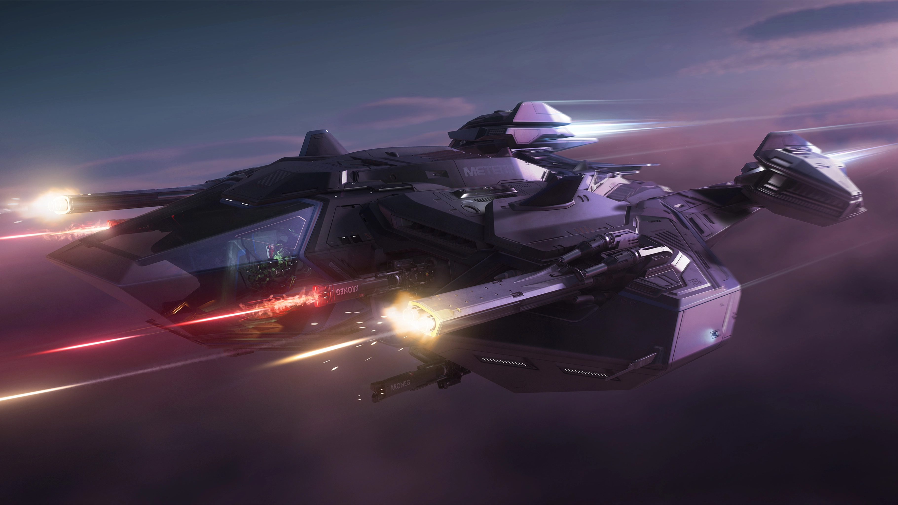
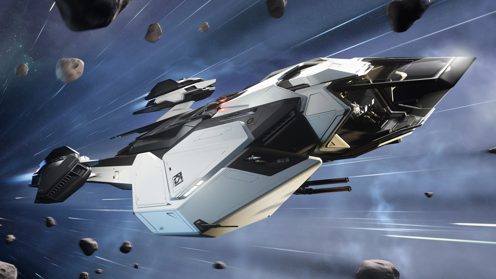
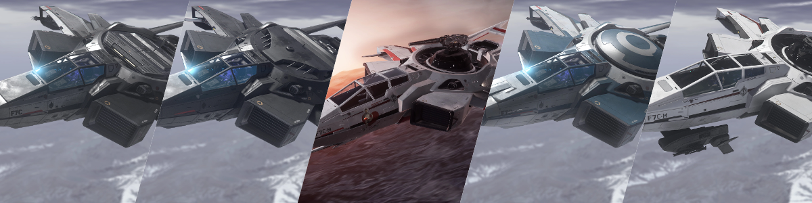
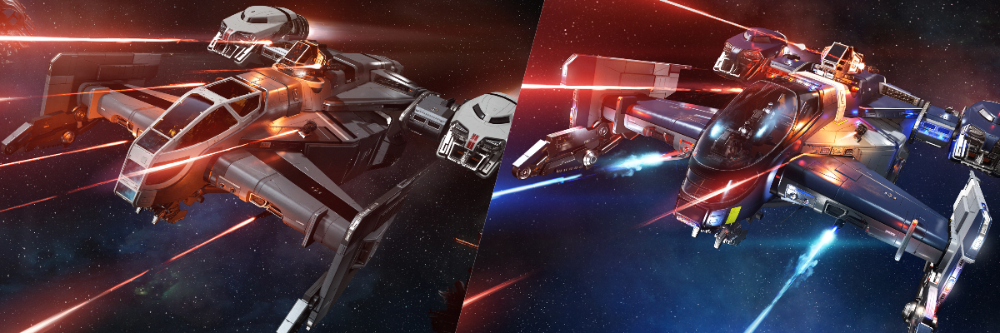

## เปรียบเทียบ Medium Fighter ทุกลำใน Star Citizen Alpha 4.3

ใน Star Citizen Alpha 4.3 ยาน Medium Fighter (MF) คือกลุ่มยานรบกลางที่เน้นพลังทำลายล้าง ความทนทาน และความเก่งกาจหลายด้าน เหมาะกับทั้งนักบิน Solo และ Squadron ที่ต้องการความแข็งแกร่งในการต่อสู้แบบ Multi-role 

วันนี้เราจะมาเจาะลึกจุดเด่น จุดด้อย และความแตกต่างของ Medium Fighter ทั้งหมดใน Alpha 4.3 โดยแบ่งออกเป็น 3 กลุ่มหลัก:

- **🚀 Modern Medium Fighter** - ยานรุ่นใหม่ที่มีประสิทธิภาพสูงสุด
- **⚔️ Hornet Mk I Series** - ยานรุ่นคลาสสิกที่ยังคงใช้งานได้ดี เหมาะสำหรับงบจำกัด
- **🔧 Multi-Role Fighters** - ยาน Cutlass ที่ผสมผสานความสามารถต่อสู้และขนส่ง

## รายชื่อ Medium Fighter ทั้งหมดใน Alpha 4.3

### 🚀 Modern Medium Fighter
ยานรุ่นใหม่ล่าสุดที่มีประสิทธิภาพสูงสุด

- [Anvil F7A Hornet Mk II](https://robertsspaceindustries.com/pledge/ships/anvil-hornet-mkii/F7A-Hornet-Mk-II) - รุ่นปรับแต่งพิเศษสำหรับใช้ในกองทัพ UEE
- [Anvil F7C Hornet Mk II](https://robertsspaceindustries.com/pledge/ships/anvil-hornet-mkii/F7C-Hornet-Mk-II) - รุ่นมาตรฐาน Mk II
- [Anvil F7C-M Super Hornet Mk II](https://robertsspaceindustries.com/pledge/ships/anvil-hornet-mkii/F7C-M-Super-Hornet-Mk-II) - ยานนั่งคู่พลังสูง
- [Anvil F7C-M Hornet Heartseeker Mk II](https://robertsspaceindustries.com/en/comm-link/transmission/20378-Valentines-Day-2025) - ยานนั่งคู่ เพิ่มชุดแต่ง skin และปืน ballistic gatling
- [Anvil F7C-S Hornet Ghost Mk II](https://robertsspaceindustries.com/pledge/ships/anvil-hornet-mkii/F7C-S-Hornet-Ghost-Mk-II) - ยาน Stealth
- [Anvil F7C-R Hornet Tracker Mk II](https://robertsspaceindustries.com/pledge/ships/anvil-hornet-mkii/F7C-R-Hornet-Tracker-Mk-II) - ยานสอดแนม
- [Esperia Glaive](https://robertsspaceindustries.com/pledge/ships/esperia-glaive/Glaive) - ยาน Vanduul Glass Cannon
- [Esperia Scythe](https://robertsspaceindustries.com/pledge/ships/scythe/Scythe) - ยาน Vanduul คลาสสิก
- [Aopoa San'tok.yāi](https://robertsspaceindustries.com/pledge/ships/aopoa-santokyai/Santoky-i) - ยาน Xi'an คล่องตัวสูง
- [RSI Meteor](https://robertsspaceindustries.com/pledge/ships/rsi-meteor/Meteor) - ป้อมปราการบินได้
- [RSI Mantis](https://robertsspaceindustries.com/pledge/ships/rsi-mantis/Mantis) - ยาน Interdiction

### ⚔️ Hornet Mk I Series
ยานรุ่นคลาสสิกที่ยังคงประสิทธิภาพดี เหมาะสำหรับงบจำกัด

- [Anvil F7C Hornet Mk I](https://robertsspaceindustries.com/pledge/ships/anvil-hornet/Hornet) - รุ่นพื้นฐาน
- [Anvil F7C Hornet Wildfire Mk I](https://robertsspaceindustries.com/pledge/ships/anvil-hornet/F7C-Hornet-Wildfire-Mk-I) - **Special Edition**
- [Anvil F7C-M Hornet Heartseeker Mk I](https://robertsspaceindustries.com/pledge/ships/anvil-hornet/F7C-M-Super-Hornet-Heartseeker-Mk-I) - ตัวเลือกที่ดีที่สุดใน Mk I
- [Anvil F7C-M Super Hornet Mk I](https://robertsspaceindustries.com/pledge/ships/anvil-hornet/F7C-M-Super-Hornet-Mk-I) - ยานนั่งคู่รุ่นเก่า
- [Anvil F7C-S Hornet Ghost Mk I](https://robertsspaceindustries.com/pledge/ships/anvil-hornet/F7C-S-Hornet-Ghost-Mk-I) - Stealth รุ่นเก่า

### 🔧 Multi-Role Fighters
จากข้อมูลของ CIG สองลำนี้มันมี role เป็น Medium Fighter ก็จริง แต่ความสามารถมันออกไปทาง Multi-Role สู้ได้ ขนของได้ เหมาะสำหรับผู้เล่นใหม่ที่ต้องการเล่นหลายๆ แบบ แต่ถ้าถามว่าเอาไป dogfight กับ Fighter อื่นได้หรือเปล่า ก็คงต้องตอบว่าไม่

- [Drake Cutlass Black](https://robertsspaceindustries.com/pledge/ships/drake-cutlass/Cutlass-Black) - Jack-of-all-trades ที่แท้จริง
- [Drake Cutlass Blue](https://robertsspaceindustries.com/pledge/ships/drake-cutlass/Cutlass-Blue) - รุ่น Law Enforcement

---

## จุดเด่นและจุดด้อยของแต่ละลำ : Key Stats & Highlights

### 🚀 Modern Medium Fighter

| 
Ship
 | 
Hull HP
 | 
Shield
 | 
Stock Shield HP
 | 
Main Weapons
 | 
Stock DPS
 | 
Missiles
 | 
Nav Speed (m/s)
 | 
SCM Speed (Boost)
 | 
Pitch/Yaw/Roll (Boosted)
 | 
Price (aUEC)
 |
|:---:|:---:|:---:|:---:|:---:|:---:|:---:|:---:|:---:|:---:|:---:|
| F7A Hornet Mk II | 13,051 | 2x S1 | 3,460 | 4x S3 2x S4 | 2,823 | 8x S2 | 1,146 | 220 (479) | 50/40/143 (60/48/171.6) | **Military Only** |
| F7C Hornet Mk II | 16,050 | 2x S1 | 3,460 | 2x S4 | 1,688 | 8x S1 | 1,150 | 220 (480) | 52/43/148 (62.4/51.6/177.6) | 4,895,100 |
| Super Hornet Mk II | 15,250 | 3x S1 | 5,190 | 4x S3 2x S4 | 2,825 | 8x S2 | 1,125 | 215 (465) | 50/40/140 (60/48/168) | N/A |
| Hornet Heartseeker Mk II | 15,250 | 3x S1 | 5,190 | 2x S3 4x S4 | 3,404 | 8x S2 | 1,125 | 215 (465) | 50/40/140 (60/48/168) | N/A |
| Hornet Tracker Mk II | 12,751 | 2x S1 | 3,460 | 2x S4 | 1,688 | 8x S1 | 1,150 | 220 (480) | 52/43/148 (62.4/51.6/177.6) | N/A |
| Hornet Ghost Mk II | 12,551 | 2x S1 | 2,100 | 2x S4 | 1,688 | 8x S1 | 1,150 | 220 (480) | 51/42/147 (61.2/50.4/176.4) | 5,384,600 |
| Glaive | 10,962 | 2x S1 | 3,460 | 2x S1 2x S5 | 1,670 | 8x S2 | 1,150 | 218 (480) | 60/43/155 (72/51.6/186) | N/A |
| Scythe | 11,701 | 2x S1 | 3,460 | 2x S1 2x S5 | 1,012 | 8x S1 | 1,150 | 222 (480) | 56/52/147 (67.2/62.4/176.4) | N/A |
| San'tok.yāi | 11,476 | 1x S2 | 4,740 | 4x S3 | 870 | 8x S2 | 1,161 | 227 (493) | 58/58/160 (69.6/69.6/192) | 9,355,500 |
| Meteor | 30,150 | 2x S1 | 3,460 | 4x S3 2x S5 | 3,351 | 4x S2 4x S4 | 1,405 | 229 (570) | 46/38/155 (55.2/45.6/186) | N/A |
| Mantis | 32,476 | 2x S1 | 3,460 | 2x S3 | 380 | 8x S2 | 1,393 | 236 (605) | 50/42/160 (60/50.4/192) | 3,402,000 |

### ⚔️ Hornet Mk I Series

| 
Ship
 | 
Hull HP
 | 
Shield
 | 
Stock Shield HP
 | 
Main Weapons
 | 
Stock DPS
 | 
Missiles
 | 
Nav Speed (m/s)
 | 
SCM Speed (Boost)
 | 
Pitch/Yaw/Roll (Boosted)
 | 
Price (aUEC)
 |
|:---:|:---:|:---:|:---:|:---:|:---:|:---:|:---:|:---:|:---:|:---:|
| F7A Hornet Mk I | 16,756 | 2x S1 | 3,000 | 2x S2 2x S3 2x S4 | 2,594 | 4x S1 4x S2 | 1,146 | 220 (479) | 53/42/147 (63.6/50.4/176.4) | **Military Only** |
| F7C Hornet Mk I | 15,550 | 2x S1 | 3,000 | 2x S3 | 582 | 4x S2 4x S1 | 1,150 | 220 (480) | 55/44/149 (66/52.8/178.8) | 2,910,600 |
| F7C Hornet Wildfire Mk I | 15,550 | 2x S1 | 3,000 | 2x S3 1x S4 | 1,463 | 4x S2 4x S1 | 1,150 | 220 (480) | 55/44/149 (66/52.8/178.8) | 4,630,500 |
| Super Hornet Mk I | 15,450 | 2x S1 | 3,460 | 2x S1 2x S2 2x S3 | 1,201 | 8x S1 | 1,142 | 219 (477) | 53/42/145 (63.6/50.4/174) | 4,762,800 |
| Hornet Heartseeker Mk I | 15,450 | 2x S1 | 3,460 | 2x S1 2x S3 1x S4 | 1,490 | 4x S2 | 1,142 | 219 (477) | 53/42/145 (63.6/50.4/174) | N/A |
| Hornet Tracker Mk I | 15,550 | 2x S1 | 3,000 | 2x S3 | 582 | 4x S2 4x S1 | 1,142 | 219 (477) | 56/45/150 (67.2/54/180) | 3,210,480 |
| Hornet Ghost Mk I | 15,350 | 2x S1 | 2,100 | 2x S3 | 582 | 4x S2 4x S1 | 1,142 | 219 (477) | 55/44/149 (66/52.8/178.8) | 3,307,500 |

### 🔧 Multi-Role Fighters

| 
Ship
 | 
Hull HP
 | 
Shield
 | 
Stock Shield HP
 | 
Main Weapons
 | 
Stock DPS
 | 
Missiles
 | 
Nav Speed (m/s)
 | 
SCM Speed (Boost)
 | 
Pitch/Yaw/Roll (Boosted)
 | 
Price (aUEC)
 |
|:---:|:---:|:---:|:---:|:---:|:---:|:---:|:---:|:---:|:---:|:---:|
| Cutlass Black | 29,760 | 1x S2 | 4,130 | 4x S3 2x S3 Turret | 1,206 | 8x S2 8x S3 | 1,150 | 217 (465) | 39/35/110 (46.8/42/132) | 2,116,800 |
| Cutlass Blue | 35,770 | 1x S2 | 5,760 | 4x S3 2x S3 Turret | 1,140 | 24x S2 | 1,165 | 220 (467) | 38/34/110 (45.6/40.8/132) | 3,704,400 |

## วิเคราะห์เจาะลึก : In-Depth Analysis

การวิเคราะห์แต่ละยานโดยอิงจากสถิติในตารางเปรียบเทียบ พร้อมเล่าประวัติ จุดเด่น-จุดด้อย และคำแนะนำสไตล์การเล่นที่เหมาะสมในสนามรบ Alpha 4.3

### **Anvil F7A Hornet Mk II** - Medium Fighter แห่ง UEE

F7A Hornet Mk II คือยานรบจาก Anvil Aerospace ที่เกิดจากสมรภูมิ Vanduul ของจริง มันคือมาตรฐานใหม่ของนักล่าแห่งน่านฟ้า ที่ได้รับการออกแบบใหม่ทั้งระบบสำหรับกองทัพ UEE โดยเฉพาะ

หัวใจของมันคือพลังทำลายล้างมหาศาล ด้วย DPS ที่สูงถึง 2,823 พร้อมกับอาวุธหลากหลาย (4x S3 + 2x S4) ที่ให้ความยืดหยุ่นสูง ความเร็วและความคล่องตัวยังคงดีเยี่ยมด้วย SCM Speed 220/479 m/s และค่า Pitch/Yaw/Roll ที่สมดุลที่ 50/40/143 (60/48/171.6 เมื่อ Boost) ทำให้เป็นออกแบบมาเพื่อสาย Dogfighting โดยเฉพาะ

อย่างไรก็ตาม F7A Hornet Mk II ไม่ใช่ยานสายถึก ด้วยเกราะระดับกลาง (Hull HP 13,051) และโล่มาตรฐาน (2x S1 ให้ 3,460 HP) survivability จึงขึ้นอยู่กับฝีมือนักบินสักครึ่งนึง สไตล์การเล่นที่เหมาะที่สุดคือการจู่โจมแบบ Hit-and-Run ที่เน้นความแม่นยำและความเร็ว โดยเฉพาะเหมาะกับการต่อสู้ระยะกลางด้วยมิสไซล์ 8x S2

---

### **Anvil F7C Hornet Mk II** - ยานรบสมดุลแห่งอนาคต

F7C Hornet Mk II คือเวอร์ชันพลเรือนของตำนาน Hornet ที่ได้รับการปรับปรุงใหม่ทั้งหมด เป็นยานที่ Anvil ออกแบบให้เป็น "Gold Standard" สำหรับนักบินที่ต้องการความสมดุลระหว่างพลังงาน ความทนทาน และราคา

จุดแข็งของมันอยู่ที่ความสมดุลที่ยอดเยี่ยม ด้วย Hull HP ที่สูงถึง 16,050 (สูงที่สุดในตระกูล Mk II) ทำให้ทนทานกว่า F7A แต่ยังคงความเร็วดี SCM 220/480 m/s และความคล่องตัวที่เหนือกว่าด้วย Pitch/Yaw/Roll 52/43/148 (62.4/51.6/177.6 Boost) อาวุธหลัก 2x S4 ให้ DPS 1,688 ซึ่งแม้จะไม่สูงมากแต่ก็เพียงพอสำหรับการป้องกันตัวและภารกิจทั่วไป

ข้อเสียคือพลังทำลายล้างที่จำกัด เมื่อเทียบกับรุ่นพิเศษอื่นๆ และมิสไซล์เพียง 8x S1 ทำให้ความสามารถในการต่อสู้ระยะไกลค่อนข้างอ่อน แต่ด้วยความทนทานและราคาที่สมเหตุสมผล (4,895,100 aUEC) ทำให้เป็นตัวเลือกที่ยอดเยี่ยมสำหรับนักบินที่ต้องการยานลำเดียวจบครบ

---

### **Anvil F7C-M Super Hornet Mk II** - Heavy Brawler สองที่นั่ง

Super Hornet Mk II คือนักสู้หน้าด่านที่ออกแบบมาเพื่อการปะทะระยะประชิด มันคือ F7C Mk II ที่เพิ่มที่นั่งคนที่สองและปรับแต่งระบบอาวุธให้ทรงพลังยิ่งขึ้น เป็นยานที่เหมาะสำหรับ Co-op Combat มากที่สุดในตระกูล Hornet

จุดเด่นที่สุดคือพลังทำลายล้างที่น่าเกรงขาม DPS สูงถึง 2,825 จาก 4x S3 + 2x S4 (turret) พร้อมด้วยโล่ที่แข็งแกร่งที่สุดในตระกูลด้วย 3x S1 ให้ Shield HP ถึง 5,190 และมิสไซล์ระยะกลาง 8x S2 ที่เหมาะสำหรับการสนับสนุนการต่อสู้

แต่ความทรงพลังนี้มีราคา ความเร็วลดลงเหลือ SCM 215/465 m/s และความคล่องตัวที่ด้อยลงด้วย Pitch/Yaw/Roll เพียง 50/40/140 (60/48/168 Boost) ทำให้ไม่เหมาะกับ Dogfighting แต่เป็นยานที่ยอดเยี่ยมสำหรับการต่อสู้แบบ Stand & Fight

---

### **Anvil F7C-M Hornet Heartseeker Mk II** - เครื่องจักรสังหารสุดขั้ว

Heartseeker Mk II คือ "อสูรกายแห่งสมรภูมิ" ที่เกิดจากการนำ Super Hornet Mk II มาติดตั้งอาวุธระดับ Overkill พร้อมชุดแต่งพิเศษ มันคือยานที่มี DPS สูงที่สุดในกลุ่ม Modern Fighter ด้วยค่าอันน่าสะพรึง 3,404 DPS

ความน่ากลัวของมันมาจาก 2x S3 + 4x S4 ซึ่งรวมถึง Ballistic Gatling บนป้อมปืนที่สามารถทำลายศัตรูได้ในพริบตา โล่แข็งแรงเช่นเดียวกับ Super Hornet (3x S1, 5,190 HP) และมิสไซล์ 8x S2 ที่ให้ความยืดหยุ่นในการต่อสู้ระยะกลาง

ข้อเสียเช่นเดียวกับ Super Hornet คือความเร็วและความคล่องตัวที่ลดลง SCM 215/465 m/s และ Pitch/Yaw/Roll 50/40/140 (60/48/168 Boost) แต่เมื่อความแรงของปืนสูงขนาดนี้ ศัตรูส่วนใหญ่จะหมดสภาพก่อนที่จะใช้ประโยชน์จากความคล่องตัวได้

---

### **Anvil F7C-S Hornet Ghost Mk II** - เงามืดแห่งสมรภูมิ

Ghost Mk II คือศิลปะแห่งการล่องหน ออกแบบมาเพื่อการปฏิบัติการแบบ Stealth และการโจมตีแบบไม่มีเสียง มันเป็นยาน Mk II ที่บางที่สุดแต่อันตรายที่สุด เมื่อใช้อย่างถูกต้อง

ความพิเศษของมันอยู่ที่เทคโนโลยี Stealth ขั้นสูงที่ทำให้ตรวจจับได้ยาก แต่ต้องแลกมาด้วยโล่ที่อ่อนแอที่สุด (2x S1 เพียง 2,100 HP) และ Hull HP ที่ต่ำที่สุดในตระกูล Mk II (12,551) อาวุธ 2x S4 ให้ DPS 1,688 ซึ่งพอเพียงสำหรับการโจมตีแบบฉับพลัน

ความเร็วและความคล่องตัวยังคงดีเยี่ยม SCM 220/480 m/s และ Pitch/Yaw/Roll 51/42/147 (61.2/50.4/176.4 Boost) ทำให้สามารถเข้าออกสนามรบได้อย่างรวดเร็ว มิสไซล์ 8x S1 เหมาะสำหรับการโจมตีแบบเงียบๆ

---

### **Anvil F7C-R Hornet Tracker Mk II** - ดวงตาแห่งกองเรือ

Tracker Mk II คือยานสอดแนมที่ออกแบบมาเพื่อการรวบรวมข้อมูลและการติดตามเป้าหมาย มันคือ F7C Mk II ที่เสียสละอาวุธบางส่วนเพื่อระบบเซนเซอร์และเรดาร์ขั้นสูง (แม้ว่าระบบนี้จะยังไม่ได้ใช้งานใน Alpha 4.3)

ในปัจจุบัน สเปคของมันคล้ายกับ F7C Mk II มาตรฐาน ด้วย Hull HP 12,751 (ต่ำกว่า F7C เล็กน้อย) อาวุธ 2x S4 ให้ DPS 1,688 และมิสไซล์ 8x S1 ความเร็วและความคล่องตัวเหมือนกับ F7C Mk II (SCM 220/480, Pitch/Yaw/Roll 52/43/148)

ในอนาคตเมื่อระบบสอดแนมมาครบ มันจะกลายเป็นยานที่มีค่าอย่างยิ่งสำหรับ Squadron ในการระบุตำแหน่งศัตรู ติดตามการเคลื่อนไหว และประสานงานการโจมตี

---

### **Esperia Glaive** - ดาบแห่ง Vanduul

Glaive คือยานรบ Vanduul ที่ถูก Esperia ผลิตซ้ำ เป็น Glass Cannon ที่แท้จริงที่แลกความทนทานเพื่อพลังทำลายล้างและความคล่องตัว มันคือศิลปะแห่งการต่อสู้แบบ High-Risk High-Reward

จุดเด่นที่โดดเด่นคือความคล่องตัวในแกน Pitch สูงสุด 60/72 (Boost) ในกลุ่ม Modern Fighter ทำให้หมุนตัวขึ้น-ลงได้เร็วกว่าใคร อาวุธ 2x S1 + 2x S5 ให้ DPS 1,670 ซึ่งมาจากปืนใหญ่ระดับ S5 ที่ทรงพลัง และมิสไซล์ 8x S2 สำหรับการสนับสนุน

แต่ความเปราะบางของมันก็สุดขั้ว Hull HP เพียง 10,962 ต่ำที่สุดในกลุ่ม Modern Fighter และโล่มาตรฐาน 2x S1 (3,460 HP) หมายความว่าผิดพลาดครั้งเดียวอาจถึงแก่ชีวิต ต้องอาศัยทักษะการบินระดับสูงในการหลีกเลี่ยงการถูกโจมตี

---

### **Esperia Scythe** - เคียวสยบดาว

Scythe คือยาน Vanduul รุ่นเก่าแต่ยังคงเอกลักษณ์ เป็น Glass Cannon อีกหนึ่งลำที่เน้นความคล่องตัวในแนวระนาบ ออกแบบมาเพื่อการต่อสู้แบบ Horizontal Maneuvers

ความพิเศษของมันอยู่ที่ความคล่องตัวในแกน Yaw สูงสุด 52/62.4 (Boost) ทำให้สามารถหมุนซ้าย-ขวาได้เร็วกว่ายานอื่น เหมาะสำหรับการต่อสู้แบบ Strafing อาวุธ 2x S1 + 2x S5 ให้ DPS 1,012 ซึ่งต่ำกว่า Glaive แต่ยังคงมีปืนใหญ่ S5 เป็นอาวุธหลัก

ข้อเสียคล้าย Glaive คือความเปราะบาง Hull HP 11,701 และโล่ 2x S1 (3,460 HP) ทำให้ต้องระวังการถูกโจมตีอย่างมาก มิสไซล์เพียง 8x S1 ยังทำให้ความสามารถในการต่อสู้ระยะกลางจำกัด

---

### **Aopoa San'tok.yāi** - นักเต้นแห่งดวงดาว

San'tok.yāi คือผลงานชิ้นเอกของเทคโนโลยี Xi'an ที่ผสานศิลปะการบินเข้ากับวิทยาศาสตร์ขั้นสูง เป็นยานเดียวใน Modern Fighter ที่มีโล่ระดับ S2 และความคล่องตัวที่สมดุลที่สุด

จุดเด่นสุดยอดคือความคล่องตัวที่สมดุลสมบูรณ์ Pitch/Yaw 58/58 (69.6/69.6 Boost) ทำให้ควบคุมได้อย่างแม่นยำในทุกทิศทาง ความเร็ว SCM 227/493 m/s ที่เร็วกว่ายาน Hornet และโล่ระดับ S2 ให้ Shield HP 4,740 ที่ทนทานกว่ายานอื่นในกลุ่ม

แต่ต้องแลกมาด้วย Hull HP ต่ำ 11,476 และ DPS ที่ต่ำที่สุดเพียง 870 จาก 4x S3 ทำให้ต้องอาศัยความคล่องตัวในการหลีกเลี่ยงมากกว่าการสู้ตรงๆ นอกจากนี้ยังมีขนาดตัวยานใหญ่ ทำให้เป็นเป้าง่าย และราคา 9,355,500 aUEC ที่สูงมาก

---

### **RSI Meteor** - ป้อมปราการบินได้

Meteor คือนิยามใหม่ของ "Heavy Fighter" ในกลุ่ม Medium Fighter มันคือป้อมปราการบินได้ที่แลกความคล่องตัวเพื่อพลังทำลายล้างและความทนทานที่เหนือชั้น

จุดแข็งที่น่าเกรงขามคือ Hull HP สูงสุด 30,150 เกือบ 3 เท่าของยานอื่น DPS สูงเป็นอันดับสอง 3,351 จาก 4x S3 + 2x S5 และความเร็วสูงสุด Nav 1,405 m/s, SCM 229/570 m/s ทำให้เคลื่อนที่ได้รวดเร็วแม้จะหนัก มิสไซล์หลากหลาย 4x S2 + 4x S4 เหมาะสำหรับการโจมตีหลายระยะ

จุดอ่อนคือความคล่องตัวต่ำที่สุด Pitch/Yaw 46/38 (55.2/45.6 Boost) ทำให้ไม่เหมาะกับ Dogfighting และเป็นเป้าง่ายสำหรับยานที่คล่องตัวกว่า โล่มาตรฐาน 2x S1 (3,460 HP) ทำให้ต้องพึ่งพา Hull HP เป็นหลัก

---

### **RSI Mantis** - ผู้พิทักษ์อวกาศ

Mantis คือยาน Quantum Control Specialist ที่มีบทบาทสำคัญในการควบคุมสนามรบผ่านเทคโนโลยี Quantum สองระบบ มันคือยานที่ออกแบบมาเพื่อทำงานร่วมกับ Squadron โดยใช้ Quantum Interdiction (ดึงยานออกจาก Warp) และ Quantum Enforcement Device (QED) ที่ป้องกันการเปิด Quantum Drive

จุดเด่นหลักคือความสามารถในการควบคุมสนามรบอย่างสมบูรณ์ Quantum Interdiction สามารถดึงยานศัตรูออกจากการ Quantum Jump ได้ ขณะที่ QED สร้าง "Quantum Dampening Field" ที่ป้องกันไม่ให้ยานในพื้นที่เปิด Quantum Drive ได้ ทำให้ศัตรูติดอยู่ในความเร็ว SCM เท่านั้น ความทนทานสุดขั้ว Hull HP 32,476 ช่วยให้อยู่รอดในระหว่างปฏิบัติการ และความเร็วสูง SCM 236/605 m/s เร็วที่สุดในกลุ่ม

อาวุธ 2x S3 ให้ DPS เพียง 380 เป็นอาวุธป้องกันตัวเท่านั้น บทบาทหลักคือการควบคุมสนามรบและรักษาระยะห่างปลอดภัย ให้เพื่อนในทีมจัดการศัตรูที่ถูกดักและไม่สามารถหลบหนีได้ มิสไซล์ 8x S2 เพียงพอสำหรับการสนับสนุน

---

### **กลุ่ม Anvil Hornet Mk I: The Classic Fighters**

ยาน Hornet รุ่นแรกทั้งหมด (F7A, F7C, Wildfire, Super Hornet, Heartseeker, Tracker, Ghost) คือมรดกที่ถูกส่งต่อมา แม้จะเคยเป็นยานที่โดดเด่นในอดีต แต่ในปัจจุบันมีประสิทธิภาพที่ด้อยกว่ารุ่น Mk II อย่างมาก โดยเฉพาะในด้านพลังทำลายล้าง (DPS) ที่ต่ำกว่าอย่างเห็นได้ชัด ทำให้ไม่เหมาะกับการใช้งานในสนามรบสมัยใหม่
- **คำแนะนำและสไตล์การเล่น:** เป็นตัวเลือกที่ยอดเยี่ยมสำหรับ **นักบินใหม่ที่มีงบจำกัด** หรือ **นักสะสม** ที่ชื่นชอบดีไซน์คลาสสิก แม้ประสิทธิภาพจะด้อยกว่า แต่ก็ยังคงใช้งานได้ดีในสถานการณ์ส่วนใหญ่ โดย **Heartseeker Mk I** เป็นตัวเลือกที่น่าสนใจที่สุดในกลุ่มนี้ด้วย DPS ที่สูงสุด

---

### **กลุ่ม Cutlass Series: The Versatile Powerhouses**

- **Cutlass Black**: "กบฏแห่งวงการ" ที่มาพร้อมความอเนกประสงค์ มี **Hull HP สูงถึง 29,760** และมิสไซล์ 8x S2 + 8x S3 ทำให้เป็นยานที่ทรงพลังและทนทาน แต่ต้องแลกมาด้วย **ความคล่องตัวที่ต่ำ**
    - **คำแนะนำและสไตล์การเล่น:** **Jack-of-all-trades** ที่แท้จริง เหมาะสำหรับผู้เล่นใหม่ที่ต้องการความยืดหยุ่น สามารถทำได้ทั้งการต่อสู้, ขนส่งสินค้า หรือแม้แต่บรรทุกยานพาหนะขนาดเล็ก
- **Cutlass Blue**: รุ่น Law Enforcement ที่มี **Hull HP สูงที่สุดในกลุ่ม (35,770)** และมิสไซล์มากถึง 24x S2 ทำให้เป็นป้อมปราการลอยฟ้าที่แท้จริง แต่ก็ยังคงมี **ความคล่องตัวที่ต่ำ** เช่นเดียวกับ Cutlass Black
    - **คำแนะนำและสไตล์การเล่น:** **Tanker** ที่แท้จริง เหมาะสำหรับภารกิจที่ต้องการความทนทานสูง เช่น การล่าค่าหัว (Bounty Hunting) หรือภารกิจ Law Enforcement

---

## บทสรุป

ยาน Medium Fighter ใน Alpha 4.3 ถือเป็นจุดสมดุลที่สมบูรณ์แบบระหว่างยานประเภทต่างๆ โดยนำเสนอความสมดุลระหว่างพลังทำลายล้าง, ความทนทาน และความคล่องตัว ซึ่งแตกต่างจากยาน Light Fighter ที่เน้นความเร็วและความคล่องตัวสูงสุดแต่ต้องแลกมาด้วยเกราะและอาวุธที่เบากว่า และ Heavy Fighter ที่เป็นเหมือนป้อมปืนเคลื่อนที่ซึ่งมีพลังทำลายล้างและความทนทานมหาศาลแต่ขาดความคล่องตัวอย่างสิ้นเชิง Medium Fighter จึงเป็นตัวเลือกที่ยืดหยุ่นที่สุด เหมาะสำหรับนักบินที่ต้องการยานที่รับมือได้ทุกสถานการณ์ ตั้งแต่ Dogfight ไปจนถึงการโจมตีเป้าหมายขนาดกลาง

---

