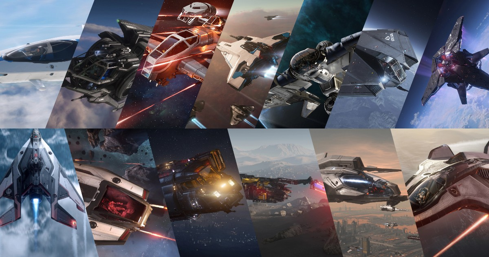

## เปรียบเทียบ Starter Ship ทุกลำใน Star Citizen Alpha 4.3

ใน Star Citizen Alpha 4.3, ยาน Starter Ship ก็คือยานลำแรกที่เราจะได้ขับออกไปผจญภัยในจักรวาลอันกว้างใหญ่ของเกมนี้เลย ยานพวกนี้ถูกออกแบบมาให้มือใหม่หัดบินโดยเฉพาะ ช่วยให้เราได้เรียนรู้พื้นฐานการบิน, การสำรวจ, และการต่อสู้ แถมยังเป็นยานอเนกประสงค์ (Multi-Role) ที่ให้เราลองทำอาชีพได้หลากหลาย

วันนี้เราจะมาเจาะลึกกันว่ายานแต่ละลำมีดีมีเสียต่างกันยังไง โดยจะแบ่งเป็นกลุ่มๆ ตามสไตล์การเล่นให้เข้าใจง่ายๆ ครับ:

- **🌟 Citizen Starter** - ยานเริ่มต้นที่เน้นความเร็วและความคล่องตัว
- **🔧 Generalist Starter** - ยานเริ่มต้นสำหรับผู้ที่ต้องการความยืดหยุ่น
- **🔍 Seeker Starter** - ยานเริ่มต้นสำหรับการสำรวจและการเดินทางเป็นทีม
- **⛏️ Miner Starter** - ยานเริ่มต้นสำหรับการขุดแร่
- **⚔️ Duelist Starter** - ยานเริ่มต้นสำหรับการต่อสู้
- **📦 Hauler Starter** - ยานเริ่มต้นสำหรับการขนส่งสินค้า
- **👤 Outsider Starter** - ยานเริ่มต้นเทคโนโลยีเอเลี่ยน
- **🏴‍☠️ Privateer Starter** - ยานเริ่มต้นสำหรับการเล่นแบบทีม

## รายชื่อ Starter Ship ทั้งหมดใน Alpha 4.3

### 🌟 Citizen Starter
ยานสำหรับมือใหม่หัดซิ่ง เน้นความเร็วและความคล่องตัวสูง

- [Consolidated Outland Mustang Alpha](https://robertsspaceindustries.com/en/pledge/ships/mustang/Mustang-Alpha) - ยานซิ่งเริ่มต้นที่เร็วและคล่องตัว แต่หยิบของลำบากนิดหน่อย

### 🔧 Generalist Starter
สำหรับคนที่ยังไม่รู้จะเล่นสายไหนดี

- [Drake Interplanetary Cutter](https://robertsspaceindustries.com/en/pledge/ships/cutter/Cutter) - ยานสารพัดประโยชน์ มีครบทุกอย่างในตัว แต่จะช้าๆ หน่อย

### 🔍 Seeker Starter
สำหรับสายสำรวจและชอบเล่นกับเพื่อน

- [Anvil C8X Pisces Expedition](https://robertsspaceindustries.com/en/pledge/ships/anvil-pisces/C8X-Pisces-Expedition) - ยานลำเดียวที่ขนเพื่อนไปได้ 2 คน แต่ก็บางเหมือนกระดาษ

### ⛏️ Miner Starter  
สำหรับคนอยากรวยจากการขุดแร่

- [Drake Golem](https://robertsspaceindustries.com/en/pledge/ships/golem/Golem) - ยานขุดแร่สำหรับมือใหม่ มีเลเซอร์ขุดแร่มาให้เลย แต่ไม่มีพื้นที่ใช้สอยภายใน

### ⚔️ Duelist Starter
สำหรับสายบู๊ ชอบหาเรื่องใส่ตัว

- [Aegis Avenger Titan](https://robertsspaceindustries.com/en/pledge/ships/aegis-avenger/Avenger-Titan) - ยานต่อสู้สุดคุ้ม มีปืนใหญ่ไซส์ S4 แต่ก็ทำได้อย่างละนิดอย่างละหน่อย
- [Anvil Arrow](https://robertsspaceindustries.com/en/pledge/ships/anvil-arrow/Arrow) - ยานรบสุดพลิ้ว คล่องตัวสูง แต่โดนยิงทีเดียวอาจจอด

### 📦 Hauler Starter
สำหรับพ่อค้าแม่ค้าสายขนส่ง

- [Crusader Industries Intrepid](http://robertsspaceindustries.com/en/pledge/ships/intrepid/Intrepid) - ยานขนส่งดีไซน์ใหม่ ปลอดภัย แต่ขนของใหญ่ๆ ไม่ได้
- [Consolidated Outland Nomad](https://robertsspaceindustries.com/en/pledge/ships/nomad/Nomad) - ยานขนส่งลำเดียวที่ขนรถได้ แต่กระบะท้ายเปิดโล่ง ระวังขโมย!

### � Outsider Starter
เทคโนโลยีเอเลี่ยนสำหรับผู้ที่ต้องการความแตกต่าง

- [Gatac Manufacture Syulen](https://robertsspaceindustries.com/en/pledge/ships/syulen/Syulen) - ยานต่างดาวสุดล้ำ คล่องตัวสูง แต่ลำใหญ่ เป็นเป้าง่าย และขนของใหญ่ไม่ได้

### 🏴‍☠️ Privateer Starter
สำหรับการเล่นเป็นทีมและปล้นสะดม

- [Drake Cutlass Black](https://robertsspaceindustries.com/en/pledge/ships/drake-cutlass/Cutlass-Black) - ยานโจรสลัดในตำนาน มีป้อมปืนและรองรับลูกเรือ 3 คน แต่ใหญ่และอุ้ยอ้าย

### 🌟 Classic Starters
ยานเริ่มต้นสุดคลาสสิกที่ยังเก๋าอยู่

- [MISC Reliant Kore](https://robertsspaceindustries.com/en/pledge/ships/reliant/Reliant-Kore) - ยานแปลงร่างได้ มีที่นั่งให้เพื่อนไปด้วย
- [RSI Aurora ES](https://robertsspaceindustries.com/en/pledge/ships/rsi-aurora/Aurora-ES) - ยานเริ่มต้นในตำนาน สมดุลและไว้ใจได้
- [Origin Jumpworks 100i](https://robertsspaceindustries.com/en/pledge/ships/origin-100/100i) - ยานเริ่มต้นสายหรู ขับไปไหนก็มีแต่คนมอง

---

## 📊 Key Stats & Highlights

| 
Ship
 | 
Hull HP
 | 
Shield
 | 
Stock Shield HP
 | 
Main Weapons
 | 
Stock DPS
 | 
Missiles
 | 
Cargo Capacity (SCU)
 | 
Nav Speed (m/s)
 | 
SCM Speed (Boost)
 | 
Pitch/Yaw/Roll (Boosted)
 | 
Price in-game (Pledge)
 | 
Ship Interior
 |
|:---:|:---:|:---:|:---:|:---:|:---:|:---:|:---:|:---:|:---:|:---:|:---:|:---:|:---:|
| Mustang Alpha | 10,080 | 2x S1 | 2,800 | 2x S2 | 350 | None | 4 | 1,218 | 228 (500) | 70/53/205 (84/64/246) | 642,600 ($30) | N/A |
| Cutter | 17,000 | 1x S1 | 1,500 | 2x S2 | 350 | 4x S1 | 4 | 1,010 | 180 (380) | 36/36/100 (43/43/120) | 625,040 ($45) | Bed, Weapon Racks, WC, Kitchenette |
| C8X Pisces | 6,250 | 1x S1 | 1,050 | 4x S1 | 402 | 2x S1 | 4 | 1,150 | 220 (460) | 60/60/150 (72/72/180) | 515,970 ($45) | Jumpseat |
| Drake Golem | 17,300 | 1x S1 | 2,100 | 2x S1 | 233 | 2x S1 | 0 | 1,010 | 203 (280) | 43/43/140 (52/52/168) | 1,058,400 ($60) | N/A |
| Avenger Titan | 11,900 | 2x S1 | 4,200 | 1x S4 2x S3 | 1,425 | 4x S2 | 8 | 1,425 | 260 (610) | 53/49/180 (63/58/216) | 1,358,280 ($60) | Bed |
| Arrow | 8,580 | 1x S1 | 1,730 | 2x S1 2x S3 | 855 | 6x S2 | 0 | 1,215 | 229 (515) | 75/57/205 (90/68/246) | 1,984,500 ($75) | N/A |
| Intrepid | 15,350 | 1x S1 | 1,500 | 1x S4 | 436 | 2x S1 | 8 | 1,225 | 227 (455) | 48/48/145 (58/58/174) | 705,600 ($65) | Bed, Weapon Racks, Suit Locker, WC, Kitchenette |
| Nomad | 9,800 | 3x S1 | 4,500 | 3x S3 | 708 | 8x S2 | 24 | 1,100 | 205 (450) | 45/45/120 (54/54/144) | 1,512,000 ($80) | Bed, Weapon Racks, WC, Kitchenette |
| Syulen | 11,740 | 2x S1 | 3,000 | 3x S3 | 873 | 12x S2 | 6 | 1,175 | 225 (450) | 42/42/135 (50/50/162) | 2,778,300 ($70) | Bed, Weapon Racks, WC, Kitchenette |
| Cutlass Black | 29,760 | 1x S2 | 4,130 | 4x S3 Pilot 2x S3 Turret | 1,206 | 8x S2 8x S3 | 46 | 1,150 | 217 (465) | 39/35/110 (47/42/132) | 2,116,800 ($110) | Bed, Weapon Rack |
| Reliant Kore | 15,460 | 2x S1 | 3,000 | 6x S2 | 700 | 4x S2 | 6 | 1,150 | 218 (480) | 54/43/140 (65/52/168) | 1,719,900 ($65) | Interior |
| Aurora ES | 5,740 | 2x S1 | 2,800 | 2x S1 | 272 | 2x S1 | 3 | 1,180 | 222 (440) | 62/57/140 (74/68/168) | 423,360 ($20) | Bed |
| 100i | 3,900 | 1x S1 | 1,500 | 2x S3 | 582 | 2x S2 | 2 | 1,425 | 260 (610) | 50/50/195 (60/60/234) | 1,146,600 ($50) | Bed |

<!-- Scratch Note

Average Value for each Stat:
Hull HP: 12,527.7
Stock Shield HP: 2,600.8
Stock DPS: 645.5
Cargo Capacity: 8.4
Nav Speed: 1,187.2
SCM Speed: 222.6
SCM Speed Boost: 468.8
Pitch: 52.1
Yaw: 47.5
Roll: 151.2
Pitch Boosted: 62.5
Yaw Boosted: 57.0
Roll Boosted: 181.4
Price in-game (aUEC): 1,275,950
Price Pledge Store (USD): $60

Ship Rank sort by each stat:

Hull HP (Higher is better):
1. Cutlass Black (29,760) | 2. Drake Golem (17,300) | 3. Cutter (17,000) | 4. Reliant Kore (15,460) | 5. Intrepid (15,350) | 6. Avenger Titan (11,900) | 7. Syulen (11,740) | 8. Mustang Alpha (10,080) | 9. Nomad (9,800) | 10. Arrow (8,580) | 11. C8X Pisces (6,250) | 12. Aurora ES (5,740) | 13. 100i (3,900)

Stock Shield HP (Higher is better):
1. Nomad (4,500) | 2. Avenger Titan (4,200) | 3. Cutlass Black (4,130) | 4. Syulen (3,000) | 5. Reliant Kore (3,000) | 6. Mustang Alpha (2,800) | 7. Aurora ES (2,800) | 8. Drake Golem (2,100) | 9. Arrow (1,730) | 10. Cutter (1,500) | 11. Intrepid (1,500) | 12. 100i (1,500) | 13. C8X Pisces (1,050)

Stock DPS (Higher is better):
1. Avenger Titan (1,425) | 2. Cutlass Black (1,206) | 3. Syulen (873) | 4. Arrow (855) | 5. Nomad (708) | 6. Reliant Kore (700) | 7. 100i (582) | 8. Intrepid (436) | 9. C8X Pisces (402) | 10. Mustang Alpha (350) | 11. Cutter (350) | 12. Aurora ES (272) | 13. Drake Golem (233)

Cargo Capacity (Higher is better):
1. Cutlass Black (46) | 2. Nomad (24) | 3. Avenger Titan (8) | 4. Intrepid (8) | 5. Reliant Kore (6) | 6. Syulen (6) | 7. Mustang Alpha (4) | 8. Cutter (4) | 9. C8X Pisces (4) | 10. Aurora ES (3) | 11. 100i (2) | 12. Drake Golem (0) | 13. Arrow (0)

Nav Speed (Higher is better):
1. Avenger Titan (1,425) | 2. 100i (1,425) | 3. Intrepid (1,225) | 4. Mustang Alpha (1,218) | 5. Arrow (1,215) | 6. Aurora ES (1,180) | 7. Syulen (1,175) | 8. C8X Pisces (1,150) | 9. Cutlass Black (1,150) | 10. Reliant Kore (1,150) | 11. Nomad (1,100) | 12. Cutter (1,010) | 13. Drake Golem (1,010)

SCM Speed (Higher is better):
1. Avenger Titan (260) | 2. 100i (260) | 3. Arrow (229) | 4. Mustang Alpha (228) | 5. Intrepid (227) | 6. Syulen (225) | 7. Aurora ES (222) | 8. C8X Pisces (220) | 9. Reliant Kore (218) | 10. Cutlass Black (217) | 11. Nomad (205) | 12. Drake Golem (203) | 13. Cutter (180)

SCM Speed Boost (Higher is better):
1. Avenger Titan (610) | 2. 100i (610) | 3. Arrow (515) | 4. Mustang Alpha (500) | 5. Reliant Kore (480) | 6. Cutlass Black (465) | 7. C8X Pisces (460) | 8. Intrepid (455) | 9. Nomad (450) | 10. Syulen (450) | 11. Aurora ES (440) | 12. Cutter (380) | 13. Drake Golem (280)

Pitch (Higher is better):
1. Arrow (75) | 2. Mustang Alpha (70) | 3. Aurora ES (62) | 4. C8X Pisces (60) | 5. Reliant Kore (54) | 6. Avenger Titan (53) | 7. 100i (50) | 8. Intrepid (48) | 9. Nomad (45) | 10. Drake Golem (43) | 11. Syulen (42) | 12. Cutlass Black (39) | 13. Cutter (36)

Yaw (Higher is better):
1. C8X Pisces (60) | 2. Arrow (57) | 3. Aurora ES (57) | 4. Mustang Alpha (53) | 5. 100i (50) | 6. Avenger Titan (49) | 7. Intrepid (48) | 8. Nomad (45) | 9. Drake Golem (43) | 10. Reliant Kore (43) | 11. Syulen (42) | 12. Cutter (36) | 13. Cutlass Black (35)

Roll (Higher is better):
1. Mustang Alpha (205) | 2. Arrow (205) | 3. 100i (195) | 4. Avenger Titan (180) | 5. C8X Pisces (150) | 6. Intrepid (145) | 7. Drake Golem (140) | 8. Reliant Kore (140) | 9. Aurora ES (140) | 10. Syulen (135) | 11. Nomad (120) | 12. Cutlass Black (110) | 13. Cutter (100)

Pitch Boosted (Higher is better):
1. Arrow (90) | 2. Mustang Alpha (84) | 3. Aurora ES (74) | 4. C8X Pisces (72) | 5. Reliant Kore (65) | 6. Avenger Titan (63) | 7. 100i (60) | 8. Intrepid (58) | 9. Nomad (54) | 10. Drake Golem (52) | 11. Syulen (50) | 12. Cutlass Black (47) | 13. Cutter (43)

Yaw Boosted (Higher is better):
1. C8X Pisces (72) | 2. Arrow (68) | 3. Aurora ES (68) | 4. Mustang Alpha (64) | 5. 100i (60) | 6. Avenger Titan (58) | 7. Intrepid (58) | 8. Nomad (54) | 9. Drake Golem (52) | 10. Reliant Kore (52) | 11. Syulen (50) | 12. Cutter (43) | 13. Cutlass Black (42)

Roll Boosted (Higher is better):
1. Mustang Alpha (246) | 2. Arrow (246) | 3. 100i (234) | 4. Avenger Titan (216) | 5. C8X Pisces (180) | 6. Intrepid (174) | 7. Drake Golem (168) | 8. Reliant Kore (168) | 9. Aurora ES (168) | 10. Syulen (162) | 11. Nomad (144) | 12. Cutlass Black (132) | 13. Cutter (120)

Price in-game aUEC (Lower is better):
1. Aurora ES (423,360) | 2. C8X Pisces (515,970) | 3. Cutter (625,040) | 4. Mustang Alpha (642,600) | 5. Intrepid (705,600) | 6. Drake Golem (1,058,400) | 7. 100i (1,146,600) | 8. Avenger Titan (1,358,280) | 9. Nomad (1,512,000) | 10. Reliant Kore (1,719,900) | 11. Arrow (1,984,500) | 12. Cutlass Black (2,116,800) | 13. Syulen (2,778,300)

Price Pledge Store USD (Lower is better):
1. Aurora ES ($20) | 2. Mustang Alpha ($30) | 3. Cutter ($45) | 4. C8X Pisces ($45) | 5. 100i ($50) | 6. Drake Golem ($60) | 7. Avenger Titan ($60) | 8. Intrepid ($65) | 9. Reliant Kore ($65) | 10. Syulen ($70) | 11. Arrow ($75) | 12. Nomad ($80) | 13. Cutlass Black ($110)

-->

## วิเคราะห์เจาะลึก : In-Depth Analysis

มาดูกันทีละลำเลยดีกว่าว่าแต่ละคันมีจุดเด่นจุดด้อยอะไร เหมาะกับสไตล์ไหน มือใหม่ควรเลือกแบบไหนถึงจะคุ้มสุด

### **[Consolidated Outland Mustang Alpha](https://robertsspaceindustries.com/en/pledge/ships/mustang/Mustang-Alpha)**
#### ยานเริ่มต้นนักแข่ง

Mustang Alpha คันนี้เหมาะกับสายซิ่งที่ชอบความเร็วและความคล่องตัว ขับสนุก ตอบสนองไว จะเลี้ยวจะหมุนก็ทำได้ดีสุด ๆ แถมยังพอขนของได้บ้าง

**จุดเด่น:** จุดขายของ Mustang Alpha คือความเร็วกับความคล่องตัว ขับแล้วรู้สึกปราดเปรียวสุด ๆ โดยเฉพาะเวลาเลี้ยวหรือหมุนตัวไวมาก ใครชอบแนวขับรถแข่งในอวกาศต้องถูกใจแน่นอน ที่สำคัญราคาก็เบา ๆ ไม่เจ็บตัว ($30) มือใหม่ซื้อแล้วไม่เสียดายเงินแน่นอน

**จุดด้อย:** ข้อเสียหลัก ๆ คือยิงไม่แรงเท่าไหร่ (Stock DPS 350) ถ้าไปสู้กับลำอื่นอาจจะสู้ไม่ไหว แล้วที่เก็บของก็เป็นแบบติดนอกยาน หยิบของลำบากและเสี่ยงโดนขโมย ถ้าจะขนของจริงจังอาจต้องมองหาลำอื่น

---

### **[Drake Interplanetary Cutter](https://robertsspaceindustries.com/en/pledge/ships/cutter/Cutter)**
#### ยานเริ่มต้นแบบ No-Nonsense

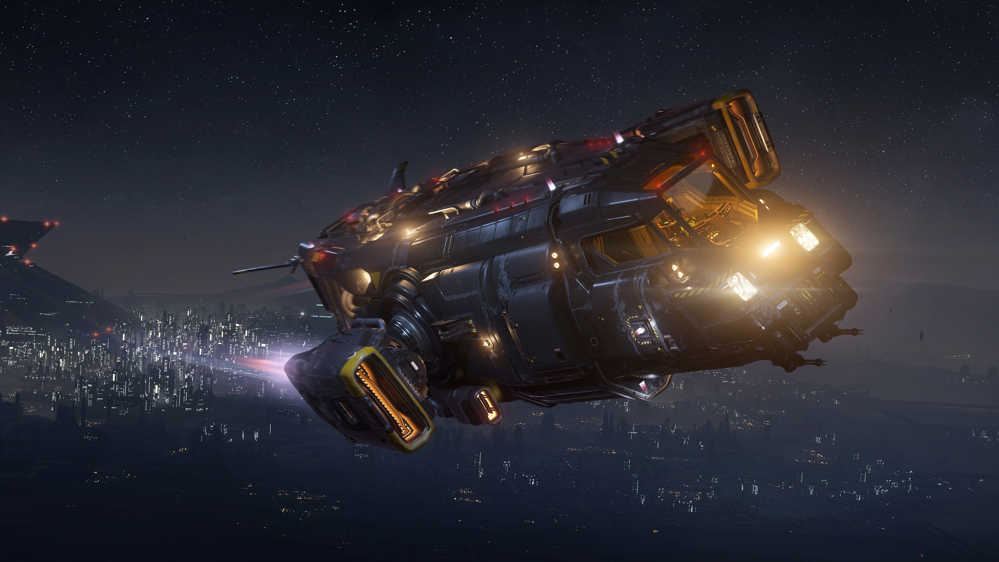

Cutter เหมาะกับคนที่ชอบอะไรเรียบง่าย ใช้งานได้จริง ไม่ต้องมีลูกเล่นเยอะ เน้นอึด ทน ใช้ชีวิตในยานได้สบาย ๆ

**จุดเด่น:** จุดเด่นของ Cutter คือความอึด ถึก ทน Hull HP เยอะมาก อยู่รอดได้นาน แถมข้างในมีครบทั้งเตียง ห้องน้ำ ที่เก็บของ ใช้ชีวิตในอวกาศได้แบบไม่ต้องรีบกลับบ้าน ราคาก็เป็นมิตร (625,040 aUEC / $45) มือใหม่ที่อยากได้ยานสารพัดประโยชน์น่าจะชอบ

**จุดด้อย:** ข้อเสียคือมันช้ามาก บินอืดสุด ๆ จะหนีจะสู้ก็ไม่คล่องตัวเท่าไหร่ เกราะก็ไม่ได้หนาแน่นอะไร ถ้าโดนยิงแรง ๆ ก็มีสิทธิ์พังไว พลังโจมตีก็เบา ไม่เหมาะกับสายบู๊

---

### **[Anvil C8X Pisces Expedition](https://robertsspaceindustries.com/en/pledge/ships/anvil-pisces/C8X-Pisces-Expedition)**
#### ยานสำรวจสำหรับทีม

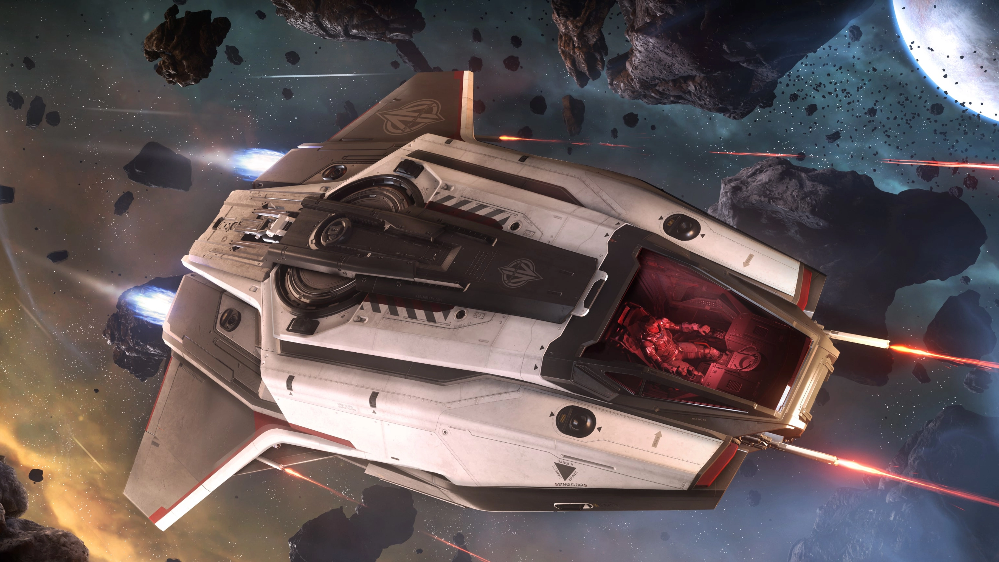

Pisces เหมาะกับคนที่อยากเล่นกับเพื่อนหรืออยากได้ยานเล็ก ๆ ที่ขนคนได้หลายคน ขับง่าย คล่องตัวดี จะรับส่งเพื่อนหรือไปสำรวจที่ไหนก็สะดวก

**จุดเด่น:** จุดเด่นคือเป็นยานเริ่มต้นที่พาเพื่อนไปด้วยได้ถึง 2 คน (รวม 3 คน) เหมาะกับสายปาร์ตี้สุด ๆ ขับก็คล่อง เลี้ยวไว หมุนตัวง่าย ราคาในเกมก็ไม่แพงมาก มือใหม่ที่อยากเล่นกับเพื่อนแนะนำเลย

**จุดด้อย:** ข้อเสียคือบางมาก โดนยิงทีเดียวก็มีสิทธิ์พังง่าย ๆ ต้องอาศัยความคล่องตัวกับขนาดเล็กในการเอาตัวรอด พลังโจมตีก็ไม่ได้แรง ถ้าจะไปสู้กับใครจริงจังอาจจะไม่เหมาะ

---

### **[Drake Golem](https://robertsspaceindustries.com/en/pledge/ships/golem/Golem)**
#### ยานขุดแร่เริ่มต้น

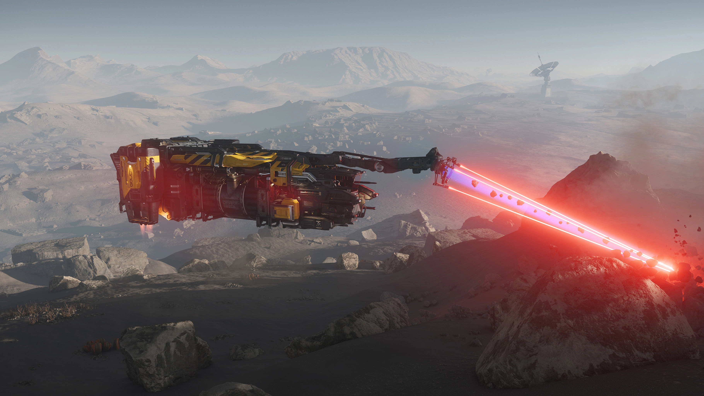

Golem เหมาะกับคนที่อยากเริ่มต้นสายขุดแร่ ไม่ต้องซื้ออุปกรณ์เพิ่ม ขุดได้เลยตั้งแต่วันแรก

**จุดเด่น:** จุดเด่นคือมีเลเซอร์ขุดแร่ติดมาให้พร้อม ขุดแร่ได้ทันทีไม่ต้องเสียเงินเพิ่ม ตัวลำก็อึดพอสมควร (Hull HP เยอะ) ราคาก็ไม่แรงมากเมื่อเทียบกับยานขุดโดยเฉพาะ ($60)

**จุดด้อย:** ข้อเสียคือทำอย่างอื่นไม่ค่อยได้ ไม่มีที่ขนของทั่วไป จะขนได้ก็แต่แร่เท่านั้น พลังโจมตีก็เบาสุด ๆ บินก็ช้า ไม่มีห้องนอนหรือพื้นที่ใช้สอยในยาน ใครอยากได้ยานสารพัดประโยชน์อาจต้องมองข้าม

---

### **[Aegis Avenger Titan](https://robertsspaceindustries.com/en/pledge/ships/aegis-avenger/Avenger-Titan)**
#### Jack of All Trades

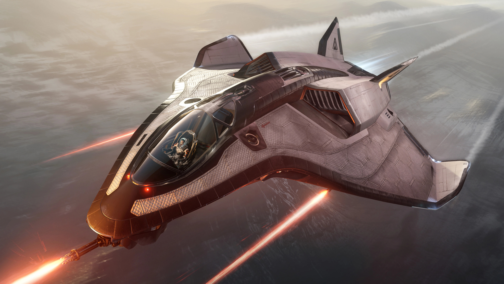

Avenger Titan เป็นยานสารพัดประโยชน์ที่ทำได้แทบทุกอย่าง จะขนของ จะสู้ จะเดินทางก็โอเคหมด เหมาะกับมือใหม่ที่ยังไม่รู้จะเน้นสายไหน

**จุดเด่น:** จุดเด่นคืออาวุธใหญ่ ยิงแรงสุดในกลุ่ม (Stock DPS 1,425) ขับก็เร็ว โล่ก็หนา ขนของได้เยอะ มีเตียงนอนด้วย ใช้ทำภารกิจได้หลากหลาย ราคาก็ไม่แรง ($60) คุ้มมากสำหรับมือใหม่ที่อยากได้ยานครบเครื่อง

**จุดด้อย:** ข้อเสียคือมันไม่ได้เด่นสุดในด้านใดด้านหนึ่ง ถ้าไปสู้กับยานรบจริง ๆ อาจจะสู้ความคล่องตัวของ Arrow ไม่ได้ หรือถ้าจะขนของเยอะ ๆ ก็ยังสู้ยานขนส่งไม่ได้ แต่ถ้าอยากได้ยานที่ทำได้ทุกอย่าง Titan ตอบโจทย์

---

### **[Anvil Arrow](https://robertsspaceindustries.com/en/pledge/ships/anvil-arrow/Arrow)**
#### Glass Cannon แห่งวงการ

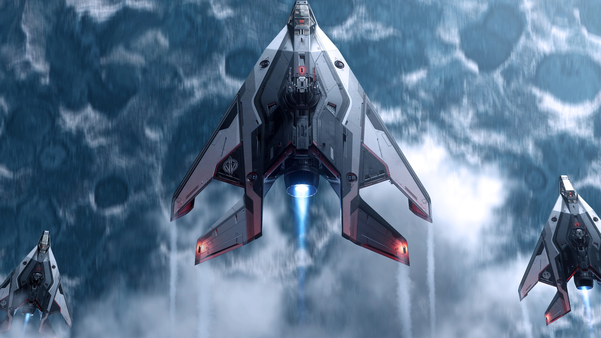

Arrow เหมาะกับสายบู๊ที่ชอบความคล่องตัว ขับสนุก หลบเก่ง หมุนไว ใครมั่นใจในฝีมือการต่อสู้ต้องลอง

**จุดเด่น:** จุดเด่นคือคล่องตัวสุด ๆ เลี้ยวไว หมุนไว หลบกระสุนได้ดีมาก ยิงก็แรงพอสมควร (Stock DPS 855) เหมาะกับคนที่ชอบดวล Dogfight หรืออยากได้ยานไว้สู้จริงจัง

**จุดด้อย:** ข้อเสียคือเปราะมาก โดนยิงทีเดียวก็มีสิทธิ์จอด ไม่มีที่เก็บของเลย ถ้าจะเอาไปทำอย่างอื่นนอกจากสู้ก็ไม่เหมาะ ราคาก็แรง ($75) ถ้าเพิ่งเริ่มอาจจะยังไม่คุ้ม แต่ถ้าเก็บเงินในเกมได้แล้วค่อยซื้อไว้สู้ก็โอเค

---

### **[Crusader Industries Intrepid](http://robertsspaceindustries.com/en/pledge/ships/intrepid/Intrepid)**
#### ยานขนส่งแห่งอนาคต

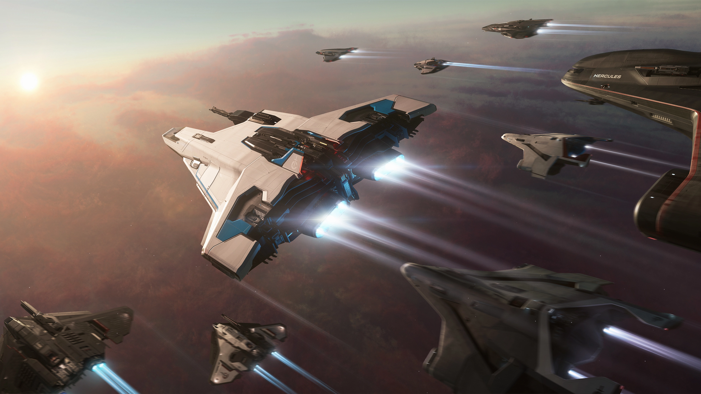

Intrepid เหมาะกับสายขนส่งที่อยากได้ยานปลอดภัย ขนของสบาย ไม่ต้องกลัวของหายหรือโดนขโมย

**จุดเด่น:** จุดเด่นคือทนพอสมควร ขนของได้ 8 SCU และที่เก็บของอยู่ในยาน ปลอดภัย ไม่ต้องกลัวของหาย ใครเน้นขนส่งหรืออยากทำภารกิจส่งของน่าจะชอบ

**จุดด้อย:** ข้อเสียคือยิงไม่แรง โล่ก็ไม่ได้หนามาก ขับก็ไม่ได้คล่องตัวเท่าไหร่ ถ้าจะเอาไปสู้ไม่เหมาะ และที่เก็บของบางแบบก็ใส่กล่องใหญ่ไม่ได้ ราคากลาง ๆ ($65) ถ้าเน้นขนส่งอย่างเดียวอาจจะยังไม่คุ้ม

---

### **[Consolidated Outland Nomad](https://robertsspaceindustries.com/en/pledge/ships/nomad/Nomad)**
#### ยานขนส่งพร้อมที่จอด

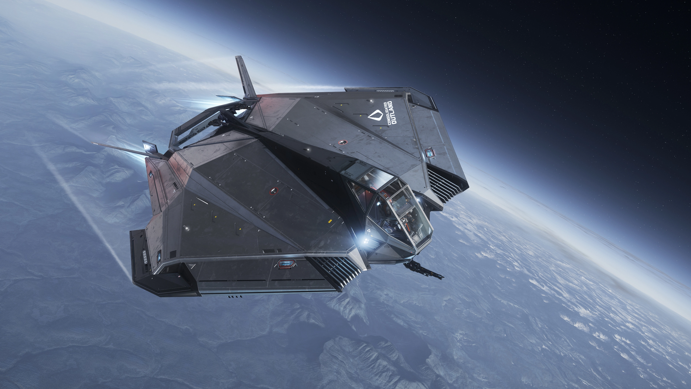

Nomad เหมาะกับคนที่อยากขนของเยอะ ๆ หรืออยากได้ยานที่ขนรถได้ด้วย ขับคนเดียวก็สบาย มีสไตล์ไม่เหมือนใคร

**จุดเด่น:** จุดเด่นคือโล่หนาสุดในกลุ่ม ขนของได้เยอะมาก (24 SCU) กระบะท้ายใส่รถเล็กได้ ใครอยากขนของหรือขนรถต้องถูกใจแน่นอน

**จุดด้อย:** ข้อเสียคือกระบะท้ายเปิดโล่ง ของไม่มีอะไรป้องกัน ถ้าโดนยิงหรือเจอสภาพแวดล้อมที่เป็นอัตรายต่อสินค้า ก็อาจเกิดความเสียหายได้ (ตอนนี้ยังไม่มี) ขับก็ไม่ได้คล่องตัวมาก ราคาก็แรง ($80) มือใหม่อาจต้องคิดดี ๆ ก่อนซื้อ

---

### **[Gatac Manufacture Syulen](https://robertsspaceindustries.com/en/pledge/ships/syulen/Syulen)**
#### ยานเริ่มต้นสไตล์ Xi'an

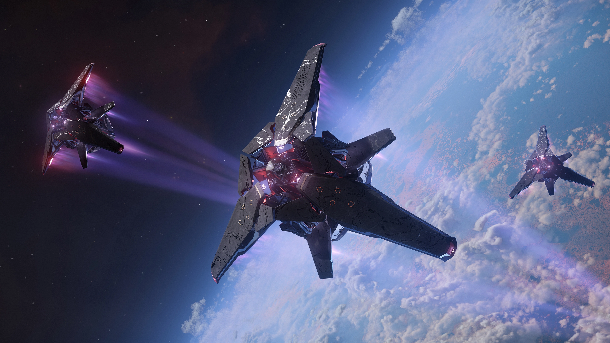

Syulen เหมาะกับคนที่ชอบดีไซน์แปลกใหม่ สายเอเลี่ยน สายแฟชั่น อยากได้อะไรไม่เหมือนใคร

**จุดเด่น:** จุดเด่นคือยิงแรง (Stock DPS 873) มีมิสไซล์เยอะสุดในกลุ่ม โล่ก็หนา ขนของได้พอสมควร ใครชอบความแปลกใหม่หรืออยากลองของใหม่ต้องลอง

**จุดด้อย:** ข้อเสียคือคล่องตัวน้อย เลี้ยวช้า หลบไม่ค่อยเก่ง ตัวลำสูงเพรียวเป็นเป้าง่าย ราคาก็แรงทั้งในเกมและเงินจริง ($70) มือใหม่ส่วนใหญ่ไม่แนะนำ ยกเว้นจะชอบดีไซน์จริง ๆ

---

### **[Drake Cutlass Black](https://robertsspaceindustries.com/en/pledge/ships/drake-cutlass/Cutlass-Black)**
#### โจรสลัดแห่งอวกาศ

Cutlass Black เหมาะกับสายทีม สายโจรสลัด หรือใครที่อยากได้ยานใหญ่ ขนของเยอะ ๆ เล่นกับเพื่อนสนุกแน่นอน

**จุดเด่น:** จุดเด่นคืออึดสุดในกลุ่ม (Hull HP เยอะมาก) ขนของได้เยอะสุด (46 SCU) มีป้อมปืนให้เพื่อนช่วยยิงได้ พลังโจมตีก็แรง ใครเน้นเล่นเป็นทีมต้องชอบ

**จุดด้อย:** ข้อเสียคือใหญ่ อุ้ยอ้าย เลี้ยวช้า เป็นเป้าง่าย ต้องอาศัยความอึดกับไฟร์พาวเวอร์ช่วย ราคาก็แพงสุดในกลุ่ม ($110) ถ้าเล่นคนเดียวอาจไม่คุ้ม

---

### **[MISC Reliant Kore](https://robertsspaceindustries.com/en/pledge/ships/reliant/Reliant-Kore)**
#### ยานแปลงร่างเริ่มต้น

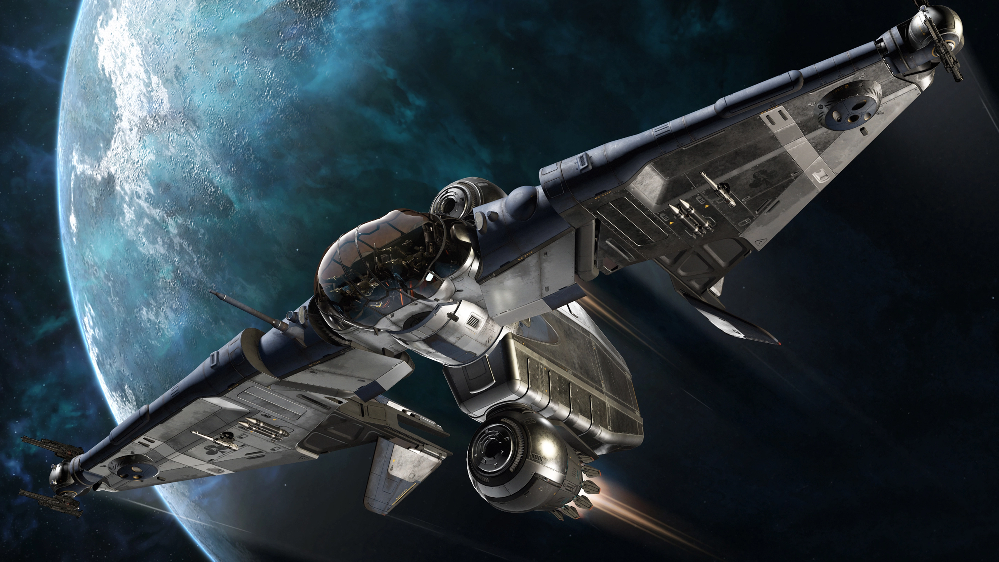

Reliant Kore เหมาะกับคนที่อยากได้ยานแปลก ๆ เปลี่ยนโหมดบินได้ มีเพื่อนนั่งไปด้วยได้ ขับสนุกไม่เหมือนใคร

**จุดเด่น:** จุดเด่นคือยิงแรงพอสมควร (Stock DPS 700) มีที่นั่งให้เพื่อนนั่งไปด้วย ขับแล้วไม่เหงา ตัวลำก็อึดใช้ได้

**จุดด้อย:** ข้อเสียคือถ้าเปลี่ยนเป็นโหมดบินแนวตั้ง อาวุธที่ปีกจะยิงไม่ได้ ต้องสลับโหมดไปมา มือใหม่อาจงงนิดหน่อย ที่เก็บของก็ไม่เยอะ ราคากลาง ๆ ($65)

---

### **[RSI Aurora ES](https://robertsspaceindustries.com/en/pledge/ships/rsi-aurora/Aurora-ES)**
#### ยานเริ่มต้นสุดคลาสสิก

Aurora ES เหมาะกับมือใหม่ที่อยากได้ยานราคาถูก ใช้งานง่าย สมดุลทุกด้าน ไม่มีอะไรซับซ้อน

**จุดเด่น:** จุดเด่นคือราคาถูกสุดในกลุ่ม (ทั้งในเกมและเงินจริง) มีเตียงนอน ขับง่าย คล่องตัวใช้ได้ เหมาะกับคนที่อยากเริ่มต้นแบบไม่ต้องคิดมาก

**จุดด้อย:** ข้อเสียคือไม่มีอะไรเด่นเป็นพิเศษ ยิงไม่แรง ตัวลำก็ไม่ได้อึดมาก เหมาะกับใช้ฝึกมือหรือเรียนรู้ระบบเกม พอเก่งแล้วค่อยเปลี่ยนลำใหม่

---

### **[Origin Jumpworks 100i](https://robertsspaceindustries.com/en/pledge/ships/origin-100/100i)**
#### ยานเริ่มต้นสายหรู

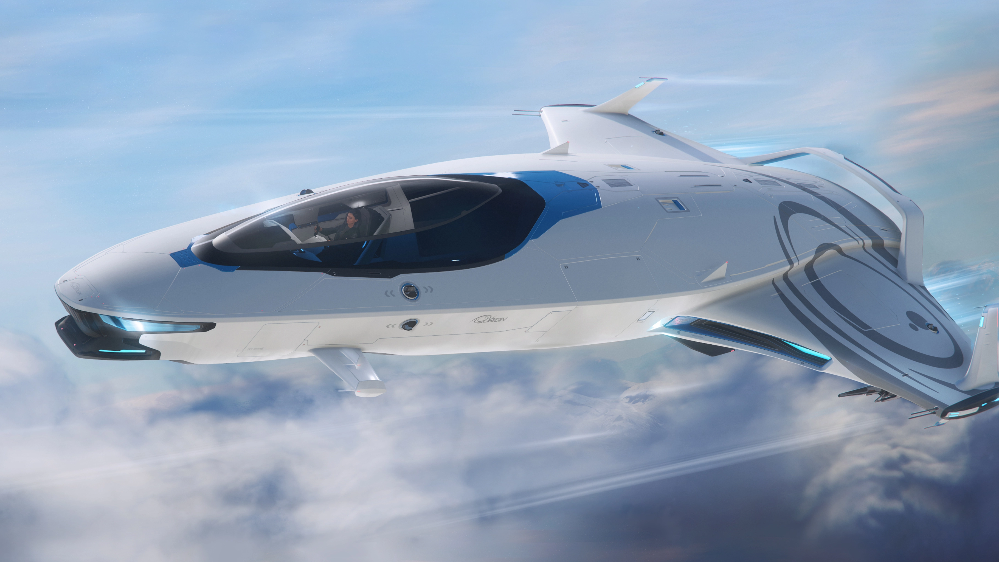

100i เหมาะกับสายหรู สายแฟชั่น อยากขับยานสวย ๆ เร็ว ๆ มีสไตล์ไม่เหมือนใคร

**จุดเด่น:** จุดเด่นคือขับเร็วสุด ๆ (Nav Speed 1,425 m/s) สวยหรูดูดี ยิงก็แรงใช้ได้ ใครอยากขับยานเท่ ๆ ต้องลอง

**จุดด้อย:** ข้อเสียคือเปราะบางมาก โดนยิงนิดเดียวก็พังง่าย ขนของได้น้อย ราคาก็แรง ($50) ถ้าอยากได้ยานที่ใช้งานได้หลากหลายอาจต้องมองลำอื่น

---

## สรุปและคำแนะนำสำหรับแต่ละสาย

**สายประหยัด เน้นถูกสุด**
ถ้าอยากเริ่มต้นแบบประหยัดสุด ๆ แนะนำเลือกยานที่ราคา package ถูกที่สุด เช่น Mustang Alpha (ตอนนี้ลดราคาอยู่บ่อย ๆ) แล้วไปหาทุกอย่างในเกมเองทีหลัง ประหยัดเงิน ได้ประสบการณ์ครบ

**สายพร้อมลุย/อยากได้พื้นที่ในยาน**
ถ้าอยากได้ยานที่มีพื้นที่ภายใน มีเตียง มีห้องน้ำ มีที่เก็บของ เผื่อหิวน้ำจะได้ถอดหมวกกินได้ หรืออยากลาก NPC มา loot ของในยานได้ แนะนำ Cutter เลย มีครบทั้งเตียง logout, weapon rack, เก็บของได้เยอะ ใช้ชีวิตในอวกาศสบาย ๆ

**สายมีงบหน่อย อยากได้ยานคุ้ม ๆ**
ถ้ามีงบเพิ่มขึ้นอีกนิด Avenger Titan ยังเป็นยาน starter ที่คุ้มที่สุดในตอนนี้ ยิงแรง ขนของได้ มีเตียงนอน แต่ interior จะเก่า ไม่ได้ออกแบบสำหรับระบบใหม่ ๆ เช่น ไม่มีห้องน้ำ ไม่มี component สำหรับถอดเปลี่ยน ยังไม่รองรับระบบ Engineering ต้องรอ rework ในอนาคต

**สาย Dogfight ชอบบู๊ล้วน ๆ**
ถ้ารู้ตัวว่าอยากสู้ อยาก dogfight แน่นอน Anvil Arrow คือคำตอบ คล่องตัวสุด ยิงก็แรง เหมาะกับสาย PvP หรือใครที่อยากฝึกฝีมือการบิน

สุดท้าย เลือกยานที่เหมาะกับสไตล์ตัวเองดีที่สุด ถ้าไม่แน่ใจ เริ่มจากยานถูก ๆ ก่อน แล้วค่อยอัปเกรดทีหลังก็ยังไม่สาย!

> 🪐 **สมัครใหม่ ห้ามพลาด!**
> สมัคร Star Citizen ด้วย Referral Code จะได้รับของขวัญพิเศษฟรี! ดูวิธีใช้โค้ดและรายละเอียดได้ที่ [คู่มือ Referral Code สำหรับมือใหม่](../../concepts/referral-code/)
