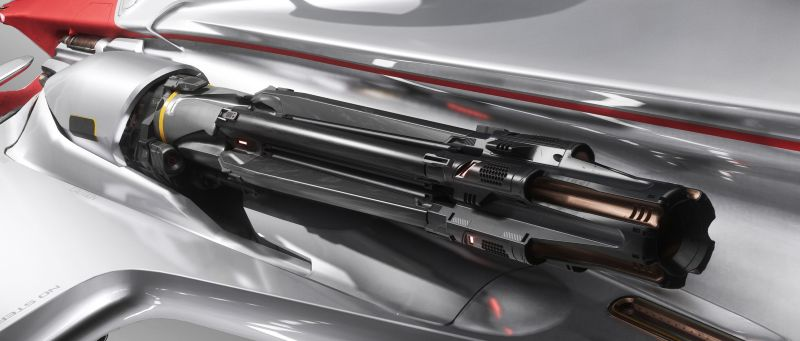

## บทนำ: หมาป่าแห่งยุคใหม่

หลังจากสร้างชื่อในฐานะผู้ผลิตชิ้นส่วนและอาวุธคุณภาพสูงให้กับยักษ์ใหญ่อย่าง RSI และ Behring มานานหลายศตวรรษ Kruger Intergalactic ก็ได้ฤกษ์เปิดตัวผลงานชิ้นโบว์แดงของตัวเอง – L-21 Wolf ยานรบขนาดเล็กที่ออกแบบและผลิตโดย Kruger เองอย่างเต็มตัวเป็นครั้งแรก

L-21 Wolf ไม่ใช่แค่ยานรบธรรมดา แต่เป็นสัญลักษณ์ของความทะเยอทะยานและความเชี่ยวชาญที่สั่งสมมานานกว่า 400 ปีของ Kruger ในการสร้างสรรค์นวัตกรรมด้านอวกาศ



## Kruger Intergalactic: จากเวิร์กช็อปเล็กสู่ตำนานแห่งจักรวาล

ย้อนกลับไปในปี 2558 SEY (ค.ศ. 2461) Ozell Kruger ได้เปิดเวิร์กช็อปเล็กๆ บนดาว Borea ในระบบ Magnus ด้วยคติประจำใจ “Perfection in every piece” Kruger ค่อยๆ เติบโตจากผู้ผลิตชิ้นส่วนเล็กๆ สู่บริษัทพันล้านเครดิตที่มีชื่อเสียงด้านความประณีตและความน่าเชื่อถือ

Kruger สร้างชื่อจากการผลิตชิ้นส่วนให้กับบริษัทใหญ่ๆ ในยุคสงคราม เช่น Behring และ RSI ก่อนจะขยายไลน์ไปสู่อาวุธ (Tigerstrike rotary cannon) และในที่สุดก็เข้าสู่ตลาดยานอวกาศเต็มตัว โดยเริ่มจากการผลิต P-52 Merlin และ P-72 Archimedes ให้กับ RSI

แต่ L-21 Wolf คือก้าวกระโดดที่แท้จริง เพราะนี่คือยานที่ Kruger ออกแบบ ผลิต และวางจำหน่ายเอง 100% เป็นครั้งแรกในประวัติศาสตร์บริษัท

## ดีไซน์: คลาสสิกเหนือกาลเวลา ผสานเทคโนโลยีล้ำยุค

L-21 Wolf ได้แรงบันดาลใจจากดีไซน์ต้นแบบยุคแรกของ Kruger ที่เคยถูกปัดตกเพราะต้นทุนการผลิตสูงเกินไป แต่ด้วยเทคโนโลยีและประสบการณ์ที่สั่งสมมา Kruger สามารถนำดีไซน์ “retro-futuristic” นี้กลับมาสู่สายตาชาวจักรวาลได้อย่างสมบูรณ์แบบ

ตัวเรือเน้นความโฉบเฉี่ยว กระทัดรัด แต่แฝงความดุดันในแบบ “หมาป่า” พร้อมลายเส้นและสีเงิน-ขาวที่เป็นเอกลักษณ์ใหม่ของ Kruger หลังรีแบรนด์โลโก้ในปี 2955

## สเปกเด่น: หมาป่าตัวจริงแห่งสนามรบ

| รายการ              | รายละเอียด |
|----------------------|-------------|
| **บทบาท**           | Light Fighter (ยานรบขนาดเล็ก) |
| **ลูกเรือ**          | 1 คน |
| **ขนาด**            | 5.25 x 12 x 3 เมตร |
| **ความเร็วสูงสุด (NAV)** | 1,225 m/s |
| **SCM Speed**        | 230 m/s (Boost 510 m/s) |
| **Pitch/Yaw/Roll**   | 75°/52°/210° (Boosted: 90°/62.4°/252°) |
| **เกราะ**            | Bubble Shield (HEX x2, Class B) |
| **พลังงาน**          | LightBlossom Power Plant (Class C) |
| **คูลเลอร์**         | BlastChill x2 (Class D) |
| **เรดาร์**           | Ecouter (Military, Class A) |
| **ควอนตัมไดรฟ์**    | FoxFire (Competition, Class B) |
| **อาวุธหลัก**        | - ปืนกล Ballistic Gatling “Relentless L-21” ขนาด S4 x2 (ติดตั้งบน VariPuck S4 Gimbal) - มิสไซล์ Marksman I ขนาด S1 x8 (L21-141 Missile Rack) |
| **Countermeasures**  | Flare 48 นัด, Chaff 5 นัด |
| **Cargo**            | ไม่มี (เน้นรบล้วนๆ) |
## เปรียบเทียบกับ Gladius และ Arrow

| ยาน | SCM/Boost (m/s) | Max Speed (NAV) | Pitch/Yaw/Roll (°) | ปืนหลัก | มิสไซล์ | ราคา (USD) |
|------|------------------|-----------------|--------------------|------------|----------|------------|
| **Kruger L-21 Wolf** | 230 / 510 | 1,225 | 75/52/210 (90/62.4/252) | 2x S4 Ballistic Gatling (Relentless L-21) | 8x S1 Marksman I | 100 |
| **Aegis Gladius**    | 226 / 520 | 1,193 | 68/52/200 (81.6/62.4/240) | 1x S3 Ballistic Gatling, 2x S3 Laser Repeater | 8x Missiles (S2/S3) | 60 |
| **Anvil Arrow**      | 229 / 515 | 1,215 | 75/57/205 (90/68.4/246) | 2x S1 Ballistic Gatling, 2x S3 Laser Repeater | 8x Missiles (S2) | 74 |

### สรุป
- **Wolf** เด่นที่อาวุธ S4 Ballistic Gatling คู่ (ใหญ่สุดในกลุ่ม) และความเร็วสูงสุด NAV สูงสุด
- **Arrow** คล่องตัวสุด (Yaw/Boosted สูงสุด) เหมาะกับ dogfight สายหลบหลีก
- **Gladius** สมดุลและราคาย่อมเยาที่สุด เหมาะกับผู้เริ่มต้นสายรบ

### **จุดเด่น**
L-21 Wolf โดดเด่นด้วยอาวุธหลัก S4 Ballistic Gatling คู่ ที่ออกแบบ bespoke สำหรับรุ่นนี้โดยเฉพาะ ให้พลังทำลายสูงและยิงต่อเนื่องได้ยาวนาน เหมาะกับการล่าเป้าหมายทั้งเดี่ยวและเป็นฝูง

## ประสบการณ์การบิน: หมาป่าที่ล่าได้ทั้งเดี่ยวและฝูง

จากข้อมูล Q&A และรีวิวเบื้องต้น L-21 Wolf ถูกออกแบบมาให้ “บินสนุก” ตอบสนองไว ควบคุมง่าย เหมาะกับนักบินที่ชอบ dogfight แบบคล่องตัว จุดเด่นคือการเร่งความเร็วและการหมุนตัวที่เหนือกว่ายานรบขนาดเล็กทั่วไป

แม้จะไม่มี cargo หรือ utility module ใดๆ แต่ Wolf ก็ชดเชยด้วยความสามารถในการรบที่แท้จริง ทั้งอาวุธหลักที่ยิงต่อเนื่องได้ยาวนาน และระบบป้องกันที่ไว้ใจได้

> **Tip:** ด้วยขนาดที่เล็กและความเร็วสูง Wolf เหมาะกับการโจมตีแบบ “ตีแล้วหนี” หรือเข้าร่วมฝูงบินเพื่อไล่ล่าเป้าหมายขนาดใหญ่

## มุมมองจากนักบิน และความเห็นจากทางบ้าน

เสียงตอบรับจากนักบินทดสอบและชุมชนส่วนใหญ่ชื่นชมดีไซน์ที่ “แตกต่าง” และความรู้สึกขณะบินที่ “สนุก” กว่าหลายๆ รุ่นในคลาสเดียวกัน จุดที่ถูกพูดถึงมากคือเสียงเครื่องยนต์และเอฟเฟกต์การยิงที่ “ดุดัน” สมกับชื่อ Wolf

อย่างไรก็ตาม มีข้อสังเกตว่า Wolf อาจไม่เหมาะกับผู้เล่นสายขนส่งหรือสำรวจ เพราะไม่มี cargo เลย และระบบป้องกันยังเป็นรองยานรบขนาดกลาง

---

## สรุป: หมาป่าแห่งยุคใหม่ที่คู่ควรกับนักบินสายรบ

Kruger L-21 Wolf คือยานที่สะท้อนจิตวิญญาณของ Kruger Intergalactic ได้อย่างแท้จริง – ประณีต ล้ำสมัย และพร้อมลุยทุกสนามรบ สำหรับนักบินที่มองหายานรบขนาดเล็กที่ “แตกต่าง” และมีสไตล์เฉพาะตัว Wolf คือคำตอบที่คุณรอคอย

	

		Perfection in every piece
	

	

		คำขวัญดั้งเดิมของ Ozell Kruger ยังคงสะท้อนอยู่ในทุกเส้นสายของ L-21 Wolf
	

  
  

---

**อ้างอิง:**
- [Kruger L-21 Wolf – Official Transmission](https://robertsspaceindustries.com/en/comm-link/transmission/20710-Kruger-L-21-Wol)
- [Q&A: Kruger L-21 Wolf](https://robertsspaceindustries.com/en/comm-link/engineering/20716-Q-A-Kruger-L-21-Wolf)
- [Kruger Intergalactic – Star Citizen Tools](https://starcitizen.tools/Kruger_Intergalactic)
